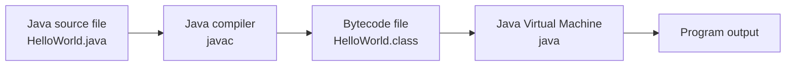
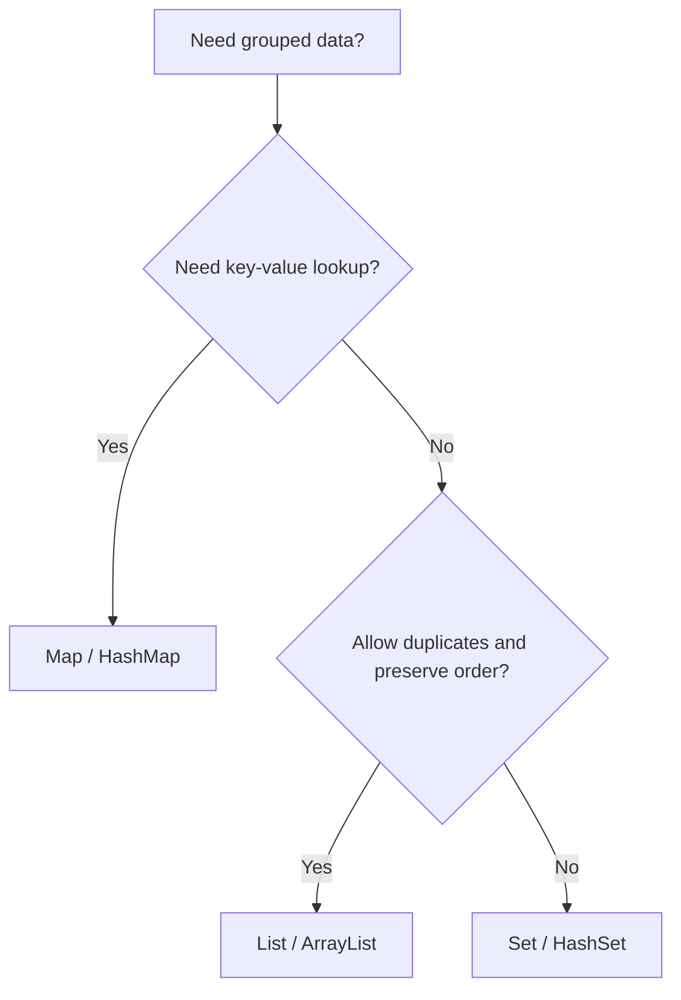
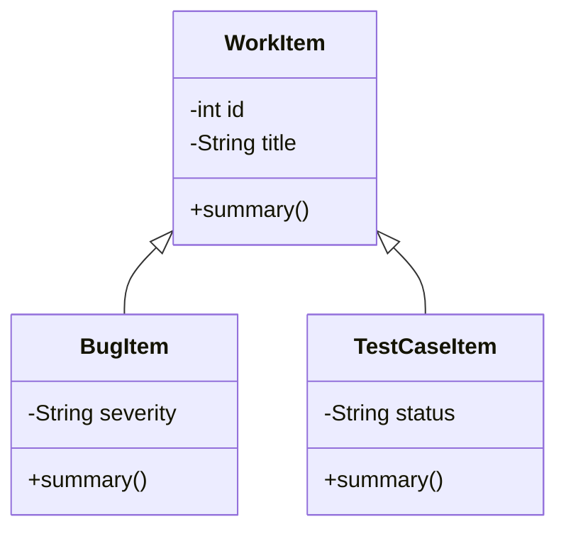
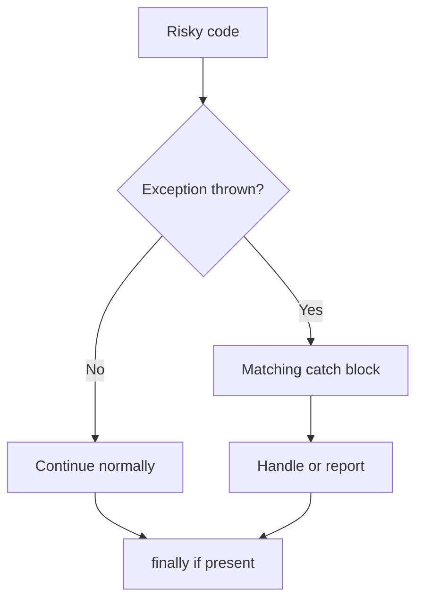
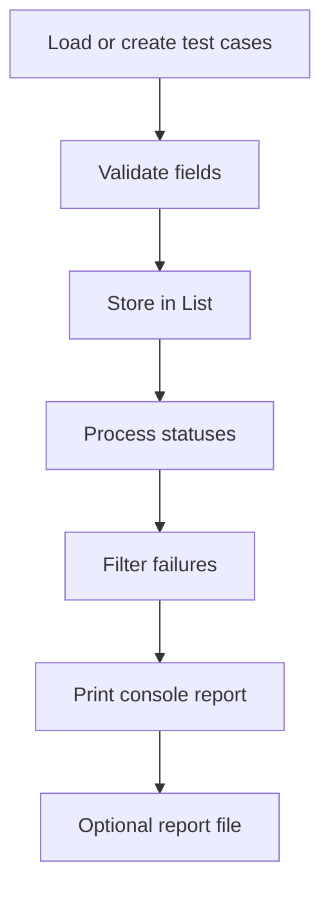

# Complete Java Study Guide for Beginners and Future SDETs

Research approach used for this guide: the course order and technical guidance were checked against official Java sources from Oracle, Dev.java, OpenJDK, and the Java Language Specification, then compared with beginner-friendly learning paths from W3Schools, Baeldung, GeeksforGeeks, and public Udemy course outlines. SDET relevance was aligned with current software testing and automation role expectations. The learning content below is original, self-contained, and written so a student can study directly from this file.

---

## 1. Course Overview

### Who This Guide Is For

This guide is for:

* Beginners who are learning Java for the first time.
* Manual testers who want to move toward automation testing.
* Future SDETs who need strong Java fundamentals before Selenium, API automation, JUnit, TestNG, Maven, or Spring Boot.
* Students who know a little programming but need a structured Java course.
* Junior developers who want to strengthen core Java, OOP, collections, exceptions, file handling, and clean code.

You do not need previous Java experience. You should be comfortable using a computer, installing software, creating files, and typing commands.

### What Java Is

Java is a general-purpose, object-oriented programming language used to build desktop applications, backend services, Android apps, automation frameworks, test tools, enterprise systems, financial systems, and many internal business platforms.

Java source code is written in `.java` files. The Java compiler converts source code into bytecode stored in `.class` files. The Java Virtual Machine runs that bytecode on different operating systems.



### Why Java Is Important

Java remains important because it is:

* Portable: compiled Java bytecode can run on any system with a compatible JVM.
* Mature: Java has decades of tooling, documentation, libraries, and community usage.
* Widely used in enterprise systems.
* Strongly typed: many mistakes are caught before the program runs.
* Object-oriented: it supports modeling real-world business concepts clearly.
* Common in test automation roles, especially Selenium, REST Assured, JUnit, TestNG, Cucumber, and backend validation work.

### Why Testers and SDETs Should Learn Java

Test automation is programming. A tester who understands Java can:

* Read and write automation scripts confidently.
* Build reusable helper methods.
* Create page objects and test data models.
* Work with collections of test cases, users, products, or API responses.
* Handle exceptions and unstable test data safely.
* Read files containing test data.
* Debug failing tests by understanding actual code behavior.
* Communicate better with developers.

Java fundamentals come before automation tools. Selenium, JUnit, TestNG, and REST Assured are easier when variables, methods, OOP, collections, exceptions, and file handling already make sense.

### What You Will Be Able To Do After Completing This Guide

After completing this guide, you should be able to:

* Install and run Java programs.
* Explain JDK, JRE, JVM, source code, bytecode, and compilation.
* Write Java console applications.
* Use variables, primitive types, strings, operators, input, and formatted output.
* Control program flow with `if`, `switch`, loops, `break`, and `continue`.
* Write reusable methods with parameters and return values.
* Use arrays and understand their limitations.
* Build classes, objects, constructors, fields, and methods.
* Apply encapsulation, inheritance, polymorphism, abstraction, interfaces, and composition.
* Use Java access modifiers and core keywords correctly.
* Handle exceptions with `try`, `catch`, `finally`, `throw`, and `throws`.
* Store and process data using `List`, `Set`, `Map`, `ArrayList`, `HashSet`, and `HashMap`.
* Understand generics and type-safe collections.
* Read and write files.
* Use `LocalDate`, `LocalTime`, `LocalDateTime`, and date formatting.
* Use basic lambdas, functional interfaces, and streams.
* Debug common errors and read compiler messages.
* Build several console mini-projects useful for SDET preparation.

### Recommended Java Version

Use Java 25 LTS for this guide. Java 26 is the current feature release as of May 31, 2026, but Java 25 is the latest Long-Term Support release and is the safest teaching baseline for students and teams. Most examples also work on Java 21 LTS because the guide avoids preview features and advanced version-specific APIs.

### Required Tools

You need:

* JDK 25 LTS.
* A terminal or command prompt.
* A code editor or IDE.
* Basic file explorer access.

Optional but useful:

* Git for version control.
* A notes app for writing explanations in your own words.

### Recommended IDE

Recommended: IntelliJ IDEA Community Edition.

Acceptable alternatives:

* Visual Studio Code with Java extensions.
* Eclipse IDE.
* NetBeans.

For beginners, IntelliJ IDEA Community Edition is a good choice because it gives helpful error messages, code completion, refactoring tools, and a built-in debugger.

### Estimated Duration

Recommended pace:

* Fast review pace: 6 to 8 weeks.
* Beginner pace: 10 to 12 weeks.
* Slow mastery pace while working full-time: 14 to 16 weeks.

Expect to spend 6 to 10 hours per week if you want strong results.

### Weekly Study Plan

| Week | Focus | Outcome |
| ---- | ----- | ------- |
| 1 | Java setup, first programs, variables | Run simple Java apps |
| 2 | Operators, strings, input, formatting | Build input/output utilities |
| 3 | Control flow and loops | Write validation logic |
| 4 | Methods and arrays | Build reusable data-processing code |
| 5 | OOP classes, objects, constructors | Model users and test cases |
| 6 | Encapsulation, inheritance, polymorphism | Build richer object models |
| 7 | Abstraction, interfaces, composition, keywords | Understand framework-style design |
| 8 | Exceptions and collections | Build safer data-driven apps |
| 9 | Generics, files, date/time | Read test data and schedule checks |
| 10 | Lambdas, streams, debugging, clean code | Process results cleanly |
| 11 | Mini-projects | Practice job-like tasks |
| 12 | Capstone project | Combine all major skills |

### How To Study This Guide Effectively

Use this method:

1. Read the explanation once without typing.
2. Type the code example manually.
3. Run the program.
4. Compare your output with the expected output.
5. Change values and predict what will happen.
6. Complete exercises before checking solutions.
7. Write a short recap in your own words.
8. Build each mini-project.
9. Keep a file called `mistakes.md` and record errors you fix.

Do not only read. Java becomes clear when you type, run, break, debug, and repair code.

---

## 2. Research Summary

| Source Type | Sources Reviewed | How The Information Was Used |
| ----------- | ---------------- | ---------------------------- |
| Official Java documentation | Oracle Java Downloads, Oracle Java SE 25 Documentation, Oracle Java SE 25 API docs, Java SE 25 Tool Specifications | Confirmed Java 25 LTS recommendation, modern API names, compiler/runtime concepts, and standard syntax. |
| Official learning material | Dev.java Learn Java, Oracle Java Tutorials archive | Used for beginner progression patterns: getting started, language basics, classes, interfaces, exceptions, collections, and deployment concepts. |
| OpenJDK | OpenJDK JDK 25 project pages and release information | Confirmed JDK 25 position as Java SE 25 reference implementation and avoided preview-only features in beginner examples. |
| Java Language Specification | Java SE 25 JLS and JVM specification references | Used when precision mattered for terms such as class, object, method invocation, access control, exceptions, and type conversion. |
| Beginner-friendly sources | W3Schools Java, Baeldung Java tutorials, GeeksforGeeks Java tutorials | Compared beginner explanation order, common examples, and areas where students often need simpler wording. |
| Udemy course benchmarking | Public curriculum listings for popular beginner/intermediate Java courses | Used only for sequencing inspiration: setup, basics, control flow, methods, OOP, arrays, collections, exceptions, and projects. No paid lesson content was copied. |
| Industry and SDET needs | Public SDET role descriptions and automation testing roadmaps | Used to emphasize test data, validation helpers, console tools, file-based data, collections, debugging, clean code, and automation-readiness. |

---

## 3. Full Learning Path

| Unit | Title | Goal | Estimated Time | Difficulty | Main Deliverable |
| ---- | ----- | ---- | -------------- | ---------- | ---------------- |
| 1 | Java Foundations and Setup | Understand how Java works and run first programs | 6-8 hours | Beginner | First compiled Java console app |
| 2 | Variables, Types, Strings, Input, and Formatting | Store, transform, input, and display data | 8-10 hours | Beginner | Test data formatter |
| 3 | Control Flow | Make decisions and repeat actions | 8-10 hours | Beginner | Validation decision engine |
| 4 | Methods and Reusable Logic | Break code into reusable actions | 7-9 hours | Beginner | QA validation helper |
| 5 | Arrays and Nested Data | Store fixed-size lists and tabular values | 6-8 hours | Beginner | Test score analyzer |
| 6 | OOP Part 1: Classes, Objects, Constructors, Encapsulation | Model real entities safely | 10-12 hours | Beginner to Intermediate | User profile model |
| 7 | OOP Part 2: Inheritance, Polymorphism, Abstraction, Interfaces, Composition | Build flexible object designs | 12-14 hours | Intermediate | Bug/test-case domain model |
| 8 | Java Modifiers and Core Keywords | Use Java keywords intentionally | 5-7 hours | Beginner to Intermediate | Access-control demo |
| 9 | Exception Handling | Handle failures without crashing carelessly | 7-9 hours | Intermediate | Safe input and validation utility |
| 10 | Collections Framework | Store dynamic groups of data | 10-12 hours | Intermediate | Test case manager data store |
| 11 | Generics | Use type-safe reusable code | 5-7 hours | Intermediate | Type-safe result container |
| 12 | File Handling | Read and write test data files | 7-9 hours | Intermediate | File-based test data reader |
| 13 | Date and Time API | Work with dates, times, and deadlines | 5-7 hours | Beginner to Intermediate | Test execution scheduler |
| 14 | Modern Java Basics | Use lambdas and streams for simple data processing | 8-10 hours | Intermediate | Test result filtering utility |
| 15 | Debugging, Clean Code, and Problem Solving | Write readable code and fix errors | 8-10 hours | Intermediate | Refactored clean-code utility |
| 16 | SDET Integration Review | Combine fundamentals into an SDET-style app | 12-16 hours | Intermediate | End-to-end Java review app |

---

## 4. Complete Units and Lessons

# Unit 1: Java Foundations and Setup

## Unit Goal

You will understand what Java is, how Java code runs, how to install and check the JDK, how to write your first program, and how to compile and run Java code from the command line and an IDE.

## Why This Unit Matters

Every Java automation framework starts with the same foundation: source files, class files, packages, a JDK, a compiler, and a runtime. Testers who understand the Java execution flow can diagnose setup problems faster and understand what an IDE is doing behind the scenes.

## Lessons

### Lesson 1.1: How Java Works

#### What You Will Learn

* What source code, bytecode, JVM, JRE, and JDK mean.
* Why Java is called portable.
* How `javac` and `java` work together.

#### Simple Explanation

You write Java code in a text file ending with `.java`. The compiler program `javac` checks the code and converts it into bytecode. Bytecode is not normal machine code for only one operating system. It is a portable format that the JVM understands. The `java` command starts the JVM and runs the bytecode.

#### Key Terms

* Source code: human-readable code written by the programmer.
* Compiler: a tool that checks and converts source code.
* Bytecode: compiled Java instructions stored in `.class` files.
* JVM: Java Virtual Machine, the program that runs bytecode.
* JRE: Java Runtime Environment, runtime pieces needed to run Java apps.
* JDK: Java Development Kit, tools needed to write, compile, and run Java apps.

#### Syntax

```bash
javac FileName.java
java FileName
```

#### Detailed Code Example

```java
public class HelloJava {
    public static void main(String[] args) {
        System.out.println("Java is ready.");
    }
}
```

#### Code Explanation

* `public class HelloJava` defines a class named `HelloJava`.
* The file should be named `HelloJava.java`.
* `main` is the starting point for this console program.
* `System.out.println` prints text and moves to a new line.

#### Expected Output

```text
Java is ready.
```

#### Practical Testing / SDET Example

When a Selenium or API test runs, Java still follows the same pattern: source code is compiled, then the JVM runs the compiled classes. If a test fails before opening a browser, the problem may be compilation, classpath, dependency setup, or runtime configuration.

#### Common Mistakes

* Naming the file `hellojava.java` while the public class is `HelloJava`.
* Running `java HelloJava.java` after compiling. After compilation, run `java HelloJava`.
* Forgetting the semicolon after `System.out.println(...)`.

#### Practice Exercises

1. Create a class named `SetupCheck` that prints `JDK installed`.
2. Create a class named `TesterIntro` that prints your name and `Future SDET`.
3. Compile and run both files from the terminal.

#### Exercise Solutions

```java
public class SetupCheck {
    public static void main(String[] args) {
        System.out.println("JDK installed");
    }
}
```

```java
public class TesterIntro {
    public static void main(String[] args) {
        System.out.println("Amina");
        System.out.println("Future SDET");
    }
}
```

#### Lesson Recap

* Java source code is saved in `.java` files.
* `javac` compiles source code into bytecode.
* `java` runs compiled bytecode on the JVM.
* The JDK is required for development.

### Lesson 1.2: Installing Java and Checking Environment Variables

#### What You Will Learn

* How Java is installed conceptually.
* What `JAVA_HOME` and `PATH` do.
* How to verify installation.

#### Simple Explanation

The JDK must be installed on your computer. Your terminal needs to know where Java tools are located. `JAVA_HOME` usually points to the JDK installation folder. `PATH` allows commands such as `java` and `javac` to run from any folder.

#### Key Terms

* Environment variable: a system-level setting used by programs.
* `JAVA_HOME`: points to the JDK folder.
* `PATH`: list of folders where the terminal searches for commands.
* Terminal: command-line tool used to run commands.

#### Syntax

```bash
java -version
javac -version
```

#### Detailed Code Example

This lesson uses terminal commands instead of Java code:

```bash
java -version
javac -version
```

#### Code Explanation

* `java -version` checks the runtime.
* `javac -version` checks the compiler.
* Both should display version information.

#### Expected Output

Exact output varies, but it should look similar to:

```text
java version "25.0.1" ...
javac 25.0.1
```

#### Practical Testing / SDET Example

Automation projects often fail on a new machine because the wrong JDK is installed or `PATH` points to an older Java version. Always verify Java before blaming the test framework.

#### Common Mistakes

* Installing only a runtime instead of the full JDK.
* Having multiple Java versions and using the wrong one.
* Updating `JAVA_HOME` but not reopening the terminal.

#### Practice Exercises

1. Run `java -version`.
2. Run `javac -version`.
3. Write down the exact version number.
4. Explain the difference between `java` and `javac`.

#### Exercise Solutions

Suggested answer:

* `java` runs compiled Java programs.
* `javac` compiles `.java` source files into `.class` bytecode files.

#### Lesson Recap

* The JDK contains developer tools.
* `JAVA_HOME` points to the JDK location.
* `PATH` lets the terminal find Java commands.
* Verify setup before writing larger programs.

### Lesson 1.3: First Java Program and File Structure

#### What You Will Learn

* The structure of a basic Java class.
* The role of the `main` method.
* How comments work.

#### Simple Explanation

A simple Java program is usually a class with a `main` method. The JVM starts execution from `main`. Comments are notes for humans. Java ignores comments when running the program.

#### Key Terms

* Class: a container for Java code.
* Method: a named block of code that performs an action.
* `main` method: the entry point for a Java console application.
* Comment: explanatory text ignored by the compiler.

#### Syntax

```java
public class ClassName {
    public static void main(String[] args) {
        // code goes here
    }
}
```

#### Detailed Code Example

```java
public class FirstProgram {
    public static void main(String[] args) {
        // This line prints a message.
        System.out.println("Hello, Java learner!");

        /*
           This is a multi-line comment.
           Use it for longer notes.
        */
        System.out.println("Today I start Java.");
    }
}
```

#### Code Explanation

* `public class FirstProgram` declares the class.
* `{` and `}` define the class and method bodies.
* `public static void main(String[] args)` is the program entry point.
* `//` starts a single-line comment.
* `/* ... */` creates a multi-line comment.

#### Expected Output

```text
Hello, Java learner!
Today I start Java.
```

#### Practical Testing / SDET Example

In automation code, comments should explain why a test step exists, not describe obvious syntax. For example, `// Retry because the status update is asynchronous` is useful. `// Click button` is usually less useful if the method name already says that.

#### Common Mistakes

* Forgetting closing braces.
* Writing `Main` instead of `main`.
* Forgetting that Java is case-sensitive.
* Adding too many comments that repeat the code.

#### Practice Exercises

1. Print three lines: your name, your goal, and your favorite testing tool.
2. Add one single-line comment.
3. Add one multi-line comment.

#### Exercise Solutions

```java
public class LearningGoal {
    public static void main(String[] args) {
        // Student identity
        System.out.println("Name: Amina");

        /*
           Goal summary for this course.
        */
        System.out.println("Goal: Become an SDET");
        System.out.println("Tool: Selenium");
    }
}
```

#### Lesson Recap

* Java code is organized in classes.
* `main` is where a console app starts.
* Java is case-sensitive.
* Comments help humans understand code.

### Lesson 1.4: Basic Debugging Mindset

#### What You Will Learn

* How to approach errors calmly.
* The difference between compiler errors and runtime errors.
* How to isolate a problem.

#### Simple Explanation

Debugging means finding and fixing problems. Beginners often guess randomly. A better approach is to read the error, identify the line, check the syntax or value, make one small change, and run again.

#### Key Terms

* Compiler error: an error found before the program runs.
* Runtime error: an error that happens while the program is running.
* Logic error: code runs but gives the wrong result.
* Stack trace: a runtime error report showing where the failure happened.

#### Syntax

There is no special syntax for debugging, but this pattern helps:

```text
Read error -> Find line -> Understand cause -> Change one thing -> Run again
```

#### Detailed Code Example

```java
public class DebugExample {
    public static void main(String[] args) {
        int passedTests = 8;
        int totalTests = 10;

        System.out.println("Passed: " + passedTests);
        System.out.println("Total: " + totalTests);
        System.out.println("Failed: " + (totalTests - passedTests));
    }
}
```

#### Code Explanation

* The variables store test result counts.
* The final print statement calculates failed tests.
* Parentheses make the calculation happen before string joining.

#### Expected Output

```text
Passed: 8
Total: 10
Failed: 2
```

#### Practical Testing / SDET Example

When a test report shows `Passed: 8`, `Total: 10`, and `Failed: 810`, the program probably joined text incorrectly instead of subtracting numbers. Debugging means checking both syntax and logic.

#### Common Mistakes

* Fixing many lines at once and not knowing what helped.
* Ignoring the first error and reading only the last error.
* Treating every failure as a tool problem.
* Not printing intermediate values while learning.

#### Practice Exercises

1. Intentionally remove a semicolon and read the compiler error.
2. Intentionally misspell `println` and read the compiler error.
3. Remove parentheses from the failed tests expression and observe the result.

#### Exercise Solutions

If you write:

```java
System.out.println("Failed: " + totalTests - passedTests);
```

Java tries to combine text with `totalTests` first, then subtract a number from text. That is invalid. Use:

```java
System.out.println("Failed: " + (totalTests - passedTests));
```

#### Lesson Recap

* Debugging is a process, not guessing.
* Read the first meaningful error.
* Change one thing at a time.
* Print values while learning logic.

## Unit Practice Tasks

1. Create and run `HelloJava`.
2. Create and run `EnvironmentCheck`.
3. Write a program that prints your Java version manually as text.
4. Write a program that prints a three-line study schedule.
5. Create one program with a deliberate error, fix it, and record the mistake.

## Unit Mini Project

### Project Name

Java Setup Verification Console App

### Project Idea

Build a console program that prints a setup checklist for a new Java learner.

### Features

* Print learner name.
* Print JDK version target.
* Print IDE name.
* Print setup status lines.
* Print next study step.

### Concepts Used

* Class structure.
* `main` method.
* `System.out.println`.
* Comments.
* Basic debugging.

### Step-by-Step Implementation Guide

1. Create `SetupVerification.java`.
2. Define `public class SetupVerification`.
3. Add the `main` method.
4. Print five setup lines.
5. Compile with `javac SetupVerification.java`.
6. Run with `java SetupVerification`.

### Sample Code

```java
public class SetupVerification {
    public static void main(String[] args) {
        System.out.println("Learner: Amina");
        System.out.println("Target Java: Java 25 LTS");
        System.out.println("IDE: IntelliJ IDEA Community Edition");
        System.out.println("Status: Ready to write Java programs");
        System.out.println("Next step: Learn variables and data types");
    }
}
```

### Expected Result

```text
Learner: Amina
Target Java: Java 25 LTS
IDE: IntelliJ IDEA Community Edition
Status: Ready to write Java programs
Next step: Learn variables and data types
```

### Enhancement Ideas

* Add more setup checks as printed text.
* Print a weekly schedule.
* Print common commands.

### Completion Checklist

* [ ] File name matches class name.
* [ ] Program compiles.
* [ ] Program runs.
* [ ] Output is clear.
* [ ] You can explain every line.

## Unit Summary

You learned how Java source code becomes bytecode and runs on the JVM. You learned the difference between JDK, JRE, JVM, `javac`, and `java`. You wrote your first Java programs and practiced a debugging mindset.

## Self-Check Questions

1. What does the JDK contain?
   Answer: Development tools such as `javac`, the Java runtime, libraries, and tools needed to build Java programs.

2. What command compiles Java source code?
   Answer: `javac FileName.java`.

3. What command runs a compiled Java class?
   Answer: `java ClassName`.

4. Why must `HelloJava.java` contain `public class HelloJava`?
   Answer: A public class name must match the file name.

5. What is bytecode?
   Answer: The compiled portable instruction format that the JVM runs.

## Completion Checklist

* [ ] I can explain JDK, JRE, and JVM.
* [ ] I can compile and run a Java file.
* [ ] I can write a valid `main` method.
* [ ] I can use comments correctly.
* [ ] I can fix simple compiler errors.

# Unit 2: Variables, Types, Strings, Input, and Formatting

## Unit Goal

You will learn how Java stores data, how to choose data types, how to work with text, how to accept user input, and how to format output for readable console programs.

## Why This Unit Matters

Test automation uses data constantly: usernames, passwords, order IDs, prices, dates, expected results, actual results, status codes, and error messages. If you cannot store, compare, and print data correctly, you cannot write reliable tests.

## Lessons

### Lesson 2.1: Variables, Constants, Primitive Types, and Reference Types

#### What You Will Learn

* What variables are.
* How to declare and assign values.
* Java primitive types.
* The difference between primitive and reference types.
* How constants work with `final`.

#### Simple Explanation

A variable is a named storage location. You give it a type, a name, and usually a value. Java is strongly typed, so a variable declared as `int` stores whole numbers, while a variable declared as `String` stores text.

Primitive values store simple data directly. Reference variables store a reference to an object.

#### Key Terms

* Variable: a named container for a value.
* Type: the kind of value a variable can hold.
* Declaration: creating a variable name and type.
* Assignment: putting a value into a variable.
* Primitive type: basic built-in data type such as `int` or `boolean`.
* Reference type: type that refers to an object, such as `String`.
* Constant: a variable whose value should not change, declared with `final`.

#### Syntax

```java
type variableName = value;
final type CONSTANT_NAME = value;
```

#### Detailed Code Example

```java
public class VariableExample {
    public static void main(String[] args) {
        int testCases = 25;
        double passRate = 92.5;
        boolean buildPassed = true;
        char grade = 'A';
        String testerName = "Amina";
        final int MAX_RETRY_COUNT = 3;

        System.out.println("Tester: " + testerName);
        System.out.println("Test cases: " + testCases);
        System.out.println("Pass rate: " + passRate);
        System.out.println("Build passed: " + buildPassed);
        System.out.println("Grade: " + grade);
        System.out.println("Max retries: " + MAX_RETRY_COUNT);
    }
}
```

#### Code Explanation

* `int testCases = 25;` stores a whole number.
* `double passRate = 92.5;` stores a decimal number.
* `boolean buildPassed = true;` stores true/false.
* `char grade = 'A';` stores one character using single quotes.
* `String testerName = "Amina";` stores text using double quotes.
* `final int MAX_RETRY_COUNT = 3;` stores a constant value.

#### Expected Output

```text
Tester: Amina
Test cases: 25
Pass rate: 92.5
Build passed: true
Grade: A
Max retries: 3
```

#### Practical Testing / SDET Example

Use variables to represent test data:

* `String username = "standard_user";`
* `String expectedMessage = "Login successful";`
* `int expectedStatusCode = 200;`
* `boolean isDisplayed = true;`

Clear variable names make tests easier to read.

#### Common Mistakes

* Using `String` for values that should be numeric.
* Using `int` for currency or decimal values.
* Forgetting that `char` uses single quotes and `String` uses double quotes.
* Changing a value that should be constant.

#### Practice Exercises

1. Create variables for a test case ID, test title, priority, and execution status.
2. Print all variables.
3. Create a constant named `MAX_LOGIN_ATTEMPTS`.
4. Try assigning text to an `int` and read the compiler error.

#### Exercise Solutions

```java
public class TestCaseVariables {
    public static void main(String[] args) {
        int testCaseId = 101;
        String title = "Verify valid login";
        String priority = "High";
        boolean executed = false;
        final int MAX_LOGIN_ATTEMPTS = 3;

        System.out.println("ID: " + testCaseId);
        System.out.println("Title: " + title);
        System.out.println("Priority: " + priority);
        System.out.println("Executed: " + executed);
        System.out.println("Max attempts: " + MAX_LOGIN_ATTEMPTS);
    }
}
```

#### Lesson Recap

* Variables store values.
* Java variables need types.
* Primitive types store simple values.
* Reference types refer to objects.
* `final` creates a value that should not be reassigned.

### Lesson 2.2: Operators and Type Casting

#### What You Will Learn

* Arithmetic operators.
* Comparison operators.
* Logical operators.
* Assignment operators.
* Widening and narrowing casting.

#### Simple Explanation

Operators perform actions on values. You use arithmetic operators for calculations, comparison operators for decisions, and logical operators to combine conditions.

Casting means converting a value from one type to another. Widening conversion is usually safe, such as `int` to `double`. Narrowing conversion can lose data, such as `double` to `int`.

#### Key Terms

* Operand: a value used by an operator.
* Arithmetic operator: performs math.
* Comparison operator: compares values and returns `true` or `false`.
* Logical operator: combines boolean expressions.
* Casting: converting one type to another.
* Widening: smaller type to larger type.
* Narrowing: larger type to smaller type.

#### Syntax

```java
int sum = a + b;
boolean result = age >= 18;
boolean valid = hasUsername && hasPassword;
double widened = number;
int narrowed = (int) price;
```

#### Detailed Code Example

```java
public class OperatorExample {
    public static void main(String[] args) {
        int passed = 18;
        int total = 20;
        int failed = total - passed;
        double passRate = (double) passed / total * 100;

        boolean goodBuild = passRate >= 90;
        boolean noFailures = failed == 0;
        boolean releaseCandidate = goodBuild && failed <= 2;

        System.out.println("Failed tests: " + failed);
        System.out.println("Pass rate: " + passRate);
        System.out.println("Good build: " + goodBuild);
        System.out.println("No failures: " + noFailures);
        System.out.println("Release candidate: " + releaseCandidate);
    }
}
```

#### Code Explanation

* `total - passed` calculates failed tests.
* `(double) passed / total` avoids integer division.
* `passRate >= 90` returns a boolean.
* `goodBuild && failed <= 2` means both conditions must be true.

#### Expected Output

```text
Failed tests: 2
Pass rate: 90.0
Good build: true
No failures: false
Release candidate: true
```

#### Practical Testing / SDET Example

A test report calculator needs correct numeric logic. If you write `passed / total * 100` with integers, Java may calculate `0` when `passed` is less than `total`. Cast one operand to `double` to get a decimal result.

#### Common Mistakes

* Using `=` instead of `==` for comparison.
* Forgetting integer division.
* Using `&&` when `||` is needed.
* Casting too late, for example `(double) (passed / total)`.

#### Practice Exercises

1. Calculate the failure rate.
2. Check if a user is allowed to log in when `isActive` is true and `failedAttempts < 3`.
3. Convert a `double` price to `int` and observe lost decimals.

#### Exercise Solutions

```java
public class OperatorPractice {
    public static void main(String[] args) {
        int failed = 3;
        int total = 12;
        double failureRate = (double) failed / total * 100;

        boolean isActive = true;
        int failedAttempts = 2;
        boolean canLogin = isActive && failedAttempts < 3;

        double price = 19.99;
        int wholePrice = (int) price;

        System.out.println("Failure rate: " + failureRate);
        System.out.println("Can login: " + canLogin);
        System.out.println("Whole price: " + wholePrice);
    }
}
```

Expected output:

```text
Failure rate: 25.0
Can login: true
Whole price: 19
```

#### Lesson Recap

* Operators calculate, compare, and combine values.
* Integer division can surprise beginners.
* Cast before division when decimal precision is needed.
* Logical operators are essential for validation rules.

### Lesson 2.3: String Basics and String Methods

#### What You Will Learn

* How to create strings.
* How to join strings.
* Common string methods.
* Why strings are important for validation.

#### Simple Explanation

`String` represents text. Strings are objects, so they have methods. A method is an action you can call using dot syntax, such as `username.length()`.

Strings are immutable. This means a string value does not change directly. Methods such as `trim()` or `toUpperCase()` return a new string.

#### Key Terms

* String: a sequence of characters.
* Concatenation: joining text values.
* Method call: asking an object to perform an action.
* Immutable: cannot be changed in place.
* Index: a position number, starting from `0`.

#### Syntax

```java
String name = "Amina";
int length = name.length();
String upper = name.toUpperCase();
boolean same = name.equals("Amina");
```

#### Detailed Code Example

```java
public class StringExample {
    public static void main(String[] args) {
        String username = "  standard_user  ";
        String trimmed = username.trim();

        System.out.println("Original: [" + username + "]");
        System.out.println("Trimmed: [" + trimmed + "]");
        System.out.println("Length: " + trimmed.length());
        System.out.println("Uppercase: " + trimmed.toUpperCase());
        System.out.println("Starts with standard: " + trimmed.startsWith("standard"));
        System.out.println("Contains user: " + trimmed.contains("user"));
        System.out.println("Equals standard_user: " + trimmed.equals("standard_user"));
    }
}
```

#### Code Explanation

* `trim()` removes leading and trailing spaces.
* `length()` returns the number of characters.
* `toUpperCase()` returns uppercase text.
* `startsWith` and `contains` return boolean results.
* `equals` compares string content.

#### Expected Output

```text
Original: [  standard_user  ]
Trimmed: [standard_user]
Length: 13
Uppercase: STANDARD_USER
Starts with standard: true
Contains user: true
Equals standard_user: true
```

#### Practical Testing / SDET Example

UI and API tests often compare actual messages with expected messages. Use `equals` for exact text, `contains` for partial text, and `trim` when extra spaces may appear in user input.

#### Common Mistakes

* Comparing strings with `==` instead of `equals`.
* Forgetting that indexes start at `0`.
* Calling a string method but ignoring the returned value.
* Assuming `trim()` changes the original string.

#### Practice Exercises

1. Store an error message and check if it contains `required`.
2. Convert a browser name to lowercase.
3. Compare two passwords with `equals`.
4. Print the first character of a username using `charAt(0)`.

#### Exercise Solutions

```java
public class StringPractice {
    public static void main(String[] args) {
        String error = "Password is required";
        String browser = "CHROME";
        String password = "Secret123";
        String confirmPassword = "Secret123";
        String username = "qa_user";

        System.out.println(error.contains("required"));
        System.out.println(browser.toLowerCase());
        System.out.println(password.equals(confirmPassword));
        System.out.println(username.charAt(0));
    }
}
```

Expected output:

```text
true
chrome
true
q
```

#### Lesson Recap

* Strings store text.
* Use `equals` for text comparison.
* String methods return useful values.
* Strings are central to validation and test assertions.

### Lesson 2.4: User Input and Output Formatting

#### What You Will Learn

* How to read console input with `Scanner`.
* How to read strings and numbers.
* How to format output with `printf`.

#### Simple Explanation

`Scanner` can read what the user types. It is useful for console practice programs. `printf` lets you control how output appears, including decimal places.

#### Key Terms

* Input: data entered into a program.
* Scanner: Java class used to read input.
* Format specifier: placeholder such as `%s`, `%d`, or `%.2f`.
* Prompt: text asking the user to enter something.

#### Syntax

```java
Scanner scanner = new Scanner(System.in);
String name = scanner.nextLine();
int age = scanner.nextInt();
System.out.printf("Name: %s%n", name);
```

#### Detailed Code Example

```java
import java.util.Scanner;

public class InputExample {
    public static void main(String[] args) {
        Scanner scanner = new Scanner(System.in);

        System.out.print("Enter tester name: ");
        String name = scanner.nextLine();

        System.out.print("Enter passed tests: ");
        int passed = scanner.nextInt();

        System.out.print("Enter total tests: ");
        int total = scanner.nextInt();

        double passRate = (double) passed / total * 100;

        System.out.printf("Tester: %s%n", name);
        System.out.printf("Pass rate: %.2f%%%n", passRate);

        scanner.close();
    }
}
```

#### Code Explanation

* `import java.util.Scanner;` makes `Scanner` available.
* `new Scanner(System.in)` reads from keyboard input.
* `nextLine()` reads a full line of text.
* `nextInt()` reads an integer.
* `%.2f` prints a decimal number with two digits after the decimal point.
* `%%` prints a percent sign.

#### Expected Output

If the user enters `Amina`, `18`, and `20`:

```text
Enter tester name: Amina
Enter passed tests: 18
Enter total tests: 20
Tester: Amina
Pass rate: 90.00%
```

#### Practical Testing / SDET Example

Small console programs can simulate test data input before you build automation frameworks. For example, you can enter passed/failed counts, expected messages, environment names, or user roles.

#### Common Mistakes

* Forgetting to import `Scanner`.
* Mixing `nextInt()` and `nextLine()` without handling the leftover newline.
* Dividing by zero when total tests is `0`.
* Forgetting to close the scanner in small programs.

#### Practice Exercises

1. Ask for a username and print it in lowercase.
2. Ask for item price and quantity, then print total cost.
3. Ask for passed and total tests, then print pass rate with one decimal place.

#### Exercise Solutions

```java
import java.util.Scanner;

public class InputPractice {
    public static void main(String[] args) {
        Scanner scanner = new Scanner(System.in);

        System.out.print("Username: ");
        String username = scanner.nextLine();

        System.out.print("Price: ");
        double price = scanner.nextDouble();

        System.out.print("Quantity: ");
        int quantity = scanner.nextInt();

        double total = price * quantity;

        System.out.println("Normalized username: " + username.toLowerCase());
        System.out.printf("Total cost: %.2f%n", total);

        scanner.close();
    }
}
```

#### Lesson Recap

* `Scanner` reads input.
* `printf` formats output.
* User input should be validated in real programs.
* Formatting makes console reports easier to read.

## Unit Practice Tasks

1. Create variables for a login test case and print them.
2. Calculate pass rate and failure rate.
3. Normalize a username by trimming spaces and converting to lowercase.
4. Ask the user for product name, price, and quantity, then print a receipt.
5. Create a console app that reads test result counts and prints a report.

## Unit Mini Project

### Project Name

Test Data Formatter

### Project Idea

Build a console program that reads raw test data and prints normalized values.

### Features

* Read tester name.
* Read environment name.
* Read username.
* Trim and lowercase username.
* Read passed and total tests.
* Print formatted pass rate.

### Concepts Used

* Variables.
* Primitive types.
* Strings.
* Operators.
* Type casting.
* User input.
* Output formatting.

### Step-by-Step Implementation Guide

1. Import `Scanner`.
2. Ask for tester name, environment, and username.
3. Normalize the username.
4. Ask for passed and total test counts.
5. Calculate pass rate using `(double)`.
6. Print a formatted report.

### Sample Code

```java
import java.util.Scanner;

public class TestDataFormatter {
    public static void main(String[] args) {
        Scanner scanner = new Scanner(System.in);

        System.out.print("Tester name: ");
        String testerName = scanner.nextLine();

        System.out.print("Environment: ");
        String environment = scanner.nextLine();

        System.out.print("Username: ");
        String username = scanner.nextLine();

        System.out.print("Passed tests: ");
        int passed = scanner.nextInt();

        System.out.print("Total tests: ");
        int total = scanner.nextInt();

        String normalizedUsername = username.trim().toLowerCase();
        double passRate = (double) passed / total * 100;

        System.out.println("--- Test Data Report ---");
        System.out.println("Tester: " + testerName);
        System.out.println("Environment: " + environment.toUpperCase());
        System.out.println("Username: " + normalizedUsername);
        System.out.printf("Pass rate: %.2f%%%n", passRate);

        scanner.close();
    }
}
```

### Expected Result

Example run:

```text
Tester name: Amina
Environment: qa
Username:   STANDARD_USER
Passed tests: 18
Total tests: 20
--- Test Data Report ---
Tester: Amina
Environment: QA
Username: standard_user
Pass rate: 90.00%
```

### Enhancement Ideas

* Prevent division by zero.
* Add failed test calculation.
* Add build status based on pass rate.

### Completion Checklist

* [ ] Program reads user input.
* [ ] Program normalizes text.
* [ ] Program calculates pass rate correctly.
* [ ] Program formats output clearly.
* [ ] Program handles sample data successfully.

## Unit Summary

You learned how to store data with variables, use primitive and reference types, work with operators, cast values, manipulate strings, read user input, and format output. These skills are the foundation of test data handling and validation.

## Self-Check Questions

1. What is the difference between `int` and `double`?
   Answer: `int` stores whole numbers; `double` stores decimal numbers.

2. Why should strings be compared with `equals`?
   Answer: `equals` compares text content, while `==` compares references.

3. Why is `(double) passed / total` useful?
   Answer: It prevents integer division and produces a decimal result.

4. What does `final` mean?
   Answer: The variable cannot be reassigned after initialization.

5. What does `trim()` do?
   Answer: It returns a string without leading and trailing whitespace.

## Completion Checklist

* [ ] I can declare variables.
* [ ] I can choose basic data types.
* [ ] I can use arithmetic and logical operators.
* [ ] I can compare strings correctly.
* [ ] I can read input with `Scanner`.
* [ ] I can format output with `printf`.

# Unit 3: Control Flow

## Unit Goal

You will learn how Java makes decisions and repeats actions using `if`, `else`, `switch`, loops, `break`, and `continue`.

## Why This Unit Matters

Testing is full of decisions: if login succeeds, verify the dashboard; if an API returns `500`, fail the test; if a field is empty, show a validation message. Loops are also essential for processing many users, test cases, rows, or results.

## Lessons

### Lesson 3.1: if, if else, and Nested if

#### What You Will Learn

* How to run code only when a condition is true.
* How to choose between two paths.
* How nested decisions work.

#### Simple Explanation

An `if` statement checks a condition. If the condition is `true`, Java runs the code inside the block. `else` gives an alternative path. Nested `if` means an `if` inside another `if`.

#### Key Terms

* Condition: expression that evaluates to `true` or `false`.
* Branch: one possible path in a decision.
* Nested: placed inside another structure.

#### Syntax

```java
if (condition) {
    // runs when true
} else {
    // runs when false
}
```

#### Detailed Code Example

```java
public class IfExample {
    public static void main(String[] args) {
        String username = "standard_user";
        String password = "secret";
        boolean accountActive = true;

        if (username.equals("standard_user") && password.equals("secret")) {
            if (accountActive) {
                System.out.println("Login allowed");
            } else {
                System.out.println("Account inactive");
            }
        } else {
            System.out.println("Invalid username or password");
        }
    }
}
```

#### Code Explanation

* The outer `if` checks username and password.
* The inner `if` checks whether the account is active.
* The final `else` handles invalid credentials.

#### Expected Output

```text
Login allowed
```

#### Practical Testing / SDET Example

Login tests often use decision rules: valid credentials should reach the dashboard, invalid credentials should show an error, inactive users should be blocked. Understanding these branches helps you design positive and negative test cases.

#### Common Mistakes

* Writing `if (isActive = true)` instead of `if (isActive == true)`.
* Comparing strings with `==`.
* Creating deeply nested `if` blocks that are hard to read.
* Forgetting braces and accidentally controlling only one line.

#### Practice Exercises

1. Check if a number is positive, negative, or zero.
2. Check if a test status is `PASS`, `FAIL`, or unknown.
3. Check if a user can checkout based on logged-in status and cart total.

#### Exercise Solutions

```java
public class IfPractice {
    public static void main(String[] args) {
        int number = -4;

        if (number > 0) {
            System.out.println("Positive");
        } else if (number < 0) {
            System.out.println("Negative");
        } else {
            System.out.println("Zero");
        }
    }
}
```

Expected output:

```text
Negative
```

#### Lesson Recap

* `if` runs code conditionally.
* `else if` checks another condition.
* `else` handles the remaining case.
* Keep conditions readable.

### Lesson 3.2: switch Statements

#### What You Will Learn

* How to choose behavior based on one value.
* How `case`, `break`, and `default` work.
* When `switch` is clearer than multiple `if` statements.

#### Simple Explanation

`switch` compares one value against several possible cases. It is useful for fixed choices such as browser name, user role, menu option, or test status.

#### Key Terms

* `switch`: decision structure for one value.
* `case`: possible matching value.
* `break`: exits the switch block.
* `default`: runs when no case matches.

#### Syntax

```java
switch (value) {
    case "A":
        // code
        break;
    default:
        // fallback
}
```

#### Detailed Code Example

```java
public class SwitchExample {
    public static void main(String[] args) {
        String browser = "chrome";

        switch (browser.toLowerCase()) {
            case "chrome":
                System.out.println("Start Chrome browser");
                break;
            case "firefox":
                System.out.println("Start Firefox browser");
                break;
            case "edge":
                System.out.println("Start Edge browser");
                break;
            default:
                System.out.println("Unsupported browser: " + browser);
        }
    }
}
```

#### Code Explanation

* `browser.toLowerCase()` normalizes input.
* Each `case` handles one browser.
* `break` prevents falling into the next case.
* `default` handles unsupported values.

#### Expected Output

```text
Start Chrome browser
```

#### Practical Testing / SDET Example

Automation frameworks often choose a browser based on configuration. A `switch` is easy to read when the valid choices are known and limited.

#### Common Mistakes

* Forgetting `break` in traditional switch syntax.
* Not handling unknown values.
* Switching on messy input without trimming or lowercasing.

#### Practice Exercises

1. Use `switch` to print a message for `PASS`, `FAIL`, `SKIPPED`.
2. Use `switch` for priority `P1`, `P2`, `P3`.
3. Add a `default` case for invalid priority.

#### Exercise Solutions

```java
public class SwitchPractice {
    public static void main(String[] args) {
        String status = "FAIL";

        switch (status) {
            case "PASS":
                System.out.println("Test passed");
                break;
            case "FAIL":
                System.out.println("Create defect");
                break;
            case "SKIPPED":
                System.out.println("Investigate skip reason");
                break;
            default:
                System.out.println("Unknown status");
        }
    }
}
```

Expected output:

```text
Create defect
```

#### Lesson Recap

* `switch` is useful for fixed choices.
* `case` defines possible values.
* `default` handles unknown values.
* Normalize text before switching when appropriate.

### Lesson 3.3: for, while, and do while Loops

#### What You Will Learn

* How to repeat actions.
* Difference between `for`, `while`, and `do while`.
* How to loop over data.

#### Simple Explanation

Loops repeat code. Use a `for` loop when you know how many times to repeat. Use a `while` loop when repetition depends on a condition. Use a `do while` loop when the code must run at least once.

#### Key Terms

* Iteration: one repetition of a loop.
* Loop counter: variable that tracks repetitions.
* Loop condition: condition that controls whether the loop continues.
* Infinite loop: loop that never ends.

#### Syntax

```java
for (int i = 0; i < 5; i++) {
    System.out.println(i);
}

while (condition) {
    // repeat
}

do {
    // repeat at least once
} while (condition);
```

#### Detailed Code Example

```java
public class LoopExample {
    public static void main(String[] args) {
        int totalTests = 5;

        for (int testNumber = 1; testNumber <= totalTests; testNumber++) {
            System.out.println("Running test " + testNumber);
        }

        int retries = 0;
        boolean success = false;

        while (!success && retries < 3) {
            retries++;
            System.out.println("Retry attempt " + retries);
            if (retries == 2) {
                success = true;
            }
        }

        int menuChoice;
        do {
            menuChoice = 1;
            System.out.println("Menu displayed once");
        } while (menuChoice != 1);
    }
}
```

#### Code Explanation

* The `for` loop runs five test messages.
* The `while` loop retries until success or three attempts.
* The `do while` loop displays the menu at least once.

#### Expected Output

```text
Running test 1
Running test 2
Running test 3
Running test 4
Running test 5
Retry attempt 1
Retry attempt 2
Menu displayed once
```

#### Practical Testing / SDET Example

Loops are used to process rows from test data, retry unstable operations, check lists of UI items, or calculate totals across results.

#### Common Mistakes

* Starting at the wrong number.
* Using `<=` when `<` is needed.
* Forgetting to update the loop variable.
* Creating an infinite loop.

#### Practice Exercises

1. Print numbers 1 to 10.
2. Print only even numbers from 2 to 20.
3. Retry login up to three times.
4. Calculate the sum of numbers from 1 to 100.

#### Exercise Solutions

```java
public class LoopPractice {
    public static void main(String[] args) {
        int sum = 0;

        for (int number = 1; number <= 100; number++) {
            sum += number;
        }

        System.out.println("Sum: " + sum);
    }
}
```

Expected output:

```text
Sum: 5050
```

#### Lesson Recap

* Loops repeat code.
* `for` is best for known counts.
* `while` is best for condition-based repetition.
* `do while` runs at least once.

### Lesson 3.4: break, continue, and Common Logic Mistakes

#### What You Will Learn

* How to exit a loop early.
* How to skip one iteration.
* Common beginner loop mistakes.

#### Simple Explanation

`break` stops the loop. `continue` skips the rest of the current loop iteration and moves to the next one.

#### Key Terms

* `break`: exits a loop or switch.
* `continue`: skips to the next loop iteration.
* Off-by-one error: a loop runs one time too many or one time too few.

#### Syntax

```java
for (int i = 0; i < 10; i++) {
    if (i == 5) {
        break;
    }
}
```

#### Detailed Code Example

```java
public class BreakContinueExample {
    public static void main(String[] args) {
        String[] statuses = {"PASS", "PASS", "SKIPPED", "FAIL", "PASS"};

        for (String status : statuses) {
            if (status.equals("SKIPPED")) {
                continue;
            }

            System.out.println("Processing: " + status);

            if (status.equals("FAIL")) {
                System.out.println("Stopping because a failure was found");
                break;
            }
        }
    }
}
```

#### Code Explanation

* `continue` skips `SKIPPED`.
* Each non-skipped status is processed.
* `break` stops after the first failure.

#### Expected Output

```text
Processing: PASS
Processing: PASS
Processing: FAIL
Stopping because a failure was found
```

#### Practical Testing / SDET Example

If a smoke test fails, a pipeline might stop early. If a test is skipped, the report processor might ignore it for pass-rate calculation. `break` and `continue` model these workflows.

#### Common Mistakes

* Using `break` when only `continue` is needed.
* Skipping important cleanup code with `continue`.
* Hiding complex logic inside too many loop exits.
* Forgetting that enhanced for loops cannot directly change array size.

#### Practice Exercises

1. Print numbers 1 to 10 but skip 5.
2. Stop when a number greater than 7 is found.
3. Process statuses and ignore `SKIPPED`.

#### Exercise Solutions

```java
public class BreakContinuePractice {
    public static void main(String[] args) {
        for (int number = 1; number <= 10; number++) {
            if (number == 5) {
                continue;
            }
            if (number > 7) {
                break;
            }
            System.out.println(number);
        }
    }
}
```

Expected output:

```text
1
2
3
4
6
7
```

#### Lesson Recap

* `break` exits a loop.
* `continue` skips one iteration.
* Loop boundaries matter.
* Test data processing often uses controlled loop exits.

## Unit Practice Tasks

1. Create a login decision program.
2. Create a switch-based browser selector.
3. Print all test case IDs from 1 to 20.
4. Count passed and failed results from a list of statuses.
5. Stop processing when a critical failure appears.

## Unit Mini Project

### Project Name

Validation Decision Engine

### Project Idea

Build a console program that evaluates login input and prints validation results.

### Features

* Check if username is empty.
* Check if password is empty.
* Check if user is active.
* Print result based on role.
* Retry invalid attempts up to three times using a loop.

### Concepts Used

* `if`, `else if`, `else`.
* Nested decisions.
* `switch`.
* Loops.
* `break` and `continue`.

### Step-by-Step Implementation Guide

1. Store username, password, active status, and role.
2. Loop through up to three attempts.
3. Validate username and password.
4. Stop when login succeeds.
5. Use `switch` to print role-specific dashboard message.

### Sample Code

```java
public class ValidationDecisionEngine {
    public static void main(String[] args) {
        String username = "qa_admin";
        String password = "secret";
        boolean active = true;
        String role = "ADMIN";

        for (int attempt = 1; attempt <= 3; attempt++) {
            if (username.isBlank() || password.isBlank()) {
                System.out.println("Attempt " + attempt + ": username and password are required");
                continue;
            }

            if (!active) {
                System.out.println("Account inactive");
                break;
            }

            System.out.println("Login successful");

            switch (role) {
                case "ADMIN":
                    System.out.println("Open admin dashboard");
                    break;
                case "USER":
                    System.out.println("Open user dashboard");
                    break;
                default:
                    System.out.println("Open default dashboard");
            }
            break;
        }
    }
}
```

### Expected Result

```text
Login successful
Open admin dashboard
```

### Enhancement Ideas

* Read values from `Scanner`.
* Count failed attempts.
* Add locked account logic.

### Completion Checklist

* [ ] Program uses at least one `if`.
* [ ] Program uses a loop.
* [ ] Program uses `switch`.
* [ ] Program handles invalid input.
* [ ] Program stops after success.

## Unit Summary

You learned how to control program behavior with decisions and loops. These tools let you validate input, process repeated data, retry operations, and build realistic test logic.

## Self-Check Questions

1. When should you use `for`?
   Answer: When you know how many times to repeat or are looping through a known range.

2. What does `break` do?
   Answer: It exits the loop or switch.

3. What does `continue` do?
   Answer: It skips the current loop iteration and moves to the next one.

4. Why is `default` useful in `switch`?
   Answer: It handles unexpected values.

5. What is an off-by-one error?
   Answer: A loop runs one time too many or too few because of an incorrect boundary.

## Completion Checklist

* [ ] I can write `if`, `else if`, and `else`.
* [ ] I can use `switch`.
* [ ] I can write `for`, `while`, and `do while` loops.
* [ ] I can use `break` and `continue`.
* [ ] I can identify common logic mistakes.

# Unit 4: Methods and Reusable Logic

## Unit Goal

You will learn how to organize Java code into reusable methods with parameters, return values, overloading, and scope.

## Why This Unit Matters

Automation code becomes messy fast if every test repeats the same login, validation, data creation, or report logic. Methods let you create reusable helpers that make tests shorter and easier to maintain.

## Lessons

### Lesson 4.1: What Methods Are and Why They Matter

#### What You Will Learn

* What a method is.
* How methods reduce duplication.
* How to call a method.

#### Simple Explanation

A method is a named block of code. Instead of writing the same code many times, you write it once in a method and call it whenever needed.

#### Key Terms

* Method: a reusable named block of code.
* Method call: running a method.
* Method body: code inside the method braces.
* Reusable code: code designed to be used more than once.

#### Syntax

```java
static void methodName() {
    // code
}
```

#### Detailed Code Example

```java
public class MethodExample {
    public static void main(String[] args) {
        printReportHeader();
        System.out.println("Passed: 8");
        System.out.println("Failed: 2");
        printReportFooter();
    }

    static void printReportHeader() {
        System.out.println("=== Test Report ===");
    }

    static void printReportFooter() {
        System.out.println("===================");
    }
}
```

#### Code Explanation

* `printReportHeader()` calls a method.
* `static void printReportHeader()` defines a method.
* `void` means the method does not return a value.
* The methods keep report formatting reusable.

#### Expected Output

```text
=== Test Report ===
Passed: 8
Failed: 2
===================
```

#### Practical Testing / SDET Example

A test suite may need helper methods such as `login()`, `createUser()`, `verifyErrorMessage()`, or `printTestSummary()`. Good method names make test code readable.

#### Common Mistakes

* Defining a method inside another method.
* Forgetting parentheses when calling a method.
* Using unclear method names like `doStuff`.
* Making methods too long.

#### Practice Exercises

1. Create a method that prints a welcome message.
2. Create a method that prints a test report separator.
3. Call each method twice.

#### Exercise Solutions

```java
public class MethodPractice {
    public static void main(String[] args) {
        printWelcome();
        printSeparator();
        printWelcome();
        printSeparator();
    }

    static void printWelcome() {
        System.out.println("Welcome to Java practice");
    }

    static void printSeparator() {
        System.out.println("------------------------");
    }
}
```

#### Lesson Recap

* Methods organize code.
* Methods reduce duplication.
* Method names should describe actions.
* `void` methods perform actions without returning values.

### Lesson 4.2: Parameters and Return Values

#### What You Will Learn

* How to pass data into methods.
* How to return results from methods.
* How to use helper methods for validation.

#### Simple Explanation

Parameters are input values for a method. Return values are outputs from a method. A method can receive data, process it, and send a result back.

#### Key Terms

* Parameter: variable listed in a method declaration.
* Argument: actual value passed during a method call.
* Return type: type of value a method sends back.
* `return`: keyword that sends a value back and exits the method.

#### Syntax

```java
static returnType methodName(type parameterName) {
    return value;
}
```

#### Detailed Code Example

```java
public class ValidationMethodExample {
    public static void main(String[] args) {
        String username = "qa_user";
        boolean valid = isValidUsername(username);

        System.out.println("Username: " + username);
        System.out.println("Valid: " + valid);
    }

    static boolean isValidUsername(String username) {
        return username != null && username.length() >= 5 && !username.contains(" ");
    }
}
```

#### Code Explanation

* `isValidUsername(username)` passes the username as an argument.
* `String username` inside the method is a parameter.
* The method returns `true` only if the username is not null, has at least five characters, and contains no spaces.

#### Expected Output

```text
Username: qa_user
Valid: true
```

#### Practical Testing / SDET Example

Validation helpers are common in automation:

```java
static boolean isExpectedError(String actual, String expected) {
    return actual != null && actual.equals(expected);
}
```

This makes tests more readable and avoids repeating comparison logic.

#### Common Mistakes

* Forgetting to return a value from a non-void method.
* Returning the wrong type.
* Confusing parameters with arguments.
* Writing too much unrelated logic in one method.

#### Practice Exercises

1. Write `isAdult(int age)` returning `true` if age is at least 18.
2. Write `calculatePassRate(int passed, int total)`.
3. Write `isStrongPassword(String password)`.

#### Exercise Solutions

```java
public class ReturnPractice {
    public static void main(String[] args) {
        System.out.println(isAdult(20));
        System.out.println(calculatePassRate(18, 20));
        System.out.println(isStrongPassword("Secret123"));
    }

    static boolean isAdult(int age) {
        return age >= 18;
    }

    static double calculatePassRate(int passed, int total) {
        return (double) passed / total * 100;
    }

    static boolean isStrongPassword(String password) {
        return password != null && password.length() >= 8;
    }
}
```

Expected output:

```text
true
90.0
true
```

#### Lesson Recap

* Parameters send data into methods.
* Return values send data out.
* A non-void method must return the declared type.
* Helper methods make validation logic reusable.

### Lesson 4.3: Method Overloading and Scope

#### What You Will Learn

* What method overloading is.
* How Java chooses overloaded methods.
* What variable scope means.

#### Simple Explanation

Method overloading means multiple methods have the same name but different parameter lists. Scope means where a variable can be used. A variable declared inside a method cannot be used outside that method.

#### Key Terms

* Overloading: same method name with different parameters.
* Signature: method name plus parameter types.
* Scope: where a variable exists and can be accessed.
* Local variable: variable declared inside a method or block.

#### Syntax

```java
static void printValue(String value) { }
static void printValue(int value) { }
```

#### Detailed Code Example

```java
public class OverloadScopeExample {
    public static void main(String[] args) {
        printStatus("PASS");
        printStatus(200);

        int total = 10;
        System.out.println("Total in main: " + total);
    }

    static void printStatus(String status) {
        String message = "Test status: " + status;
        System.out.println(message);
    }

    static void printStatus(int statusCode) {
        System.out.println("HTTP status code: " + statusCode);
    }
}
```

#### Code Explanation

* `printStatus("PASS")` calls the `String` version.
* `printStatus(200)` calls the `int` version.
* `message` exists only inside `printStatus(String status)`.
* `total` exists only inside `main`.

#### Expected Output

```text
Test status: PASS
HTTP status code: 200
Total in main: 10
```

#### Practical Testing / SDET Example

You may overload methods to validate different kinds of results:

* `assertEquals(String actual, String expected)`
* `assertEquals(int actual, int expected)`
* `assertEquals(boolean actual, boolean expected)`

The method name stays readable while parameter types change.

#### Common Mistakes

* Trying to overload only by changing return type.
* Using variables outside their scope.
* Creating overloaded methods that behave too differently.
* Reusing the same variable name in confusing ways.

#### Practice Exercises

1. Overload `printValue` for `String`, `int`, and `boolean`.
2. Create a variable inside a method and try to access it from another method.
3. Explain why the access fails.

#### Exercise Solutions

```java
public class OverloadPractice {
    public static void main(String[] args) {
        printValue("Chrome");
        printValue(404);
        printValue(true);
    }

    static void printValue(String value) {
        System.out.println("Text: " + value);
    }

    static void printValue(int value) {
        System.out.println("Number: " + value);
    }

    static void printValue(boolean value) {
        System.out.println("Boolean: " + value);
    }
}
```

Expected output:

```text
Text: Chrome
Number: 404
Boolean: true
```

#### Lesson Recap

* Overloaded methods share a name but have different parameter lists.
* Return type alone does not overload a method.
* Local variables exist only within their scope.
* Scope helps avoid accidental misuse of data.

## Unit Practice Tasks

1. Create a method that calculates pass rate.
2. Create a method that validates an email contains `@`.
3. Create overloaded methods to print string, number, and boolean values.
4. Refactor repeated print statements into helper methods.
5. Write a method that returns a test status from a pass rate.

## Unit Mini Project

### Project Name

QA Validation Helper

### Project Idea

Build a utility-style console program with reusable validation methods.

### Features

* Validate username length.
* Validate password length.
* Validate matching expected and actual messages.
* Calculate pass rate.
* Print final validation summary.

### Concepts Used

* Methods.
* Parameters.
* Return values.
* Overloading.
* Scope.

### Step-by-Step Implementation Guide

1. Create `QaValidationHelper`.
2. Add helper methods for username, password, message matching, and pass-rate calculation.
3. Call the methods from `main`.
4. Print a readable summary.

### Sample Code

```java
public class QaValidationHelper {
    public static void main(String[] args) {
        String username = "qa_user";
        String password = "Secret123";
        String expected = "Login successful";
        String actual = "Login successful";

        System.out.println("Username valid: " + isValidUsername(username));
        System.out.println("Password valid: " + isValidPassword(password));
        System.out.println("Message valid: " + messagesMatch(expected, actual));
        System.out.println("Pass rate: " + calculatePassRate(18, 20));
    }

    static boolean isValidUsername(String username) {
        return username != null && username.length() >= 5 && !username.contains(" ");
    }

    static boolean isValidPassword(String password) {
        return password != null && password.length() >= 8;
    }

    static boolean messagesMatch(String expected, String actual) {
        return expected != null && expected.equals(actual);
    }

    static double calculatePassRate(int passed, int total) {
        if (total == 0) {
            return 0;
        }
        return (double) passed / total * 100;
    }
}
```

### Expected Result

```text
Username valid: true
Password valid: true
Message valid: true
Pass rate: 90.0
```

### Enhancement Ideas

* Add email validation.
* Add overloaded `messagesMatch` for case-insensitive checks.
* Add status labels such as `EXCELLENT`, `GOOD`, `RISKY`.

### Completion Checklist

* [ ] Program has at least four methods.
* [ ] Methods use parameters.
* [ ] Methods return values.
* [ ] `main` stays short and readable.
* [ ] Validation logic is reusable.

## Unit Summary

You learned how methods make Java code reusable and readable. You used parameters, return values, overloading, and scope. These ideas are essential for writing maintainable test automation helpers.

## Self-Check Questions

1. What is a method?
   Answer: A named reusable block of code.

2. What is a parameter?
   Answer: A variable in a method declaration that receives input.

3. What is an argument?
   Answer: The actual value passed to a method.

4. Can two overloaded methods differ only by return type?
   Answer: No.

5. What is local scope?
   Answer: The area where a local variable can be accessed, usually within the method or block where it is declared.

## Completion Checklist

* [ ] I can create methods.
* [ ] I can pass parameters.
* [ ] I can return values.
* [ ] I can overload methods.
* [ ] I understand local scope.

# Unit 5: Arrays and Nested Data

## Unit Goal

You will learn how arrays store multiple values of the same type, how to access and update elements, how to loop through arrays, how multi-dimensional arrays work, and when arrays are not the best choice.

## Why This Unit Matters

Testers often work with repeated data: usernames, expected messages, test statuses, browser names, IDs, and scores. Arrays introduce the idea of grouped data before moving to more flexible collections.

## Lessons

### Lesson 5.1: Declaring, Accessing, and Updating Arrays

#### What You Will Learn

* What arrays are.
* How to declare and initialize arrays.
* How indexes work.
* How to update elements.

#### Simple Explanation

An array stores multiple values of the same type in one variable. Each value has an index. Java array indexes start at `0`, so the first item is at index `0`, the second at index `1`, and so on.

#### Key Terms

* Array: fixed-size container for values of the same type.
* Element: one value inside an array.
* Index: position of an element.
* Length: number of elements in an array.

#### Syntax

```java
String[] names = {"Amina", "Omar", "Lina"};
System.out.println(names[0]);
names[1] = "Noor";
```

#### Detailed Code Example

```java
public class ArrayExample {
    public static void main(String[] args) {
        String[] browsers = {"Chrome", "Firefox", "Edge"};

        System.out.println("First browser: " + browsers[0]);
        System.out.println("Total browsers: " + browsers.length);

        browsers[2] = "Safari";

        System.out.println("Updated third browser: " + browsers[2]);
    }
}
```

#### Code Explanation

* `String[] browsers` declares an array of strings.
* `{...}` initializes the array with values.
* `browsers[0]` accesses the first element.
* `browsers.length` gives the array size.
* `browsers[2] = "Safari"` updates the third element.

#### Expected Output

```text
First browser: Chrome
Total browsers: 3
Updated third browser: Safari
```

#### Practical Testing / SDET Example

A small cross-browser test may store browser names in an array and run the same validation for each browser.

#### Common Mistakes

* Accessing index `3` in an array of length `3`.
* Forgetting indexes start at `0`.
* Trying to change array length after creation.
* Mixing types in the same array.

#### Practice Exercises

1. Create an array of three usernames.
2. Print the second username.
3. Update the first username.
4. Print the array length.

#### Exercise Solutions

```java
public class ArrayPractice {
    public static void main(String[] args) {
        String[] usernames = {"admin", "qa_user", "guest"};

        System.out.println(usernames[1]);
        usernames[0] = "super_admin";
        System.out.println(usernames[0]);
        System.out.println(usernames.length);
    }
}
```

Expected output:

```text
qa_user
super_admin
3
```

#### Lesson Recap

* Arrays hold multiple values of one type.
* Indexes start at `0`.
* Array size is fixed.
* Use `.length` to get the number of elements.

### Lesson 5.2: Looping Through Arrays

#### What You Will Learn

* How to loop with indexes.
* How enhanced `for` loops work.
* When each loop style is useful.

#### Simple Explanation

You can loop through arrays using a standard `for` loop when you need the index, or an enhanced `for` loop when you only need each value.

#### Key Terms

* Standard for loop: loop that uses a counter.
* Enhanced for loop: simpler loop for reading each element.
* Index-based access: using positions such as `array[i]`.

#### Syntax

```java
for (int i = 0; i < array.length; i++) {
    System.out.println(array[i]);
}

for (String item : array) {
    System.out.println(item);
}
```

#### Detailed Code Example

```java
public class ArrayLoopExample {
    public static void main(String[] args) {
        String[] statuses = {"PASS", "FAIL", "PASS", "SKIPPED"};
        int passed = 0;

        for (String status : statuses) {
            if (status.equals("PASS")) {
                passed++;
            }
        }

        for (int i = 0; i < statuses.length; i++) {
            System.out.println("Test " + (i + 1) + ": " + statuses[i]);
        }

        System.out.println("Passed count: " + passed);
    }
}
```

#### Code Explanation

* The enhanced loop counts passed statuses.
* The index-based loop prints test numbers.
* `(i + 1)` displays human-friendly numbering.

#### Expected Output

```text
Test 1: PASS
Test 2: FAIL
Test 3: PASS
Test 4: SKIPPED
Passed count: 2
```

#### Practical Testing / SDET Example

Use enhanced loops to process values. Use index loops when you need row numbers, test numbers, or positions.

#### Common Mistakes

* Using `i <= array.length` instead of `i < array.length`.
* Updating a copy of a value in an enhanced loop and expecting the array to change.
* Confusing display number with array index.

#### Practice Exercises

1. Count failed statuses.
2. Print all usernames with numbering.
3. Find the largest score in an array.

#### Exercise Solutions

```java
public class ArrayLoopPractice {
    public static void main(String[] args) {
        int[] scores = {80, 95, 72, 88};
        int largest = scores[0];

        for (int score : scores) {
            if (score > largest) {
                largest = score;
            }
        }

        System.out.println("Largest score: " + largest);
    }
}
```

Expected output:

```text
Largest score: 95
```

#### Lesson Recap

* Use enhanced loops for simple reading.
* Use index loops when position matters.
* Array boundaries are strict.
* Looping over arrays is a foundation for data processing.

### Lesson 5.3: Multi-Dimensional Arrays and Array Limitations

#### What You Will Learn

* What multi-dimensional arrays are.
* How to represent table-like data.
* Why arrays are limited.

#### Simple Explanation

A two-dimensional array is like a table with rows and columns. It can store structured values, but it is still fixed-size and less flexible than collections.

#### Key Terms

* Multi-dimensional array: array containing arrays.
* Row: one nested array.
* Column: position inside a row.
* Fixed size: size cannot change after creation.

#### Syntax

```java
String[][] data = {
    {"username", "password"},
    {"admin", "secret"}
};
```

#### Detailed Code Example

```java
public class MultiArrayExample {
    public static void main(String[] args) {
        String[][] loginData = {
            {"admin", "secret", "PASS"},
            {"guest", "wrong", "FAIL"},
            {"qa_user", "secret", "PASS"}
        };

        for (int row = 0; row < loginData.length; row++) {
            String username = loginData[row][0];
            String expectedStatus = loginData[row][2];
            System.out.println(username + " -> " + expectedStatus);
        }
    }
}
```

#### Code Explanation

* `String[][]` declares a two-dimensional string array.
* Each inner array represents one test data row.
* `loginData[row][0]` gets the username column.
* `loginData[row][2]` gets the expected status column.

#### Expected Output

```text
admin -> PASS
guest -> FAIL
qa_user -> PASS
```

#### Practical Testing / SDET Example

Two-dimensional arrays can represent simple test data tables, but real frameworks often use CSV, Excel, JSON, databases, or collections of objects.

#### Common Mistakes

* Mixing up row and column indexes.
* Hard-coding column numbers without clear meaning.
* Using arrays for data that needs to grow dynamically.
* Creating large nested arrays that are hard to read.

#### Practice Exercises

1. Create a two-dimensional array of product name and price.
2. Print each product row.
3. Count how many login rows expect `PASS`.

#### Exercise Solutions

```java
public class MultiArrayPractice {
    public static void main(String[] args) {
        String[][] products = {
            {"Laptop", "1200"},
            {"Mouse", "25"},
            {"Keyboard", "75"}
        };

        for (String[] product : products) {
            System.out.println(product[0] + ": $" + product[1]);
        }
    }
}
```

Expected output:

```text
Laptop: $1200
Mouse: $25
Keyboard: $75
```

#### Lesson Recap

* Two-dimensional arrays represent rows and columns.
* Arrays have fixed sizes.
* Arrays are useful for simple grouped data.
* Collections and objects are better for flexible real-world data.

## Unit Practice Tasks

1. Store five test statuses in an array.
2. Count passed, failed, and skipped tests.
3. Store three usernames and normalize them.
4. Create a two-dimensional login data table.
5. Print each row of the table clearly.

## Unit Mini Project

### Project Name

Test Score Analyzer

### Project Idea

Build a console program that stores test scores, calculates statistics, and prints a report.

### Features

* Store scores in an array.
* Calculate total.
* Calculate average.
* Find highest and lowest score.
* Count scores below passing threshold.

### Concepts Used

* Arrays.
* Loops.
* Conditions.
* Calculations.

### Step-by-Step Implementation Guide

1. Create an `int[]` of scores.
2. Initialize total, highest, lowest, and failed count.
3. Loop through scores.
4. Update statistics.
5. Print the report.

### Sample Code

```java
public class TestScoreAnalyzer {
    public static void main(String[] args) {
        int[] scores = {95, 80, 67, 88, 74};
        int total = 0;
        int highest = scores[0];
        int lowest = scores[0];
        int belowPassing = 0;

        for (int score : scores) {
            total += score;

            if (score > highest) {
                highest = score;
            }

            if (score < lowest) {
                lowest = score;
            }

            if (score < 70) {
                belowPassing++;
            }
        }

        double average = (double) total / scores.length;

        System.out.println("Average: " + average);
        System.out.println("Highest: " + highest);
        System.out.println("Lowest: " + lowest);
        System.out.println("Below passing: " + belowPassing);
    }
}
```

### Expected Result

```text
Average: 80.8
Highest: 95
Lowest: 67
Below passing: 1
```

### Enhancement Ideas

* Print letter grades.
* Use methods for each calculation.
* Add user input for scores.

### Completion Checklist

* [ ] Program uses an array.
* [ ] Program loops through all scores.
* [ ] Average is calculated as decimal.
* [ ] Highest and lowest are correct.
* [ ] Output is readable.

## Unit Summary

You learned how arrays store fixed-size groups of values, how indexes work, how to loop through arrays, how to use two-dimensional arrays, and why arrays are limited compared with collections.

## Self-Check Questions

1. What is the first index in a Java array?
   Answer: `0`.

2. Can an array grow after creation?
   Answer: No, its length is fixed.

3. What does `array.length` return?
   Answer: The number of elements in the array.

4. When is an index loop better than an enhanced loop?
   Answer: When you need the position or need to update by index.

5. What can a two-dimensional array represent?
   Answer: Table-like data with rows and columns.

## Completion Checklist

* [ ] I can declare arrays.
* [ ] I can access and update elements.
* [ ] I can loop through arrays.
* [ ] I can use two-dimensional arrays.
* [ ] I understand array limitations.

# Unit 6: OOP Part 1: Classes, Objects, Constructors, and Encapsulation

## Unit Goal

You will learn the first half of object-oriented programming: classes, objects, fields, methods, constructors, the `this` keyword, encapsulation, getters, and setters.

## Why This Unit Matters

Automation frameworks model real things: users, browsers, test cases, pages, bugs, products, orders, and API responses. OOP helps you group data and behavior so code reflects the domain clearly.

## Lessons

### Lesson 6.1: Classes, Objects, Fields, and Methods

#### What You Will Learn

* What a class is.
* What an object is.
* How fields and methods belong to objects.
* How to create objects with `new`.

#### Simple Explanation

A class is a blueprint. An object is a real instance created from that blueprint. A class can define fields for data and methods for behavior.

#### Key Terms

* Class: blueprint that defines data and behavior.
* Object: instance of a class.
* Field: variable that belongs to an object.
* Instance method: method that belongs to an object.
* `new`: keyword used to create an object.

#### Syntax

```java
ClassName objectName = new ClassName();
objectName.field = value;
objectName.methodName();
```

#### Detailed Code Example

```java
class TestCase {
    int id;
    String title;
    String status;

    void printSummary() {
        System.out.println(id + " - " + title + " - " + status);
    }
}

public class ObjectExample {
    public static void main(String[] args) {
        TestCase loginTest = new TestCase();
        loginTest.id = 101;
        loginTest.title = "Verify valid login";
        loginTest.status = "PASS";

        loginTest.printSummary();
    }
}
```

#### Code Explanation

* `TestCase` defines a blueprint.
* `id`, `title`, and `status` are fields.
* `printSummary()` is an instance method.
* `new TestCase()` creates an object.
* `loginTest.printSummary()` calls the method on the object.

#### Expected Output

```text
101 - Verify valid login - PASS
```

#### Practical Testing / SDET Example

A test case object can hold test ID, title, priority, and status. This is more expressive than keeping separate arrays for each field.

#### Common Mistakes

* Thinking a class and an object are the same thing.
* Forgetting to create an object before using instance fields.
* Making every field public in real applications.
* Putting too many unrelated responsibilities in one class.

#### Practice Exercises

1. Create a `Bug` class with `id`, `title`, and `severity`.
2. Create an object and print its values.
3. Add a method named `printBug()`.

#### Exercise Solutions

```java
class Bug {
    int id;
    String title;
    String severity;

    void printBug() {
        System.out.println(id + " | " + title + " | " + severity);
    }
}

public class BugDemo {
    public static void main(String[] args) {
        Bug bug = new Bug();
        bug.id = 501;
        bug.title = "Login button disabled";
        bug.severity = "High";

        bug.printBug();
    }
}
```

Expected output:

```text
501 | Login button disabled | High
```

#### Lesson Recap

* A class is a blueprint.
* An object is an instance.
* Fields store object data.
* Methods define object behavior.

### Lesson 6.2: Constructors and the this Keyword

#### What You Will Learn

* What constructors do.
* How constructor parameters initialize fields.
* How `this` refers to the current object.

#### Simple Explanation

A constructor runs when an object is created. It is commonly used to set initial field values. The `this` keyword refers to the current object and helps distinguish fields from parameters with the same name.

#### Key Terms

* Constructor: special block used when creating an object.
* Default constructor: no-argument constructor Java can provide if no constructor is written.
* Parameterized constructor: constructor with parameters.
* `this`: reference to the current object.

#### Syntax

```java
class User {
    String username;

    User(String username) {
        this.username = username;
    }
}
```

#### Detailed Code Example

```java
class UserProfile {
    String username;
    String role;
    boolean active;

    UserProfile(String username, String role, boolean active) {
        this.username = username;
        this.role = role;
        this.active = active;
    }

    void printProfile() {
        System.out.println(username + " | " + role + " | active=" + active);
    }
}

public class ConstructorExample {
    public static void main(String[] args) {
        UserProfile user = new UserProfile("qa_admin", "ADMIN", true);
        user.printProfile();
    }
}
```

#### Code Explanation

* The constructor name matches the class name.
* The constructor has no return type.
* `this.username = username` assigns the parameter to the object's field.
* The object starts with meaningful values.

#### Expected Output

```text
qa_admin | ADMIN | active=true
```

#### Practical Testing / SDET Example

Constructor-based objects make test data clear:

```java
UserProfile lockedUser = new UserProfile("locked_user", "USER", false);
```

This is easier than setting fields line by line in many tests.

#### Common Mistakes

* Giving a constructor a return type.
* Forgetting `this` when field and parameter names match.
* Creating constructors with too many parameters.
* Expecting Java to keep a no-argument constructor after you write a parameterized constructor.

#### Practice Exercises

1. Create a `Product` class with a constructor.
2. Use `this` to initialize fields.
3. Print product details.

#### Exercise Solutions

```java
class Product {
    String name;
    double price;

    Product(String name, double price) {
        this.name = name;
        this.price = price;
    }

    void printProduct() {
        System.out.println(name + ": " + price);
    }
}

public class ProductDemo {
    public static void main(String[] args) {
        Product product = new Product("Keyboard", 75.5);
        product.printProduct();
    }
}
```

Expected output:

```text
Keyboard: 75.5
```

#### Lesson Recap

* Constructors initialize objects.
* Constructor names match class names.
* Constructors do not have return types.
* `this` refers to the current object.

### Lesson 6.3: Encapsulation, Getters, and Setters

#### What You Will Learn

* What encapsulation means.
* Why fields are often private.
* How getters and setters control access.
* How validation can be placed in setters.

#### Simple Explanation

Encapsulation means hiding internal data and allowing controlled access through methods. Instead of letting every part of the program change fields directly, you make fields `private` and provide getters and setters.

#### Key Terms

* Encapsulation: protecting data by controlling access.
* Private field: field accessible only inside its class.
* Getter: method that returns a field value.
* Setter: method that updates a field value.
* Validation: checking that a value is acceptable.

#### Syntax

```java
private String username;

public String getUsername() {
    return username;
}

public void setUsername(String username) {
    this.username = username;
}
```

#### Detailed Code Example

```java
class TestUser {
    private String username;
    private boolean active;

    TestUser(String username, boolean active) {
        setUsername(username);
        this.active = active;
    }

    public String getUsername() {
        return username;
    }

    public void setUsername(String username) {
        if (username == null || username.isBlank()) {
            this.username = "unknown";
        } else {
            this.username = username.trim().toLowerCase();
        }
    }

    public boolean isActive() {
        return active;
    }

    public void setActive(boolean active) {
        this.active = active;
    }
}

public class EncapsulationExample {
    public static void main(String[] args) {
        TestUser user = new TestUser("  QA_ADMIN  ", true);

        System.out.println(user.getUsername());
        System.out.println(user.isActive());
    }
}
```

#### Code Explanation

* Fields are `private`, so outside code cannot change them directly.
* `setUsername` normalizes the username.
* `getUsername` returns the stored value.
* Boolean getters often start with `is`.

#### Expected Output

```text
qa_admin
true
```

#### Practical Testing / SDET Example

Test data models can clean or validate input when created. This reduces duplicated cleanup code in tests and prevents invalid objects from spreading through the framework.

#### Common Mistakes

* Creating getters and setters without any thought.
* Making fields public and losing control over values.
* Putting complex unrelated logic in setters.
* Returning or storing invalid data without validation.

#### Practice Exercises

1. Create a `TestCaseModel` with private fields.
2. Add getters and setters.
3. Make the setter replace blank status with `NOT_RUN`.

#### Exercise Solutions

```java
class TestCaseModel {
    private int id;
    private String status;

    public int getId() {
        return id;
    }

    public void setId(int id) {
        this.id = id;
    }

    public String getStatus() {
        return status;
    }

    public void setStatus(String status) {
        if (status == null || status.isBlank()) {
            this.status = "NOT_RUN";
        } else {
            this.status = status;
        }
    }
}

public class TestCaseModelDemo {
    public static void main(String[] args) {
        TestCaseModel testCase = new TestCaseModel();
        testCase.setId(101);
        testCase.setStatus("");

        System.out.println(testCase.getId());
        System.out.println(testCase.getStatus());
    }
}
```

Expected output:

```text
101
NOT_RUN
```

#### Lesson Recap

* Encapsulation protects object data.
* Private fields are accessed through methods.
* Getters return values.
* Setters can validate or normalize values.

## Unit Practice Tasks

1. Create a `User` class with username, password, and role.
2. Add a constructor.
3. Add getters and setters.
4. Normalize username in the setter.
5. Create three user objects and print them.

## Unit Mini Project

### Project Name

User Profile Model

### Project Idea

Create an object model for users used in test scenarios.

### Features

* Store username, role, and active status.
* Normalize username.
* Prevent blank role by using default `USER`.
* Print profile summary.

### Concepts Used

* Class.
* Object.
* Field.
* Method.
* Constructor.
* `this`.
* Encapsulation.
* Getters and setters.

### Step-by-Step Implementation Guide

1. Create `UserProfileModel`.
2. Add private fields.
3. Add constructor.
4. Add getters and setters with basic validation.
5. Add `printSummary`.
6. Create objects in `main`.

### Sample Code

```java
class UserProfileModel {
    private String username;
    private String role;
    private boolean active;

    UserProfileModel(String username, String role, boolean active) {
        setUsername(username);
        setRole(role);
        this.active = active;
    }

    public String getUsername() {
        return username;
    }

    public void setUsername(String username) {
        this.username = username == null || username.isBlank()
                ? "unknown"
                : username.trim().toLowerCase();
    }

    public String getRole() {
        return role;
    }

    public void setRole(String role) {
        this.role = role == null || role.isBlank() ? "USER" : role.toUpperCase();
    }

    public boolean isActive() {
        return active;
    }

    public void setActive(boolean active) {
        this.active = active;
    }

    public void printSummary() {
        System.out.println(username + " | " + role + " | active=" + active);
    }
}

public class UserProfileApp {
    public static void main(String[] args) {
        UserProfileModel admin = new UserProfileModel(" QA_ADMIN ", "admin", true);
        UserProfileModel guest = new UserProfileModel("guest", "", false);

        admin.printSummary();
        guest.printSummary();
    }
}
```

### Expected Result

```text
qa_admin | ADMIN | active=true
guest | USER | active=false
```

### Enhancement Ideas

* Add email field.
* Add password validation.
* Add method `canLogin`.

### Completion Checklist

* [ ] Fields are private.
* [ ] Constructor initializes fields.
* [ ] Getters and setters exist.
* [ ] Invalid role has default value.
* [ ] Output is correct.

## Unit Summary

You learned the foundation of OOP: classes, objects, fields, methods, constructors, `this`, encapsulation, getters, and setters. You can now model simple testing domain objects.

## Self-Check Questions

1. What is a class?
   Answer: A blueprint for creating objects.

2. What is an object?
   Answer: An instance of a class.

3. What does a constructor do?
   Answer: It initializes a new object.

4. What does `this` refer to?
   Answer: The current object.

5. Why use private fields?
   Answer: To protect data and control access through methods.

## Completion Checklist

* [ ] I can create a class.
* [ ] I can create objects.
* [ ] I can write constructors.
* [ ] I can use `this`.
* [ ] I can apply encapsulation.

# Unit 7: OOP Part 2: Inheritance, Polymorphism, Abstraction, Interfaces, and Composition

## Unit Goal

You will learn how Java supports flexible object-oriented design using inheritance, `super`, method overriding, polymorphism, abstract classes, interfaces, and composition.

## Why This Unit Matters

Many automation frameworks use OOP heavily. Page objects, service clients, test data builders, driver factories, and reporting tools depend on flexible object relationships. Understanding OOP helps you read and design framework code instead of only copying it.

## Lessons

### Lesson 7.1: Inheritance, super, and Method Overriding

#### What You Will Learn

* How one class can inherit from another.
* How `super` accesses parent behavior.
* How method overriding changes inherited behavior.

#### Simple Explanation

Inheritance lets a child class reuse fields and methods from a parent class. A child can also override a method to provide more specific behavior.

#### Key Terms

* Inheritance: one class extends another.
* Parent class: class being inherited from.
* Child class: class that inherits.
* `extends`: keyword for inheritance.
* `super`: keyword for parent constructor or method access.
* Override: replace parent method behavior in a child class.

#### Syntax

```java
class Child extends Parent {
    @Override
    void methodName() {
        super.methodName();
    }
}
```

#### Detailed Code Example

```java
class WorkItem {
    private int id;
    private String title;

    WorkItem(int id, String title) {
        this.id = id;
        this.title = title;
    }

    public String summary() {
        return id + " - " + title;
    }
}

class BugReport extends WorkItem {
    private String severity;

    BugReport(int id, String title, String severity) {
        super(id, title);
        this.severity = severity;
    }

    @Override
    public String summary() {
        return super.summary() + " | severity=" + severity;
    }
}

public class InheritanceExample {
    public static void main(String[] args) {
        BugReport bug = new BugReport(501, "Checkout fails", "High");
        System.out.println(bug.summary());
    }
}
```

#### Code Explanation

* `BugReport extends WorkItem` inherits from `WorkItem`.
* `super(id, title)` calls the parent constructor.
* `summary()` is overridden in the child class.
* `super.summary()` reuses the parent summary.

#### Expected Output

```text
501 - Checkout fails | severity=High
```

#### Practical Testing / SDET Example

You might have a general `WorkItem` class and specialized classes such as `BugReport`, `TestCase`, and `UserStory`. Shared fields stay in the parent; specific fields stay in child classes.

#### Common Mistakes

* Using inheritance when composition would be clearer.
* Forgetting to call the parent constructor.
* Overriding with a slightly different method signature by accident.
* Making parent classes too broad.

#### Practice Exercises

1. Create a parent class `Person`.
2. Create child class `Tester`.
3. Override a method named `describe`.
4. Use `super` in the child constructor.

#### Exercise Solutions

```java
class Person {
    private String name;

    Person(String name) {
        this.name = name;
    }

    String describe() {
        return "Person: " + name;
    }
}

class Tester extends Person {
    private String specialty;

    Tester(String name, String specialty) {
        super(name);
        this.specialty = specialty;
    }

    @Override
    String describe() {
        return super.describe() + " | specialty=" + specialty;
    }
}

public class TesterDemo {
    public static void main(String[] args) {
        Tester tester = new Tester("Amina", "Automation");
        System.out.println(tester.describe());
    }
}
```

Expected output:

```text
Person: Amina | specialty=Automation
```

#### Lesson Recap

* Inheritance reuses parent behavior.
* `super` accesses parent constructors or methods.
* Overriding customizes inherited behavior.
* Use inheritance only for true "is-a" relationships.

### Lesson 7.2: Polymorphism

#### What You Will Learn

* What polymorphism means.
* How parent references can point to child objects.
* Why polymorphism helps flexible code.

#### Simple Explanation

Polymorphism means "many forms." In Java, a parent type can refer to different child objects, and Java runs the correct overridden method at runtime.

#### Key Terms

* Polymorphism: treating different object types through a shared parent type.
* Runtime dispatch: Java chooses the actual method implementation while running.
* Parent reference: variable declared with a parent type.

#### Syntax

```java
Parent item = new Child();
item.methodName();
```

#### Detailed Code Example

```java
class TestTask {
    String run() {
        return "Run generic test task";
    }
}

class LoginTestTask extends TestTask {
    @Override
    String run() {
        return "Run login test";
    }
}

class CheckoutTestTask extends TestTask {
    @Override
    String run() {
        return "Run checkout test";
    }
}

public class PolymorphismExample {
    public static void main(String[] args) {
        TestTask[] tasks = {
            new LoginTestTask(),
            new CheckoutTestTask()
        };

        for (TestTask task : tasks) {
            System.out.println(task.run());
        }
    }
}
```

#### Code Explanation

* The array type is `TestTask[]`.
* It stores child objects.
* Each object has its own `run` method.
* Java calls the correct child method at runtime.

#### Expected Output

```text
Run login test
Run checkout test
```

#### Practical Testing / SDET Example

A test runner can process many test task types through one shared type. It does not need to know every implementation detail.

#### Common Mistakes

* Expecting parent references to access child-only methods without casting.
* Confusing overloading with overriding.
* Creating inheritance just to use polymorphism when interfaces would be better.

#### Practice Exercises

1. Create parent class `Notification`.
2. Create child classes `EmailNotification` and `SmsNotification`.
3. Loop through them and call `send`.

#### Exercise Solutions

```java
class Notification {
    String send() {
        return "Send notification";
    }
}

class EmailNotification extends Notification {
    @Override
    String send() {
        return "Send email";
    }
}

class SmsNotification extends Notification {
    @Override
    String send() {
        return "Send SMS";
    }
}

public class NotificationDemo {
    public static void main(String[] args) {
        Notification[] notifications = {new EmailNotification(), new SmsNotification()};

        for (Notification notification : notifications) {
            System.out.println(notification.send());
        }
    }
}
```

Expected output:

```text
Send email
Send SMS
```

#### Lesson Recap

* Polymorphism lets one type represent many implementations.
* Overridden methods are chosen at runtime.
* Polymorphism reduces rigid conditional logic.

### Lesson 7.3: Abstract Classes and Interfaces

#### What You Will Learn

* What abstract classes are.
* What interfaces are.
* Difference between abstract classes and interfaces.
* How future automation code uses interfaces.

#### Simple Explanation

An abstract class is an incomplete class that cannot be directly instantiated. It can contain shared fields, concrete methods, and abstract methods.

An interface defines a contract. A class that implements an interface promises to provide the required behavior.

#### Key Terms

* Abstract class: class that cannot be instantiated directly.
* Abstract method: method declared without a body.
* Interface: contract of methods a class must implement.
* `implements`: keyword used to implement an interface.
* Contract: promised behavior.

#### Syntax

```java
abstract class BaseTest {
    abstract void run();
}

interface Reportable {
    String report();
}
```

#### Detailed Code Example

```java
abstract class AutomatedTest {
    private String name;

    AutomatedTest(String name) {
        this.name = name;
    }

    public String getName() {
        return name;
    }

    abstract boolean execute();
}

interface Reportable {
    String report();
}

class LoginAutomationTest extends AutomatedTest implements Reportable {
    LoginAutomationTest() {
        super("Login Automation Test");
    }

    @Override
    boolean execute() {
        return true;
    }

    @Override
    public String report() {
        return getName() + " result: " + execute();
    }
}

public class AbstractInterfaceExample {
    public static void main(String[] args) {
        LoginAutomationTest test = new LoginAutomationTest();
        System.out.println(test.report());
    }
}
```

#### Code Explanation

* `AutomatedTest` cannot be created directly.
* `execute()` must be implemented by child classes.
* `Reportable` defines a reporting contract.
* `LoginAutomationTest` extends a class and implements an interface.

#### Expected Output

```text
Login Automation Test result: true
```

#### Practical Testing / SDET Example

Frameworks often use interfaces for components that may have many implementations, such as `DriverProvider`, `ReportWriter`, or `TestDataReader`.

#### Common Mistakes

* Trying to instantiate an abstract class.
* Forgetting to implement interface methods.
* Making interfaces too large.
* Using abstract classes when a small interface would be enough.

#### Practice Exercises

1. Create interface `Executable` with method `execute`.
2. Create class `SmokeTest` that implements it.
3. Create abstract class `BaseReport`.
4. Create a child class that provides report details.

#### Exercise Solutions

```java
interface Executable {
    boolean execute();
}

class SmokeTest implements Executable {
    @Override
    public boolean execute() {
        return true;
    }
}

public class ExecutableDemo {
    public static void main(String[] args) {
        Executable test = new SmokeTest();
        System.out.println(test.execute());
    }
}
```

Expected output:

```text
true
```

#### Lesson Recap

* Abstract classes provide partial implementation.
* Interfaces define contracts.
* Classes can implement multiple interfaces.
* Interfaces are common in flexible framework design.

### Lesson 7.4: Composition and OOP Best Practices

#### What You Will Learn

* What composition means.
* Why composition often beats inheritance.
* Practical OOP best practices.

#### Simple Explanation

Composition means one class contains another object. Instead of saying one class "is a" type of another class, composition says one class "has a" dependency.

#### Key Terms

* Composition: building classes from other objects.
* Dependency: object another class uses.
* Has-a relationship: one object contains or uses another.
* Is-a relationship: inheritance relationship.

#### Syntax

```java
class Order {
    private Customer customer;
}
```

#### Detailed Code Example

```java
class TestLogger {
    void log(String message) {
        System.out.println("[LOG] " + message);
    }
}

class LoginService {
    private TestLogger logger;

    LoginService(TestLogger logger) {
        this.logger = logger;
    }

    boolean login(String username, String password) {
        logger.log("Login attempt for " + username);
        return username.equals("qa_user") && password.equals("secret");
    }
}

public class CompositionExample {
    public static void main(String[] args) {
        TestLogger logger = new TestLogger();
        LoginService service = new LoginService(logger);

        System.out.println("Login result: " + service.login("qa_user", "secret"));
    }
}
```

#### Code Explanation

* `LoginService` has a `TestLogger`.
* The logger is passed through the constructor.
* `LoginService` uses the logger instead of inheriting from it.
* This keeps responsibilities separate.

#### Expected Output

```text
[LOG] Login attempt for qa_user
Login result: true
```

#### Practical Testing / SDET Example

Page objects often use composition. A `LoginPage` may have a `WebDriver`, a `Logger`, and a `WaitHelper`. The page is not a driver; it has a driver.

#### Common Mistakes

* Using inheritance for code reuse when no true "is-a" relationship exists.
* Creating giant classes with too many responsibilities.
* Making every method public.
* Naming classes after technical actions instead of domain concepts.

#### Practice Exercises

1. Create a `ReportPrinter` class.
2. Create a `TestRunner` class that has a `ReportPrinter`.
3. Run a fake test and print a report.

#### Exercise Solutions

```java
class ReportPrinter {
    void print(String message) {
        System.out.println("REPORT: " + message);
    }
}

class TestRunner {
    private ReportPrinter printer;

    TestRunner(ReportPrinter printer) {
        this.printer = printer;
    }

    void run() {
        printer.print("Smoke test completed");
    }
}

public class CompositionPractice {
    public static void main(String[] args) {
        TestRunner runner = new TestRunner(new ReportPrinter());
        runner.run();
    }
}
```

Expected output:

```text
REPORT: Smoke test completed
```

#### Lesson Recap

* Composition means "has-a."
* Inheritance means "is-a."
* Prefer small focused classes.
* Model the domain clearly.

## Unit Practice Tasks

1. Create `WorkItem`, `Bug`, and `TestCase` classes.
2. Override a `summary` method.
3. Create an interface named `Executable`.
4. Implement `Executable` in two test classes.
5. Use composition to add logging to a service.

## Unit Mini Project

### Project Name

Bug and Test Case Domain Model

### Project Idea

Build an OOP model that represents work items in a testing workflow.

### Features

* Base class for shared ID and title.
* Bug class with severity.
* Test case class with status.
* Interface for executable test items.
* Composition for logging.

### Concepts Used

* Inheritance.
* `super`.
* Overriding.
* Polymorphism.
* Abstract class.
* Interface.
* Composition.

### Step-by-Step Implementation Guide

1. Create abstract class `WorkItem`.
2. Add `id`, `title`, and abstract `summary`.
3. Create `BugItem` and `TestCaseItem`.
4. Create interface `ExecutableItem`.
5. Make test case executable.
6. Use an array of `WorkItem` references.

### Sample Code

```java
abstract class WorkItem {
    private int id;
    private String title;

    WorkItem(int id, String title) {
        this.id = id;
        this.title = title;
    }

    public int getId() {
        return id;
    }

    public String getTitle() {
        return title;
    }

    abstract String summary();
}

interface ExecutableItem {
    boolean execute();
}

class BugItem extends WorkItem {
    private String severity;

    BugItem(int id, String title, String severity) {
        super(id, title);
        this.severity = severity;
    }

    @Override
    String summary() {
        return "Bug " + getId() + ": " + getTitle() + " | " + severity;
    }
}

class TestCaseItem extends WorkItem implements ExecutableItem {
    private String status;

    TestCaseItem(int id, String title, String status) {
        super(id, title);
        this.status = status;
    }

    @Override
    public boolean execute() {
        return status.equals("PASS");
    }

    @Override
    String summary() {
        return "Test " + getId() + ": " + getTitle() + " | " + status;
    }
}

public class WorkItemApp {
    public static void main(String[] args) {
        WorkItem[] items = {
            new BugItem(501, "Checkout fails", "High"),
            new TestCaseItem(101, "Valid login", "PASS")
        };

        for (WorkItem item : items) {
            System.out.println(item.summary());
        }
    }
}
```

### Expected Result

```text
Bug 501: Checkout fails | High
Test 101: Valid login | PASS
```

### Enhancement Ideas

* Add priority.
* Add owner.
* Add due date.
* Add file persistence later.

### Completion Checklist

* [ ] Base class is abstract.
* [ ] Child classes override methods.
* [ ] Interface is implemented.
* [ ] Polymorphic array works.
* [ ] Output is domain-readable.

## Unit Summary

You learned advanced OOP fundamentals used in real Java systems: inheritance, `super`, overriding, polymorphism, abstract classes, interfaces, and composition. You also learned to choose relationships carefully.

## Self-Check Questions

1. What is inheritance?
   Answer: A child class reuses and specializes a parent class.

2. What does `super` do?
   Answer: It accesses parent constructors, fields, or methods.

3. What is polymorphism?
   Answer: Treating different implementations through a shared type.

4. What is an interface?
   Answer: A contract of behavior a class agrees to implement.

5. What is composition?
   Answer: Building a class by giving it references to other objects.

## Completion Checklist

* [ ] I can use inheritance.
* [ ] I can override methods.
* [ ] I can explain polymorphism.
* [ ] I can create abstract classes.
* [ ] I can create interfaces.
* [ ] I can use composition.

# Unit 8: Java Modifiers and Core Keywords

## Unit Goal

You will learn how important Java modifiers and keywords affect visibility, object behavior, method results, and code organization.

## Why This Unit Matters

Automation frameworks use keywords such as `public`, `private`, `protected`, `static`, `final`, `this`, `super`, `void`, and `return` constantly. Understanding them prevents confusion when reading framework code.

## Lessons

### Lesson 8.1: Access Modifiers: public, private, protected, and Default Access

#### What You Will Learn

* What access modifiers control.
* Difference between public, private, protected, and package-private access.
* How access modifiers support encapsulation.

#### Simple Explanation

Access modifiers control where a class member can be used. `public` is widely accessible. `private` is only inside the same class. `protected` is accessible in the same package and subclasses. Default access means no modifier and is accessible inside the same package.

#### Key Terms

* Access modifier: keyword that controls visibility.
* Public: accessible from anywhere the class is accessible.
* Private: accessible only inside the same class.
* Protected: accessible in same package and child classes.
* Default access: package-private access when no modifier is written.

#### Syntax

```java
public class Example {
    private String secret;
    protected String sharedWithChildren;
    String packageOnly;
}
```

#### Detailed Code Example

```java
class Account {
    public String owner;
    private double balance;

    Account(String owner, double balance) {
        this.owner = owner;
        this.balance = balance;
    }

    public double getBalance() {
        return balance;
    }

    private boolean hasEnoughBalance(double amount) {
        return balance >= amount;
    }

    public void withdraw(double amount) {
        if (hasEnoughBalance(amount)) {
            balance -= amount;
            System.out.println("Withdrawn: " + amount);
        } else {
            System.out.println("Insufficient balance");
        }
    }
}

public class AccessModifierExample {
    public static void main(String[] args) {
        Account account = new Account("Amina", 100);
        account.withdraw(30);
        System.out.println(account.owner);
        System.out.println(account.getBalance());
    }
}
```

#### Code Explanation

* `owner` is public, though public fields are usually avoided in real applications.
* `balance` is private and protected from direct external changes.
* `getBalance()` exposes safe read access.
* `hasEnoughBalance()` is private helper logic.

#### Expected Output

```text
Withdrawn: 30.0
Amina
70.0
```

#### Practical Testing / SDET Example

Page object fields are often private, while action methods are public:

* Private locator fields.
* Public methods such as `loginAs`.
* Private helper methods such as `typeUsername`.

This keeps tests readable and hides implementation details.

#### Common Mistakes

* Making everything public.
* Making fields public and bypassing validation.
* Expecting private members to be available in child classes.
* Forgetting that default access is package-level, not public.

#### Practice Exercises

1. Create a `TestConfig` class with private fields.
2. Add public getters.
3. Add a private helper method.
4. Explain why direct field access is blocked.

#### Exercise Solutions

```java
class TestConfig {
    private String environment = "QA";

    public String getEnvironment() {
        return environment;
    }

    private String normalize(String value) {
        return value.trim().toUpperCase();
    }
}

public class TestConfigDemo {
    public static void main(String[] args) {
        TestConfig config = new TestConfig();
        System.out.println(config.getEnvironment());
    }
}
```

Expected output:

```text
QA
```

#### Lesson Recap

* Access modifiers control visibility.
* `private` supports encapsulation.
* Public methods form the usable interface of a class.
* Default access is package-private.

### Lesson 8.2: static, final, void, and return

#### What You Will Learn

* What `static` means.
* What `final` means.
* Difference between `void` and returning a value.
* How `return` exits a method.

#### Simple Explanation

`static` means a member belongs to the class, not a specific object. `final` means a value cannot be reassigned, a method cannot be overridden, or a class cannot be extended depending on where it is used. `void` means a method returns no value. `return` sends a value back or exits a method.

#### Key Terms

* Static member: belongs to the class.
* Instance member: belongs to an object.
* Final variable: cannot be reassigned.
* Void method: method with no return value.
* Return value: result sent back from a method.

#### Syntax

```java
static int count = 0;
final int MAX = 3;
static void print() { }
static int add(int a, int b) { return a + b; }
```

#### Detailed Code Example

```java
class RetryPolicy {
    static final int MAX_RETRIES = 3;
    static int createdPolicies = 0;

    RetryPolicy() {
        createdPolicies++;
    }

    static boolean canRetry(int attempt) {
        return attempt < MAX_RETRIES;
    }
}

public class StaticFinalExample {
    public static void main(String[] args) {
        new RetryPolicy();
        new RetryPolicy();

        System.out.println("Max retries: " + RetryPolicy.MAX_RETRIES);
        System.out.println("Policies created: " + RetryPolicy.createdPolicies);
        System.out.println("Can retry attempt 2: " + RetryPolicy.canRetry(2));
    }
}
```

#### Code Explanation

* `MAX_RETRIES` is a class-level constant.
* `createdPolicies` is shared by all instances.
* `canRetry` is called on the class.
* `return attempt < MAX_RETRIES` returns a boolean.

#### Expected Output

```text
Max retries: 3
Policies created: 2
Can retry attempt 2: true
```

#### Practical Testing / SDET Example

Constants such as timeout values, retry counts, default environments, and browser names are often declared with `static final`.

#### Common Mistakes

* Overusing `static` to avoid understanding objects.
* Trying to change a `final` variable.
* Returning a value from a `void` method.
* Forgetting that `return` exits the method immediately.

#### Practice Exercises

1. Create a `Timeouts` class with static final constants.
2. Create a static method that checks if a status code is successful.
3. Create a void method that prints a separator.

#### Exercise Solutions

```java
class Timeouts {
    static final int SHORT_WAIT = 5;
    static final int LONG_WAIT = 30;

    static boolean isSuccessStatus(int statusCode) {
        return statusCode >= 200 && statusCode < 300;
    }
}

public class KeywordPractice {
    public static void main(String[] args) {
        printSeparator();
        System.out.println(Timeouts.SHORT_WAIT);
        System.out.println(Timeouts.isSuccessStatus(200));
    }

    static void printSeparator() {
        System.out.println("-----");
    }
}
```

Expected output:

```text
-----
5
true
```

#### Lesson Recap

* `static` belongs to the class.
* `final` prevents reassignment for variables.
* `void` methods do not return values.
* `return` sends results back or exits a method.

### Lesson 8.3: this and super Review

#### What You Will Learn

* How `this` identifies the current object.
* How `super` identifies parent behavior.
* When these keywords are needed.

#### Simple Explanation

Use `this` when you need to refer to the current object's field or method. Use `super` when a child class needs to call a parent constructor or parent method.

#### Key Terms

* Current object: object whose method is currently running.
* Parent method: method inherited from a superclass.
* Constructor chaining: one constructor calling another constructor.

#### Syntax

```java
this.field = field;
super(parentValue);
super.methodName();
```

#### Detailed Code Example

```java
class BasePage {
    private String name;

    BasePage(String name) {
        this.name = name;
    }

    String describe() {
        return "Page: " + name;
    }
}

class LoginPageModel extends BasePage {
    private String url;

    LoginPageModel(String url) {
        super("Login");
        this.url = url;
    }

    @Override
    String describe() {
        return super.describe() + " at " + url;
    }
}

public class ThisSuperExample {
    public static void main(String[] args) {
        LoginPageModel page = new LoginPageModel("/login");
        System.out.println(page.describe());
    }
}
```

#### Code Explanation

* `super("Login")` calls the parent constructor.
* `this.url = url` assigns the parameter to the current object's field.
* `super.describe()` reuses parent method behavior.

#### Expected Output

```text
Page: Login at /login
```

#### Practical Testing / SDET Example

Page object models often inherit from a base page. Child pages call parent setup using `super`, then store their own page-specific data using `this`.

#### Common Mistakes

* Using `this` in static methods.
* Forgetting `super(...)` must be the first statement in a constructor when used.
* Using inheritance when composition is clearer.

#### Practice Exercises

1. Create parent class `BaseApiClient`.
2. Create child class `UserApiClient`.
3. Use `super` to initialize a base URL.
4. Use `this` to store an endpoint.

#### Exercise Solutions

```java
class BaseApiClient {
    private String baseUrl;

    BaseApiClient(String baseUrl) {
        this.baseUrl = baseUrl;
    }

    String baseInfo() {
        return "Base URL: " + baseUrl;
    }
}

class UserApiClient extends BaseApiClient {
    private String endpoint;

    UserApiClient(String endpoint) {
        super("https://api.example.test");
        this.endpoint = endpoint;
    }

    String info() {
        return baseInfo() + endpoint;
    }
}

public class ApiClientDemo {
    public static void main(String[] args) {
        UserApiClient client = new UserApiClient("/users");
        System.out.println(client.info());
    }
}
```

Expected output:

```text
Base URL: https://api.example.test/users
```

#### Lesson Recap

* `this` points to the current object.
* `super` points to parent behavior.
* Both keywords make object relationships clearer.

## Unit Practice Tasks

1. Create a class with private fields and public methods.
2. Create static final constants for browser names.
3. Write a method that returns early for invalid input.
4. Use `this` in a constructor.
5. Use `super` in a child class.

## Unit Mini Project

### Project Name

Access-Control Demo

### Project Idea

Build a small program that demonstrates safe access to account-like test data.

### Features

* Private fields.
* Public getters.
* Static final role constants.
* Method that returns early when access is denied.
* Constructor using `this`.

### Concepts Used

* Access modifiers.
* `static`.
* `final`.
* `void`.
* `return`.
* `this`.

### Step-by-Step Implementation Guide

1. Create `AccessControlledUser`.
2. Add private fields.
3. Add static final constants for roles.
4. Add method `canAccessAdminArea`.
5. Add app class and print results.

### Sample Code

```java
class AccessControlledUser {
    static final String ROLE_ADMIN = "ADMIN";
    static final String ROLE_USER = "USER";

    private String username;
    private String role;

    AccessControlledUser(String username, String role) {
        this.username = username;
        this.role = role;
    }

    public boolean canAccessAdminArea() {
        return ROLE_ADMIN.equals(role);
    }

    public void printAccessResult() {
        if (!canAccessAdminArea()) {
            System.out.println(username + " denied");
            return;
        }
        System.out.println(username + " allowed");
    }
}

public class AccessControlApp {
    public static void main(String[] args) {
        AccessControlledUser admin = new AccessControlledUser("qa_admin", AccessControlledUser.ROLE_ADMIN);
        AccessControlledUser user = new AccessControlledUser("qa_user", AccessControlledUser.ROLE_USER);

        admin.printAccessResult();
        user.printAccessResult();
    }
}
```

### Expected Result

```text
qa_admin allowed
qa_user denied
```

### Enhancement Ideas

* Add more roles.
* Add protected base behavior.
* Add audit logging.

### Completion Checklist

* [ ] Constants use `static final`.
* [ ] Fields are private.
* [ ] Constructor uses `this`.
* [ ] Method uses `return`.
* [ ] Output matches expected behavior.

## Unit Summary

You learned how important Java modifiers and keywords shape access, object behavior, constants, return values, and class relationships. These keywords appear throughout real Java and automation code.

## Self-Check Questions

1. What does `private` mean?
   Answer: The member is accessible only inside the same class.

2. What does `static` mean?
   Answer: The member belongs to the class rather than a specific object.

3. What does `final` mean for a variable?
   Answer: The variable cannot be reassigned.

4. What does `void` mean?
   Answer: The method does not return a value.

5. What does `return` do?
   Answer: It sends back a value or exits a method.

## Completion Checklist

* [ ] I can explain access modifiers.
* [ ] I can use `static final` constants.
* [ ] I understand `void` and return values.
* [ ] I can use `this`.
* [ ] I can use `super`.

# Unit 9: Exception Handling

## Unit Goal

You will learn what exceptions are, how errors differ from normal validation failures, and how to handle exceptional situations using `try`, `catch`, `finally`, `throw`, `throws`, and custom exceptions.

## Why This Unit Matters

Automation code must handle missing files, invalid test data, failed parsing, unavailable environments, and unexpected states. Exception handling lets your code fail clearly instead of crashing silently or producing misleading results.

## Lessons

### Lesson 9.1: What Exceptions Are

#### What You Will Learn

* Difference between compile-time errors, runtime errors, logic errors, and exceptions.
* What checked and unchecked exceptions are.
* How stack traces help debugging.

#### Simple Explanation

An exception is an object that represents a problem during program execution. Some exceptions must be handled or declared, such as many file-related exceptions. Others are unchecked, such as `NullPointerException` or `ArrayIndexOutOfBoundsException`.

#### Key Terms

* Exception: object representing an abnormal situation.
* Checked exception: exception Java requires you to handle or declare.
* Unchecked exception: runtime exception Java does not force you to handle.
* Stack trace: report showing where an exception happened.
* Logic error: program runs but gives incorrect behavior.

#### Syntax

```java
try {
    // risky code
} catch (ExceptionType e) {
    // handling code
}
```

#### Detailed Code Example

```java
public class ExceptionIntroExample {
    public static void main(String[] args) {
        String[] statuses = {"PASS", "FAIL"};

        try {
            System.out.println(statuses[2]);
        } catch (ArrayIndexOutOfBoundsException e) {
            System.out.println("Invalid index used: " + e.getMessage());
        }

        System.out.println("Program continues");
    }
}
```

#### Code Explanation

* The array has indexes `0` and `1`.
* Accessing index `2` causes an exception.
* The `catch` block handles the exception.
* The program continues after handling.

#### Expected Output

```text
Invalid index used: Index 2 out of bounds for length 2
Program continues
```

#### Practical Testing / SDET Example

If a test data row is missing a column, your framework can throw or handle a clear exception such as `Missing required field: username` instead of failing later with confusing behavior.

#### Common Mistakes

* Catching exceptions and doing nothing.
* Using exceptions for normal expected decisions.
* Hiding root causes behind vague messages.
* Ignoring stack traces.

#### Practice Exercises

1. Catch an array index exception.
2. Catch a number format exception.
3. Print a clear error message.

#### Exercise Solutions

```java
public class ParseExceptionPractice {
    public static void main(String[] args) {
        String text = "abc";

        try {
            int number = Integer.parseInt(text);
            System.out.println(number);
        } catch (NumberFormatException e) {
            System.out.println("Cannot convert to number: " + text);
        }
    }
}
```

Expected output:

```text
Cannot convert to number: abc
```

#### Lesson Recap

* Exceptions represent runtime problems.
* Checked exceptions must be handled or declared.
* Unchecked exceptions often indicate programming mistakes.
* A useful error message saves debugging time.

### Lesson 9.2: try, catch, finally, throw, and throws

#### What You Will Learn

* How to handle exceptions.
* How `finally` works.
* How to throw your own exception.
* How `throws` declares possible exceptions.

#### Simple Explanation

Put risky code in a `try` block. Put handling code in a `catch` block. Use `finally` for cleanup code that should run whether an exception happens or not. Use `throw` to create an exception. Use `throws` in a method declaration to say the method may pass an exception to its caller.

#### Key Terms

* `try`: block containing risky code.
* `catch`: block that handles a specific exception.
* `finally`: block that runs after `try` and `catch`.
* `throw`: creates and sends an exception.
* `throws`: declares that a method may throw an exception.

#### Syntax

```java
static void method() throws ExceptionType {
    throw new ExceptionType("message");
}
```

#### Detailed Code Example

```java
public class ThrowExample {
    public static void main(String[] args) {
        try {
            validateTotalTests(0);
            System.out.println("Valid total");
        } catch (IllegalArgumentException e) {
            System.out.println("Validation error: " + e.getMessage());
        } finally {
            System.out.println("Validation finished");
        }
    }

    static void validateTotalTests(int total) {
        if (total <= 0) {
            throw new IllegalArgumentException("Total tests must be greater than zero");
        }
    }
}
```

#### Code Explanation

* `validateTotalTests(0)` is invalid.
* The method throws `IllegalArgumentException`.
* The `catch` block prints the message.
* The `finally` block runs regardless.

#### Expected Output

```text
Validation error: Total tests must be greater than zero
Validation finished
```

#### Practical Testing / SDET Example

Throw exceptions when test setup is invalid. For example, if a required environment variable is missing, failing fast with a clear message is better than running unreliable tests.

#### Common Mistakes

* Catching the broad `Exception` type too early.
* Throwing exceptions with unclear messages.
* Using `finally` to return values.
* Declaring `throws` everywhere instead of handling errors at the right level.

#### Practice Exercises

1. Write `validateUsername` that throws when username is blank.
2. Catch the exception and print the message.
3. Add a `finally` block.

#### Exercise Solutions

```java
public class ThrowPractice {
    public static void main(String[] args) {
        try {
            validateUsername("");
        } catch (IllegalArgumentException e) {
            System.out.println(e.getMessage());
        } finally {
            System.out.println("Done");
        }
    }

    static void validateUsername(String username) {
        if (username == null || username.isBlank()) {
            throw new IllegalArgumentException("Username is required");
        }
    }
}
```

Expected output:

```text
Username is required
Done
```

#### Lesson Recap

* `try` contains risky code.
* `catch` handles exceptions.
* `finally` runs cleanup code.
* `throw` creates an exception.
* `throws` declares exceptions a method may pass on.

### Lesson 9.3: Custom Exceptions and Best Practices

#### What You Will Learn

* How to create a basic custom exception.
* When custom exceptions are useful.
* Exception-handling best practices.

#### Simple Explanation

A custom exception is your own exception class. It can make errors more meaningful in your domain, such as `InvalidTestDataException`.

#### Key Terms

* Custom exception: exception class created by you.
* Domain-specific error: error meaningful to your app or framework.
* Fail fast: stop early when required conditions are missing.

#### Syntax

```java
class CustomException extends RuntimeException {
    CustomException(String message) {
        super(message);
    }
}
```

#### Detailed Code Example

```java
class InvalidTestDataException extends RuntimeException {
    InvalidTestDataException(String message) {
        super(message);
    }
}

public class CustomExceptionExample {
    public static void main(String[] args) {
        try {
            validateTestData("qa_user", "");
        } catch (InvalidTestDataException e) {
            System.out.println("Test data error: " + e.getMessage());
        }
    }

    static void validateTestData(String username, String password) {
        if (username == null || username.isBlank()) {
            throw new InvalidTestDataException("username is required");
        }

        if (password == null || password.isBlank()) {
            throw new InvalidTestDataException("password is required");
        }
    }
}
```

#### Code Explanation

* `InvalidTestDataException` extends `RuntimeException`.
* `super(message)` passes the message to the parent exception.
* The validation method throws a domain-specific exception.

#### Expected Output

```text
Test data error: password is required
```

#### Practical Testing / SDET Example

Custom exceptions make framework failures clearer:

* `MissingTestDataException`
* `UnsupportedBrowserException`
* `InvalidEnvironmentException`

These names are more helpful than a generic `RuntimeException`.

#### Common Mistakes

* Creating custom exceptions for every tiny problem.
* Throwing checked custom exceptions everywhere in beginner projects.
* Hiding the original exception cause.
* Writing vague messages such as `bad data`.

#### Practice Exercises

1. Create `UnsupportedBrowserException`.
2. Throw it when browser is not `chrome`, `firefox`, or `edge`.
3. Catch it and print the message.

#### Exercise Solutions

```java
class UnsupportedBrowserException extends RuntimeException {
    UnsupportedBrowserException(String message) {
        super(message);
    }
}

public class BrowserExceptionPractice {
    public static void main(String[] args) {
        try {
            validateBrowser("opera");
        } catch (UnsupportedBrowserException e) {
            System.out.println(e.getMessage());
        }
    }

    static void validateBrowser(String browser) {
        if (!browser.equals("chrome") && !browser.equals("firefox") && !browser.equals("edge")) {
            throw new UnsupportedBrowserException("Unsupported browser: " + browser);
        }
    }
}
```

Expected output:

```text
Unsupported browser: opera
```

#### Lesson Recap

* Custom exceptions can improve clarity.
* Exception messages should explain the actual problem.
* Do not catch and ignore errors.
* Fail fast when setup or test data is invalid.

## Unit Practice Tasks

1. Catch `NumberFormatException`.
2. Throw `IllegalArgumentException` for invalid pass rate input.
3. Create `InvalidTestDataException`.
4. Validate browser name and throw a custom exception.
5. Write a safe division method that rejects zero denominator.

## Unit Mini Project

### Project Name

Safe Input and Validation Utility

### Project Idea

Build a utility that validates test input and reports clear errors.

### Features

* Validate username.
* Validate password.
* Validate total test count.
* Throw custom exception for invalid test data.
* Catch exception in app class.

### Concepts Used

* Exceptions.
* `try`.
* `catch`.
* `finally`.
* `throw`.
* Custom exceptions.

### Step-by-Step Implementation Guide

1. Create `InvalidInputException`.
2. Create validation methods.
3. Throw clear messages.
4. Catch errors in `main`.
5. Print a summary.

### Sample Code

```java
class InvalidInputException extends RuntimeException {
    InvalidInputException(String message) {
        super(message);
    }
}

public class SafeInputUtility {
    public static void main(String[] args) {
        try {
            validateUser("qa_user", "Secret123");
            validateTotalTests(20);
            System.out.println("Input is valid");
        } catch (InvalidInputException e) {
            System.out.println("Input error: " + e.getMessage());
        } finally {
            System.out.println("Validation completed");
        }
    }

    static void validateUser(String username, String password) {
        if (username == null || username.isBlank()) {
            throw new InvalidInputException("username is required");
        }
        if (password == null || password.length() < 8) {
            throw new InvalidInputException("password must be at least 8 characters");
        }
    }

    static void validateTotalTests(int totalTests) {
        if (totalTests <= 0) {
            throw new InvalidInputException("total tests must be positive");
        }
    }
}
```

### Expected Result

```text
Input is valid
Validation completed
```

### Enhancement Ideas

* Add email validation.
* Add browser validation.
* Return a list of errors instead of failing on first error.

### Completion Checklist

* [ ] Custom exception exists.
* [ ] Validation methods throw clear errors.
* [ ] App catches errors.
* [ ] `finally` block runs.
* [ ] Valid input produces success message.

## Unit Summary

You learned how Java represents and handles exceptional situations. You practiced catching runtime problems, throwing clear validation exceptions, and creating domain-specific custom exceptions.

## Self-Check Questions

1. What is an exception?
   Answer: An object representing a problem during program execution.

2. What does `catch` do?
   Answer: It handles a specific exception type.

3. What does `finally` do?
   Answer: It runs after `try` and `catch`, whether an exception happened or not.

4. What is the difference between `throw` and `throws`?
   Answer: `throw` creates/sends an exception; `throws` declares that a method may pass an exception to its caller.

5. Why use custom exceptions?
   Answer: To make domain-specific failures clearer.

## Completion Checklist

* [ ] I can explain exceptions.
* [ ] I can use `try` and `catch`.
* [ ] I can use `finally`.
* [ ] I can throw exceptions.
* [ ] I can create a basic custom exception.

# Unit 10: Collections Framework

## Unit Goal

You will learn why Java collections are needed, how to use `List`, `ArrayList`, `LinkedList`, `Set`, `HashSet`, `Map`, `HashMap`, enhanced `for`, and `Iterator`, and how to choose the right collection.

## Why This Unit Matters

Collections are everywhere in Java automation. Test cases, users, products, API response values, browser names, failed assertions, and report rows are usually stored in collections rather than arrays.



## Lessons

### Lesson 10.1: List, ArrayList, and LinkedList

#### What You Will Learn

* Why lists are more flexible than arrays.
* How to add, get, update, and remove values.
* Difference between `ArrayList` and `LinkedList` at a beginner level.

#### Simple Explanation

A `List` stores ordered values and allows duplicates. `ArrayList` is the most common list implementation for beginners. It is good for general use and fast access by index. `LinkedList` can be useful for frequent additions/removals at the beginning or middle, but `ArrayList` is the default choice for most beginner scenarios.

#### Key Terms

* Collection: object that stores groups of values.
* List: ordered collection that allows duplicates.
* ArrayList: resizable array-backed list.
* LinkedList: list made of linked nodes.
* Element: item inside a collection.

#### Syntax

```java
List<String> names = new ArrayList<>();
names.add("Amina");
String first = names.get(0);
```

#### Detailed Code Example

```java
import java.util.ArrayList;
import java.util.List;

public class ListExample {
    public static void main(String[] args) {
        List<String> statuses = new ArrayList<>();

        statuses.add("PASS");
        statuses.add("FAIL");
        statuses.add("PASS");

        statuses.set(1, "SKIPPED");
        statuses.remove("SKIPPED");

        for (String status : statuses) {
            System.out.println(status);
        }

        System.out.println("Total: " + statuses.size());
    }
}
```

#### Code Explanation

* `List<String>` declares a list of strings.
* `new ArrayList<>()` creates a resizable list.
* `add` inserts elements.
* `set` updates an index.
* `remove` removes an element.
* `size()` returns count.

#### Expected Output

```text
PASS
PASS
Total: 2
```

#### Practical Testing / SDET Example

A list can store all failed test names. As tests fail, add their names to the list. At the end, print the list in the report.

#### Common Mistakes

* Forgetting imports.
* Using arrays when the size changes.
* Accessing an invalid list index.
* Removing elements from a list while using an enhanced loop.

#### Practice Exercises

1. Create a list of browser names.
2. Add three browsers.
3. Remove one browser.
4. Print all remaining browsers.

#### Exercise Solutions

```java
import java.util.ArrayList;
import java.util.List;

public class ListPractice {
    public static void main(String[] args) {
        List<String> browsers = new ArrayList<>();
        browsers.add("Chrome");
        browsers.add("Firefox");
        browsers.add("Edge");
        browsers.remove("Edge");

        for (String browser : browsers) {
            System.out.println(browser);
        }
    }
}
```

Expected output:

```text
Chrome
Firefox
```

#### Lesson Recap

* Lists are ordered and allow duplicates.
* `ArrayList` is the common default list.
* Lists grow dynamically.
* Use `size()` instead of `.length`.

### Lesson 10.2: Set and HashSet

#### What You Will Learn

* What sets are.
* How `HashSet` handles unique values.
* When a set is useful.

#### Simple Explanation

A `Set` stores unique values. It does not allow duplicates. A `HashSet` is a common implementation. It does not guarantee insertion order.

#### Key Terms

* Set: collection of unique values.
* HashSet: common set implementation.
* Duplicate: repeated value.
* Unique: appears only once.

#### Syntax

```java
Set<String> roles = new HashSet<>();
roles.add("ADMIN");
```

#### Detailed Code Example

```java
import java.util.HashSet;
import java.util.Set;

public class SetExample {
    public static void main(String[] args) {
        Set<String> roles = new HashSet<>();

        roles.add("ADMIN");
        roles.add("USER");
        roles.add("ADMIN");

        System.out.println("Roles count: " + roles.size());
        System.out.println("Has ADMIN: " + roles.contains("ADMIN"));

        for (String role : roles) {
            System.out.println(role);
        }
    }
}
```

#### Code Explanation

* The duplicate `ADMIN` is ignored.
* `size()` returns unique count.
* `contains` checks membership.
* Loop order is not guaranteed.

#### Expected Output

Order may vary:

```text
Roles count: 2
Has ADMIN: true
ADMIN
USER
```

#### Practical Testing / SDET Example

Use a set to collect unique error messages, unique browser names, unique user roles, or unique failed modules.

#### Common Mistakes

* Expecting `HashSet` to preserve insertion order.
* Trying to access set elements by index.
* Forgetting duplicates are ignored.

#### Practice Exercises

1. Create a set of unique test tags.
2. Add duplicate tags.
3. Print the count.
4. Check if `smoke` exists.

#### Exercise Solutions

```java
import java.util.HashSet;
import java.util.Set;

public class SetPractice {
    public static void main(String[] args) {
        Set<String> tags = new HashSet<>();
        tags.add("smoke");
        tags.add("regression");
        tags.add("smoke");

        System.out.println(tags.size());
        System.out.println(tags.contains("smoke"));
    }
}
```

Expected output:

```text
2
true
```

#### Lesson Recap

* Sets store unique values.
* `HashSet` does not preserve order.
* Sets are good for membership checks.
* Sets do not use indexes.

### Lesson 10.3: Map and HashMap

#### What You Will Learn

* What maps are.
* How key-value pairs work.
* How to add, get, update, and loop over map entries.

#### Simple Explanation

A `Map` stores key-value pairs. A key is used to find a value. Keys are unique. Values can be duplicated.

#### Key Terms

* Map: collection of key-value pairs.
* Key: unique lookup value.
* Value: data associated with a key.
* HashMap: common map implementation.
* Entry: one key-value pair.

#### Syntax

```java
Map<String, String> users = new HashMap<>();
users.put("admin", "ADMIN");
String role = users.get("admin");
```

#### Detailed Code Example

```java
import java.util.HashMap;
import java.util.Map;

public class MapExample {
    public static void main(String[] args) {
        Map<String, String> userRoles = new HashMap<>();

        userRoles.put("qa_admin", "ADMIN");
        userRoles.put("qa_user", "USER");
        userRoles.put("guest", "GUEST");

        System.out.println("qa_admin role: " + userRoles.get("qa_admin"));
        System.out.println("Has guest: " + userRoles.containsKey("guest"));

        for (Map.Entry<String, String> entry : userRoles.entrySet()) {
            System.out.println(entry.getKey() + " -> " + entry.getValue());
        }
    }
}
```

#### Code Explanation

* `put` adds or updates a key-value pair.
* `get` retrieves by key.
* `containsKey` checks whether a key exists.
* `entrySet()` gives all key-value pairs for looping.

#### Expected Output

Order may vary:

```text
qa_admin role: ADMIN
Has guest: true
qa_admin -> ADMIN
qa_user -> USER
guest -> GUEST
```

#### Practical Testing / SDET Example

Maps are excellent for test data:

* username -> role
* field name -> expected error
* product SKU -> price
* API header name -> value

#### Common Mistakes

* Expecting `HashMap` order to be stable.
* Calling `get` for a missing key and not handling `null`.
* Confusing keys and values.
* Using a map when a class would be clearer.

#### Practice Exercises

1. Create a map of product names to prices.
2. Print one product price.
3. Update a price.
4. Loop over all products.

#### Exercise Solutions

```java
import java.util.HashMap;
import java.util.Map;

public class MapPractice {
    public static void main(String[] args) {
        Map<String, Double> prices = new HashMap<>();
        prices.put("Laptop", 1200.0);
        prices.put("Mouse", 25.0);
        prices.put("Keyboard", 75.0);

        prices.put("Mouse", 20.0);

        System.out.println("Mouse: " + prices.get("Mouse"));
    }
}
```

Expected output:

```text
Mouse: 20.0
```

#### Lesson Recap

* Maps store key-value pairs.
* Keys are unique.
* `HashMap` is common and fast for lookups.
* Use classes instead of maps when data has stable named fields and behavior.

### Lesson 10.4: Iteration, Iterator Basics, and Choosing Collections

#### What You Will Learn

* How to iterate collections.
* What an `Iterator` does.
* How to choose between List, Set, and Map.

#### Simple Explanation

Iteration means visiting each item. Enhanced `for` loops are easiest for reading. `Iterator` is useful when you need to remove items safely while looping.

#### Key Terms

* Iterate: visit each item.
* Iterator: object that moves through a collection.
* `hasNext`: checks if another item exists.
* `next`: returns the next item.
* `remove`: removes the current item safely through iterator.

#### Syntax

```java
Iterator<String> iterator = list.iterator();
while (iterator.hasNext()) {
    String value = iterator.next();
}
```

#### Detailed Code Example

```java
import java.util.ArrayList;
import java.util.Iterator;
import java.util.List;

public class IteratorExample {
    public static void main(String[] args) {
        List<String> statuses = new ArrayList<>();
        statuses.add("PASS");
        statuses.add("SKIPPED");
        statuses.add("FAIL");
        statuses.add("SKIPPED");

        Iterator<String> iterator = statuses.iterator();

        while (iterator.hasNext()) {
            String status = iterator.next();
            if (status.equals("SKIPPED")) {
                iterator.remove();
            }
        }

        System.out.println(statuses);
    }
}
```

#### Code Explanation

* `iterator()` creates an iterator.
* `hasNext()` controls the loop.
* `next()` returns the current value.
* `iterator.remove()` safely removes skipped statuses.

#### Expected Output

```text
[PASS, FAIL]
```

#### Practical Testing / SDET Example

If you collect many test results but want to remove skipped results before calculating pass rate, use an iterator or create a filtered collection.

#### Common Mistakes

* Removing from an `ArrayList` directly inside an enhanced loop.
* Choosing `Map` when a `List` is enough.
* Choosing `List` when uniqueness matters.
* Choosing `Set` when order and duplicates matter.

#### Practice Exercises

1. Remove all `SKIPPED` statuses from a list.
2. Choose a collection for unique tags.
3. Choose a collection for username-to-password lookup.

#### Exercise Solutions

* Unique tags: `Set<String>`.
* Username-to-password lookup: `Map<String, String>`.
* Ordered repeated statuses: `List<String>`.

```java
import java.util.ArrayList;
import java.util.Iterator;
import java.util.List;

public class IteratorPractice {
    public static void main(String[] args) {
        List<String> statuses = new ArrayList<>();
        statuses.add("PASS");
        statuses.add("SKIPPED");
        statuses.add("FAIL");

        Iterator<String> iterator = statuses.iterator();
        while (iterator.hasNext()) {
            if (iterator.next().equals("SKIPPED")) {
                iterator.remove();
            }
        }

        System.out.println(statuses);
    }
}
```

Expected output:

```text
[PASS, FAIL]
```

#### Lesson Recap

* Enhanced loops are simple for reading.
* Iterator can remove safely while looping.
* Choose `List` for order and duplicates.
* Choose `Set` for uniqueness.
* Choose `Map` for key-value lookup.

## Unit Practice Tasks

1. Store test case names in a list.
2. Store unique test tags in a set.
3. Store user roles in a map.
4. Remove skipped statuses from a list.
5. Print a report from a map.

## Unit Mini Project

### Project Name

Test Case Manager Data Store

### Project Idea

Build a simple in-memory test case manager using collections.

### Features

* Store test case titles in a list.
* Store unique tags in a set.
* Store test case status by ID in a map.
* Print all data.
* Count failed cases.

### Concepts Used

* `List`.
* `ArrayList`.
* `Set`.
* `HashSet`.
* `Map`.
* `HashMap`.
* Loops.

### Step-by-Step Implementation Guide

1. Create collections.
2. Add sample test data.
3. Loop through test cases.
4. Count failed statuses from map values.
5. Print summary.

### Sample Code

```java
import java.util.ArrayList;
import java.util.HashMap;
import java.util.HashSet;
import java.util.List;
import java.util.Map;
import java.util.Set;

public class TestCaseManagerStore {
    public static void main(String[] args) {
        List<String> titles = new ArrayList<>();
        titles.add("Valid login");
        titles.add("Invalid login");
        titles.add("Checkout with card");

        Set<String> tags = new HashSet<>();
        tags.add("smoke");
        tags.add("regression");
        tags.add("smoke");

        Map<Integer, String> statuses = new HashMap<>();
        statuses.put(101, "PASS");
        statuses.put(102, "FAIL");
        statuses.put(103, "PASS");

        int failed = 0;
        for (String status : statuses.values()) {
            if (status.equals("FAIL")) {
                failed++;
            }
        }

        System.out.println("Titles: " + titles);
        System.out.println("Tags: " + tags);
        System.out.println("Statuses: " + statuses);
        System.out.println("Failed count: " + failed);
    }
}
```

### Expected Result

Order may vary for set/map:

```text
Titles: [Valid login, Invalid login, Checkout with card]
Tags: [regression, smoke]
Statuses: {101=PASS, 102=FAIL, 103=PASS}
Failed count: 1
```

### Enhancement Ideas

* Use a `TestCase` class instead of plain strings.
* Add search by title.
* Add update status method.
* Add file storage later.

### Completion Checklist

* [ ] Program uses a list.
* [ ] Program uses a set.
* [ ] Program uses a map.
* [ ] Program counts failures.
* [ ] Program prints readable summary.

## Unit Summary

You learned how Java collections store dynamic data. Lists preserve order and allow duplicates. Sets store unique values. Maps store key-value pairs. Iteration lets you process collections in test workflows.

## Self-Check Questions

1. Which collection stores ordered values and allows duplicates?
   Answer: `List`.

2. Which collection stores unique values?
   Answer: `Set`.

3. Which collection stores key-value pairs?
   Answer: `Map`.

4. Does `HashMap` guarantee insertion order?
   Answer: No.

5. Why use an iterator?
   Answer: To traverse a collection and remove safely when needed.

## Completion Checklist

* [ ] I can use `ArrayList`.
* [ ] I can use `HashSet`.
* [ ] I can use `HashMap`.
* [ ] I can iterate collections.
* [ ] I can choose the right collection for common cases.

# Unit 11: Generics

## Unit Goal

You will learn what generics are, why Java uses them, how they make collections type-safe, and how to create simple generic classes and methods.

## Why This Unit Matters

Most Java collections and many automation libraries use generics. When you see `List<String>`, `Map<String, Integer>`, or `Response<User>`, you are seeing generics. Understanding them helps you read modern Java code confidently.

## Lessons

### Lesson 11.1: Generics with Collections

#### What You Will Learn

* What generics are.
* Why `List<String>` is safer than a raw `List`.
* How generics prevent type mistakes.

#### Simple Explanation

Generics let you tell Java what type a class or method should work with. A `List<String>` should contain strings. Java then stops you from accidentally adding numbers to that list.

#### Key Terms

* Generic type: class or method that works with a type parameter.
* Type parameter: placeholder for a type, such as `T`.
* Type-safe: prevents wrong types at compile time.
* Raw type: generic class used without a type argument.

#### Syntax

```java
List<String> names = new ArrayList<>();
Map<String, Integer> scores = new HashMap<>();
```

#### Detailed Code Example

```java
import java.util.ArrayList;
import java.util.List;

public class GenericsCollectionExample {
    public static void main(String[] args) {
        List<String> usernames = new ArrayList<>();
        usernames.add("qa_admin");
        usernames.add("qa_user");

        for (String username : usernames) {
            System.out.println(username.toUpperCase());
        }
    }
}
```

#### Code Explanation

* `List<String>` means the list holds strings.
* Java allows string methods such as `toUpperCase`.
* Adding an `int` to the list would fail at compile time.

#### Expected Output

```text
QA_ADMIN
QA_USER
```

#### Practical Testing / SDET Example

Use generics to make test data collections clear:

* `List<TestCase>`
* `Map<String, User>`
* `Set<String>`

This reduces casting and runtime surprises.

#### Common Mistakes

* Using raw collections like `List users = new ArrayList();`.
* Mixing unrelated types in one collection.
* Thinking generics only work with strings.
* Forgetting wrapper types such as `Integer` instead of primitive `int` in collections.

#### Practice Exercises

1. Create `List<Integer>` for status codes.
2. Create `Map<String, Boolean>` for feature flags.
3. Explain why `List<int>` is invalid.

#### Exercise Solutions

```java
import java.util.ArrayList;
import java.util.HashMap;
import java.util.List;
import java.util.Map;

public class GenericsPractice {
    public static void main(String[] args) {
        List<Integer> statusCodes = new ArrayList<>();
        statusCodes.add(200);
        statusCodes.add(404);

        Map<String, Boolean> featureFlags = new HashMap<>();
        featureFlags.put("newCheckout", true);

        System.out.println(statusCodes);
        System.out.println(featureFlags);
    }
}
```

Expected output:

```text
[200, 404]
{newCheckout=true}
```

`List<int>` is invalid because generics require reference types. Use `List<Integer>`.

#### Lesson Recap

* Generics add type safety.
* Collections should usually be parameterized.
* Use wrapper classes for primitives.
* Avoid raw types.

### Lesson 11.2: Generic Classes and Generic Methods

#### What You Will Learn

* How to create a basic generic class.
* How to create a generic method.
* How generics support reusable models.

#### Simple Explanation

A generic class works with a type chosen later. For example, `Result<String>` can store a string result, while `Result<Integer>` can store a number result.

#### Key Terms

* Type argument: actual type supplied to a generic class.
* Generic class: class declared with a type parameter.
* Generic method: method declared with its own type parameter.

#### Syntax

```java
class Box<T> {
    private T value;
}

static <T> void printValue(T value) {
    System.out.println(value);
}
```

#### Detailed Code Example

```java
class TestResult<T> {
    private T value;
    private boolean passed;

    TestResult(T value, boolean passed) {
        this.value = value;
        this.passed = passed;
    }

    public T getValue() {
        return value;
    }

    public boolean isPassed() {
        return passed;
    }
}

public class GenericClassExample {
    public static void main(String[] args) {
        TestResult<String> messageResult = new TestResult<>("Login successful", true);
        TestResult<Integer> statusResult = new TestResult<>(200, true);

        printResult(messageResult.getValue());
        printResult(statusResult.getValue());
    }

    static <T> void printResult(T value) {
        System.out.println("Result value: " + value);
    }
}
```

#### Code Explanation

* `TestResult<T>` can hold a value of any reference type.
* `TestResult<String>` holds a string.
* `TestResult<Integer>` holds an integer.
* `<T> void printResult(T value)` is a generic method.

#### Expected Output

```text
Result value: Login successful
Result value: 200
```

#### Practical Testing / SDET Example

A generic result object can store different kinds of validation results: text messages, status codes, booleans, or domain objects.

#### Common Mistakes

* Making generic code too abstract too early.
* Using single-letter type names without understanding them.
* Trying to use primitive types directly as type arguments.
* Forgetting that generics are mostly compile-time type safety.

#### Practice Exercises

1. Create generic class `Box<T>`.
2. Store a `String` in one box and `Double` in another.
3. Create generic method `printTwice`.

#### Exercise Solutions

```java
class Box<T> {
    private T value;

    Box(T value) {
        this.value = value;
    }

    T getValue() {
        return value;
    }
}

public class BoxDemo {
    public static void main(String[] args) {
        Box<String> browser = new Box<>("Chrome");
        Box<Double> price = new Box<>(19.99);

        printTwice(browser.getValue());
        printTwice(price.getValue());
    }

    static <T> void printTwice(T value) {
        System.out.println(value);
        System.out.println(value);
    }
}
```

Expected output:

```text
Chrome
Chrome
19.99
19.99
```

#### Lesson Recap

* Generic classes work with type parameters.
* Generic methods can accept flexible types.
* Generics are useful when the logic is the same but the data type changes.

## Unit Practice Tasks

1. Create `List<Integer>` and calculate average.
2. Create `Map<String, List<String>>` for user permissions.
3. Create generic class `ApiResult<T>`.
4. Create generic method `printValue`.
5. Refactor raw collections into typed collections.

## Unit Mini Project

### Project Name

Type-Safe Result Container

### Project Idea

Create a generic class that stores validation results for different value types.

### Features

* Store actual value.
* Store expected value.
* Store pass/fail result.
* Print result summary.

### Concepts Used

* Generic class.
* Generic methods.
* Type-safe collections.

### Step-by-Step Implementation Guide

1. Create `ValidationResult<T>`.
2. Add actual, expected, and passed fields.
3. Add constructor and getters.
4. Add `printSummary`.
5. Use the class with `String` and `Integer`.

### Sample Code

```java
class ValidationResult<T> {
    private T expected;
    private T actual;

    ValidationResult(T expected, T actual) {
        this.expected = expected;
        this.actual = actual;
    }

    boolean passed() {
        return expected.equals(actual);
    }

    void printSummary() {
        System.out.println("Expected: " + expected + ", Actual: " + actual + ", Passed: " + passed());
    }
}

public class ValidationResultApp {
    public static void main(String[] args) {
        ValidationResult<String> message = new ValidationResult<>("Login successful", "Login successful");
        ValidationResult<Integer> status = new ValidationResult<>(200, 404);

        message.printSummary();
        status.printSummary();
    }
}
```

### Expected Result

```text
Expected: Login successful, Actual: Login successful, Passed: true
Expected: 200, Actual: 404, Passed: false
```

### Enhancement Ideas

* Handle null values safely.
* Add timestamp.
* Store a failure message.

### Completion Checklist

* [ ] Generic class uses `<T>`.
* [ ] Two different type arguments are used.
* [ ] Result comparison works.
* [ ] Output is readable.

## Unit Summary

You learned how generics make Java code type-safe and reusable. You used generics with collections and created basic generic classes and methods.

## Self-Check Questions

1. What does `List<String>` mean?
   Answer: A list that should contain string values.

2. Why avoid raw types?
   Answer: They remove compile-time type safety and can cause runtime errors.

3. Can generics use primitive types directly?
   Answer: No, use wrapper types such as `Integer` or `Double`.

4. What is `T`?
   Answer: A common placeholder name for a generic type parameter.

5. When should you create a generic class?
   Answer: When the same class logic should work with different value types.

## Completion Checklist

* [ ] I understand `List<String>` syntax.
* [ ] I can use wrapper types.
* [ ] I can create a generic class.
* [ ] I can create a generic method.
* [ ] I can avoid raw collections.

# Unit 12: File Handling

## Unit Goal

You will learn how to read and write text files using modern Java APIs, handle file exceptions, and use files as simple test data sources.

## Why This Unit Matters

Automation often reads test data from files and writes reports or logs. Even before advanced tools, you should know how Java opens, reads, writes, and handles file-related failures.

## Lessons

### Lesson 12.1: Reading Files

#### What You Will Learn

* How to use `Path`.
* How to read all lines from a text file.
* How file exceptions work.

#### Simple Explanation

Java's `java.nio.file` package provides modern file APIs. A `Path` represents a file location. `Files.readAllLines` reads a text file into a `List<String>`.

#### Key Terms

* Path: object representing a file or folder location.
* Files: utility class for file operations.
* IOException: checked exception for input/output failures.
* Line: one row of text in a file.

#### Syntax

```java
Path path = Path.of("data.txt");
List<String> lines = Files.readAllLines(path);
```

#### Detailed Code Example

Assume `testdata.txt` contains:

```text
qa_admin,ADMIN
qa_user,USER
guest,GUEST
```

Java code:

```java
import java.io.IOException;
import java.nio.file.Files;
import java.nio.file.Path;
import java.util.List;

public class FileReadExample {
    public static void main(String[] args) {
        Path path = Path.of("testdata.txt");

        try {
            List<String> lines = Files.readAllLines(path);

            for (String line : lines) {
                String[] parts = line.split(",");
                System.out.println("Username: " + parts[0] + ", Role: " + parts[1]);
            }
        } catch (IOException e) {
            System.out.println("Could not read file: " + e.getMessage());
        }
    }
}
```

#### Code Explanation

* `Path.of("testdata.txt")` points to the file.
* `Files.readAllLines` reads all rows.
* `split(",")` separates username and role.
* `IOException` is caught if reading fails.

#### Expected Output

```text
Username: qa_admin, Role: ADMIN
Username: qa_user, Role: USER
Username: guest, Role: GUEST
```

#### Practical Testing / SDET Example

File-based test data lets you run the same test logic with multiple users or inputs. Later, this idea expands to CSV, Excel, JSON, databases, and API fixtures.

#### Common Mistakes

* Using the wrong relative path.
* Assuming every line has all required columns.
* Forgetting to handle `IOException`.
* Not trimming values after splitting.

#### Practice Exercises

1. Read a file of browser names.
2. Print each browser in uppercase.
3. Handle missing file errors.

#### Exercise Solutions

```java
import java.io.IOException;
import java.nio.file.Files;
import java.nio.file.Path;
import java.util.List;

public class ReadBrowsersPractice {
    public static void main(String[] args) {
        try {
            List<String> browsers = Files.readAllLines(Path.of("browsers.txt"));
            for (String browser : browsers) {
                System.out.println(browser.trim().toUpperCase());
            }
        } catch (IOException e) {
            System.out.println("File problem: " + e.getMessage());
        }
    }
}
```

#### Lesson Recap

* `Path` represents a file path.
* `Files.readAllLines` reads text lines.
* File operations can throw `IOException`.
* Always validate file data before trusting it.

### Lesson 12.2: Writing Files

#### What You Will Learn

* How to write lines to a file.
* How to create simple reports.
* How to handle write failures.

#### Simple Explanation

Writing files lets your program save output. You can write a list of strings to a file using `Files.write`.

#### Key Terms

* Output file: file created or updated by a program.
* Report: saved summary of results.
* Overwrite: replace existing file content.

#### Syntax

```java
Files.write(Path.of("report.txt"), lines);
```

#### Detailed Code Example

```java
import java.io.IOException;
import java.nio.file.Files;
import java.nio.file.Path;
import java.util.ArrayList;
import java.util.List;

public class FileWriteExample {
    public static void main(String[] args) {
        List<String> report = new ArrayList<>();
        report.add("Test Report");
        report.add("Passed: 8");
        report.add("Failed: 2");

        try {
            Files.write(Path.of("report.txt"), report);
            System.out.println("Report written");
        } catch (IOException e) {
            System.out.println("Could not write report: " + e.getMessage());
        }
    }
}
```

#### Code Explanation

* A list stores report lines.
* `Files.write` writes the lines to `report.txt`.
* The catch block handles file write problems.

#### Expected Output

```text
Report written
```

The file `report.txt` should contain:

```text
Test Report
Passed: 8
Failed: 2
```

#### Practical Testing / SDET Example

Simple automation utilities can write execution summaries, failed test names, generated data, or debugging logs to files.

#### Common Mistakes

* Accidentally overwriting an important file.
* Writing to a folder that does not exist.
* Ignoring write failures.
* Mixing file paths for different operating systems.

#### Practice Exercises

1. Write three usernames to `users.txt`.
2. Write a test report with pass/fail counts.
3. Catch and print write errors.

#### Exercise Solutions

```java
import java.io.IOException;
import java.nio.file.Files;
import java.nio.file.Path;
import java.util.List;

public class WriteUsersPractice {
    public static void main(String[] args) {
        List<String> users = List.of("qa_admin", "qa_user", "guest");

        try {
            Files.write(Path.of("users.txt"), users);
            System.out.println("Users saved");
        } catch (IOException e) {
            System.out.println("Save failed: " + e.getMessage());
        }
    }
}
```

Expected output:

```text
Users saved
```

#### Lesson Recap

* `Files.write` writes text lines.
* File writing can fail.
* Reports can be saved as simple text files.
* Be careful with overwriting.

### Lesson 12.3: Practical Test Data File Reader

#### What You Will Learn

* How to parse simple CSV-like data.
* How to validate rows.
* How to convert file rows into objects.

#### Simple Explanation

Real test data should not remain as raw strings forever. After reading a line, parse it, validate it, and convert it into a useful object.

#### Key Terms

* Parse: convert text into structured data.
* CSV: comma-separated values.
* Data row: one record in a file.
* Model object: object representing parsed data.

#### Syntax

```java
String[] parts = line.split(",");
```

#### Detailed Code Example

Assume `users.csv` contains:

```text
qa_admin,ADMIN,true
qa_user,USER,true
locked_user,USER,false
```

Java code:

```java
import java.io.IOException;
import java.nio.file.Files;
import java.nio.file.Path;
import java.util.ArrayList;
import java.util.List;

class FileUser {
    private String username;
    private String role;
    private boolean active;

    FileUser(String username, String role, boolean active) {
        this.username = username;
        this.role = role;
        this.active = active;
    }

    public String summary() {
        return username + " | " + role + " | active=" + active;
    }
}

public class TestDataReaderExample {
    public static void main(String[] args) {
        List<FileUser> users = new ArrayList<>();

        try {
            List<String> lines = Files.readAllLines(Path.of("users.csv"));

            for (String line : lines) {
                String[] parts = line.split(",");
                if (parts.length != 3) {
                    System.out.println("Skipping invalid row: " + line);
                    continue;
                }

                String username = parts[0].trim();
                String role = parts[1].trim();
                boolean active = Boolean.parseBoolean(parts[2].trim());

                users.add(new FileUser(username, role, active));
            }

            for (FileUser user : users) {
                System.out.println(user.summary());
            }
        } catch (IOException e) {
            System.out.println("Cannot read users: " + e.getMessage());
        }
    }
}
```

#### Code Explanation

* Lines are read from a file.
* Each line is split into three columns.
* Invalid rows are skipped.
* Valid rows become `FileUser` objects.

#### Expected Output

```text
qa_admin | ADMIN | active=true
qa_user | USER | active=true
locked_user | USER | active=false
```

#### Practical Testing / SDET Example

This is the core idea behind data-driven testing: keep test data separate, read it, convert it into objects, and run the same logic for each object.

#### Common Mistakes

* Parsing without checking column count.
* Not trimming values.
* Assuming boolean text is always valid.
* Treating simple CSV parsing as enough for complex CSV files with commas inside quoted text.

#### Practice Exercises

1. Read product data from a file.
2. Convert each row into a `Product` object.
3. Skip invalid rows.
4. Print all products.

#### Exercise Solutions

```java
class SimpleProduct {
    String name;
    double price;

    SimpleProduct(String name, double price) {
        this.name = name;
        this.price = price;
    }

    String summary() {
        return name + " costs " + price;
    }
}
```

Use the same reading pattern as the lesson example, with `Double.parseDouble(parts[1].trim())` for price.

#### Lesson Recap

* Read raw lines.
* Split and validate columns.
* Convert rows to objects.
* Invalid data should produce clear handling.

## Unit Practice Tasks

1. Read `browsers.txt`.
2. Write `report.txt`.
3. Read `users.csv` and print normalized users.
4. Skip rows with missing columns.
5. Convert file data into objects.

## Unit Mini Project

### Project Name

File-Based Test Data Reader

### Project Idea

Build a console app that reads user test data from a file and prints valid user scenarios.

### Features

* Read lines from `users.csv`.
* Parse username, role, and active status.
* Skip invalid rows.
* Store users in a list.
* Print a summary.

### Concepts Used

* File reading.
* `Path`.
* `Files`.
* Exceptions.
* Collections.
* Objects.

### Step-by-Step Implementation Guide

1. Create sample `users.csv`.
2. Create a `UserData` class.
3. Read all lines.
4. Split each line by comma.
5. Validate column count.
6. Convert valid rows into objects.
7. Print summaries.

### Sample Code

Use the `TestDataReaderExample` lesson code as the project foundation and rename classes to match your project.

### Expected Result

```text
qa_admin | ADMIN | active=true
qa_user | USER | active=true
locked_user | USER | active=false
```

### Enhancement Ideas

* Write invalid rows to `invalid-users.txt`.
* Count active and inactive users.
* Add password column.
* Throw a custom exception for missing file.

### Completion Checklist

* [ ] File is read successfully.
* [ ] Invalid rows are handled.
* [ ] Objects are created from rows.
* [ ] Output is readable.
* [ ] Exceptions are handled.

## Unit Summary

You learned to read and write files with Java's modern file APIs, handle `IOException`, parse simple test data, and convert file rows into objects.

## Self-Check Questions

1. What does `Path` represent?
   Answer: A file or folder location.

2. What does `Files.readAllLines` return?
   Answer: A list of strings, one per line.

3. What exception type commonly appears with file operations?
   Answer: `IOException`.

4. Why validate columns after splitting a line?
   Answer: To avoid index errors and detect bad data.

5. Why convert file rows into objects?
   Answer: Objects make data easier and safer to use in code.

## Completion Checklist

* [ ] I can read text files.
* [ ] I can write text files.
* [ ] I can handle file exceptions.
* [ ] I can parse simple CSV-like rows.
* [ ] I can convert rows into objects.

# Unit 13: Date and Time API

## Unit Goal

You will learn how to use Java's modern date and time API: `LocalDate`, `LocalTime`, `LocalDateTime`, formatting, parsing, comparing, and practical test scheduling examples.

## Why This Unit Matters

Applications and tests often depend on dates: registration dates, order dates, expiration dates, report timestamps, booking windows, and SLA deadlines. Modern Java date/time classes are clearer and safer than old legacy date APIs.

## Lessons

### Lesson 13.1: LocalDate, LocalTime, and LocalDateTime

#### What You Will Learn

* How to represent dates.
* How to represent times.
* How to represent date-time values.
* How to add and subtract time.

#### Simple Explanation

`LocalDate` stores a date without time. `LocalTime` stores a time without date. `LocalDateTime` stores both date and time. "Local" means no time zone is included.

#### Key Terms

* LocalDate: date such as `2026-05-31`.
* LocalTime: time such as `14:30`.
* LocalDateTime: date and time together.
* Immutable: date/time objects return new values instead of changing themselves.

#### Syntax

```java
LocalDate today = LocalDate.now();
LocalTime time = LocalTime.now();
LocalDateTime timestamp = LocalDateTime.now();
```

#### Detailed Code Example

```java
import java.time.LocalDate;
import java.time.LocalDateTime;
import java.time.LocalTime;

public class DateTimeExample {
    public static void main(String[] args) {
        LocalDate executionDate = LocalDate.of(2026, 5, 31);
        LocalTime executionTime = LocalTime.of(10, 30);
        LocalDateTime executionTimestamp = LocalDateTime.of(executionDate, executionTime);

        System.out.println("Date: " + executionDate);
        System.out.println("Time: " + executionTime);
        System.out.println("Timestamp: " + executionTimestamp);
        System.out.println("Next run: " + executionTimestamp.plusDays(1));
    }
}
```

#### Code Explanation

* `LocalDate.of` creates a specific date.
* `LocalTime.of` creates a specific time.
* `LocalDateTime.of` combines them.
* `plusDays(1)` returns a new date-time value.

#### Expected Output

```text
Date: 2026-05-31
Time: 10:30
Timestamp: 2026-05-31T10:30
Next run: 2026-06-01T10:30
```

#### Practical Testing / SDET Example

Use date/time objects for test report timestamps, future booking dates, expired coupon tests, and SLA deadline checks.

#### Common Mistakes

* Using old `Date` and `Calendar` in new beginner code.
* Forgetting date/time objects are immutable.
* Confusing local date-time with time-zone-aware date-time.
* Hard-coding today's date in tests that should work later.

#### Practice Exercises

1. Create today's date with `LocalDate.now()`.
2. Create a due date seven days later.
3. Print current time.
4. Create a timestamp for a test run.

#### Exercise Solutions

```java
import java.time.LocalDate;

public class DatePractice {
    public static void main(String[] args) {
        LocalDate today = LocalDate.of(2026, 5, 31);
        LocalDate dueDate = today.plusDays(7);

        System.out.println(today);
        System.out.println(dueDate);
    }
}
```

Expected output:

```text
2026-05-31
2026-06-07
```

#### Lesson Recap

* `LocalDate` stores dates.
* `LocalTime` stores times.
* `LocalDateTime` stores both.
* Date/time values are immutable.

### Lesson 13.2: Formatting and Comparing Dates

#### What You Will Learn

* How to format dates.
* How to parse text into dates.
* How to compare dates.

#### Simple Explanation

`DateTimeFormatter` controls how dates are displayed or parsed. Date objects also have comparison methods such as `isBefore`, `isAfter`, and `isEqual`.

#### Key Terms

* Formatter: object that controls date text format.
* Parse: convert text to a date object.
* Compare: check whether one date is before, after, or equal to another.

#### Syntax

```java
DateTimeFormatter formatter = DateTimeFormatter.ofPattern("dd/MM/yyyy");
String text = date.format(formatter);
LocalDate parsed = LocalDate.parse("31/05/2026", formatter);
```

#### Detailed Code Example

```java
import java.time.LocalDate;
import java.time.format.DateTimeFormatter;

public class DateFormatExample {
    public static void main(String[] args) {
        LocalDate releaseDate = LocalDate.of(2026, 6, 15);
        LocalDate today = LocalDate.of(2026, 5, 31);

        DateTimeFormatter formatter = DateTimeFormatter.ofPattern("dd/MM/yyyy");

        System.out.println("Release date: " + releaseDate.format(formatter));
        System.out.println("Is release in future: " + releaseDate.isAfter(today));

        LocalDate parsedDate = LocalDate.parse("10/06/2026", formatter);
        System.out.println("Parsed date: " + parsedDate);
    }
}
```

#### Code Explanation

* The formatter displays dates as day/month/year.
* `isAfter` checks whether release date is later than today.
* `parse` converts formatted text into a date object.

#### Expected Output

```text
Release date: 15/06/2026
Is release in future: true
Parsed date: 2026-06-10
```

#### Practical Testing / SDET Example

If a UI displays `31/05/2026`, your Java code can parse it and compare it to an expected business deadline.

#### Common Mistakes

* Using `MM` for minutes instead of months in date formats. In date patterns, `MM` is month; `mm` is minute.
* Parsing text with the wrong formatter.
* Comparing date strings instead of date objects.
* Ignoring locale differences in displayed dates.

#### Practice Exercises

1. Format a date as `yyyy-MM-dd`.
2. Parse `05/06/2026` with formatter `dd/MM/yyyy`.
3. Check if a due date is overdue.

#### Exercise Solutions

```java
import java.time.LocalDate;
import java.time.format.DateTimeFormatter;

public class DateComparePractice {
    public static void main(String[] args) {
        DateTimeFormatter formatter = DateTimeFormatter.ofPattern("dd/MM/yyyy");
        LocalDate dueDate = LocalDate.parse("05/06/2026", formatter);
        LocalDate today = LocalDate.of(2026, 6, 6);

        System.out.println("Overdue: " + dueDate.isBefore(today));
    }
}
```

Expected output:

```text
Overdue: true
```

#### Lesson Recap

* Use `DateTimeFormatter` for date text.
* Parse text into date objects before comparing.
* Use `isBefore`, `isAfter`, and `isEqual`.
* Avoid comparing date strings.

## Unit Practice Tasks

1. Print a test execution timestamp.
2. Calculate a due date five days from a start date.
3. Parse a UI date string.
4. Check whether a coupon is expired.
5. Format a report date.

## Unit Mini Project

### Project Name

Test Execution Scheduler

### Project Idea

Build a console app that calculates and prints future test execution dates.

### Features

* Store current execution date.
* Calculate next smoke run.
* Calculate next regression run.
* Format dates for reports.
* Compare deadline to current date.

### Concepts Used

* `LocalDate`.
* `LocalTime`.
* `LocalDateTime`.
* `DateTimeFormatter`.
* Date comparison.

### Step-by-Step Implementation Guide

1. Create a fixed current date for predictable output.
2. Add one day for smoke test.
3. Add seven days for regression test.
4. Format both dates.
5. Compare release deadline.

### Sample Code

```java
import java.time.LocalDate;
import java.time.format.DateTimeFormatter;

public class TestExecutionScheduler {
    public static void main(String[] args) {
        LocalDate today = LocalDate.of(2026, 5, 31);
        LocalDate smokeRun = today.plusDays(1);
        LocalDate regressionRun = today.plusDays(7);
        LocalDate releaseDeadline = LocalDate.of(2026, 6, 10);

        DateTimeFormatter formatter = DateTimeFormatter.ofPattern("dd MMM yyyy");

        System.out.println("Smoke run: " + smokeRun.format(formatter));
        System.out.println("Regression run: " + regressionRun.format(formatter));
        System.out.println("Before deadline: " + regressionRun.isBefore(releaseDeadline));
    }
}
```

### Expected Result

```text
Smoke run: 01 Jun 2026
Regression run: 07 Jun 2026
Before deadline: true
```

### Enhancement Ideas

* Add time of day.
* Add weekends skip logic.
* Write schedule to a file.

### Completion Checklist

* [ ] Dates are created correctly.
* [ ] Future dates are calculated.
* [ ] Dates are formatted.
* [ ] Deadline comparison works.
* [ ] Output is readable.

## Unit Summary

You learned to use modern Java date and time classes for dates, times, timestamps, formatting, parsing, and comparison. These skills are useful for test scheduling, reports, and business rule validation.

## Self-Check Questions

1. What does `LocalDate` store?
   Answer: A date without time or time zone.

2. What does `LocalTime` store?
   Answer: A time without date or time zone.

3. What class formats dates?
   Answer: `DateTimeFormatter`.

4. Why compare date objects instead of date strings?
   Answer: Date objects compare actual date values, while strings may compare alphabetically or incorrectly.

5. Are date/time objects mutable?
   Answer: No, methods return new objects.

## Completion Checklist

* [ ] I can use `LocalDate`.
* [ ] I can use `LocalTime`.
* [ ] I can use `LocalDateTime`.
* [ ] I can format dates.
* [ ] I can compare dates.

# Unit 14: Modern Java Basics: Lambdas, Functional Interfaces, and Streams

## Unit Goal

You will learn beginner-friendly modern Java features: lambda expressions, functional interfaces, streams, filtering, mapping, collecting, and when not to overuse streams.

## Why This Unit Matters

Modern Java code often processes collections with streams and lambdas. Many automation projects use them for filtering test data, transforming API response data, and collecting report values. You should understand the basics without making code unreadable.

## Lessons

### Lesson 14.1: Lambda Expressions and Functional Interfaces

#### What You Will Learn

* What lambda expressions are.
* What functional interfaces are.
* How lambdas reduce small anonymous behavior.

#### Simple Explanation

A lambda expression is a short way to write a small function-like behavior. A functional interface is an interface with one abstract method. Java can use a lambda where a functional interface is expected.

#### Key Terms

* Lambda expression: compact function-like syntax.
* Functional interface: interface with one abstract method.
* Predicate: function that returns true or false.
* Consumer: function that accepts a value and returns nothing.

#### Syntax

```java
value -> value.startsWith("qa")
(a, b) -> a + b
```

#### Detailed Code Example

```java
import java.util.function.Predicate;

public class LambdaExample {
    public static void main(String[] args) {
        Predicate<String> isQaUser = username -> username.startsWith("qa_");

        System.out.println(isQaUser.test("qa_admin"));
        System.out.println(isQaUser.test("guest"));
    }
}
```

#### Code Explanation

* `Predicate<String>` represents a test that accepts a string and returns boolean.
* `username -> username.startsWith("qa_")` is the lambda.
* `test` runs the predicate.

#### Expected Output

```text
true
false
```

#### Practical Testing / SDET Example

Predicates can describe filtering rules, such as active users, failed tests, high-priority bugs, or valid environments.

#### Common Mistakes

* Using lambdas before understanding methods and interfaces.
* Writing long lambdas that should be normal methods.
* Forgetting that lambdas should stay readable.
* Overusing functional style in beginner code.

#### Practice Exercises

1. Create a predicate that checks if status is `PASS`.
2. Create a predicate that checks if username contains no spaces.
3. Print results for sample values.

#### Exercise Solutions

```java
import java.util.function.Predicate;

public class LambdaPractice {
    public static void main(String[] args) {
        Predicate<String> isPass = status -> status.equals("PASS");
        Predicate<String> hasNoSpaces = value -> !value.contains(" ");

        System.out.println(isPass.test("PASS"));
        System.out.println(hasNoSpaces.test("qa user"));
    }
}
```

Expected output:

```text
true
false
```

#### Lesson Recap

* Lambdas represent small behavior.
* Functional interfaces have one abstract method.
* Predicates return boolean.
* Keep lambdas short and readable.

### Lesson 14.2: Streams, Filtering, Mapping, and Collecting

#### What You Will Learn

* What streams are.
* How to filter data.
* How to map data.
* How to collect results.

#### Simple Explanation

A stream is a pipeline for processing data from a collection. You can filter items, transform them, and collect the result into a new collection.

#### Key Terms

* Stream: sequence of values processed through operations.
* Filter: keep values that match a condition.
* Map: transform each value.
* Collect: gather stream results.
* Terminal operation: operation that produces a final result.

#### Syntax

```java
List<String> result = items.stream()
    .filter(item -> item.startsWith("qa"))
    .map(String::toUpperCase)
    .toList();
```

#### Detailed Code Example

```java
import java.util.List;

public class StreamExample {
    public static void main(String[] args) {
        List<String> statuses = List.of("PASS", "FAIL", "PASS", "SKIPPED");

        List<String> failedStatuses = statuses.stream()
                .filter(status -> status.equals("FAIL"))
                .toList();

        List<String> lowercaseStatuses = statuses.stream()
                .map(String::toLowerCase)
                .toList();

        long passedCount = statuses.stream()
                .filter(status -> status.equals("PASS"))
                .count();

        System.out.println("Failed: " + failedStatuses);
        System.out.println("Lowercase: " + lowercaseStatuses);
        System.out.println("Passed count: " + passedCount);
    }
}
```

#### Code Explanation

* `stream()` starts a processing pipeline.
* `filter` keeps matching values.
* `map` transforms each value.
* `toList()` collects results into a list.
* `count()` counts matching values.

#### Expected Output

```text
Failed: [FAIL]
Lowercase: [pass, fail, pass, skipped]
Passed count: 2
```

#### Practical Testing / SDET Example

Streams can filter failed tests from a result list, extract titles, collect unique tags, or count high-priority defects.

#### Common Mistakes

* Forgetting a terminal operation.
* Making stream pipelines too complex.
* Using streams when a loop is easier to understand.
* Expecting the original list to change after `map`.

#### Practice Exercises

1. Filter active usernames from a list.
2. Convert browser names to uppercase.
3. Count failed statuses.
4. Collect only statuses that are not skipped.

#### Exercise Solutions

```java
import java.util.List;

public class StreamPractice {
    public static void main(String[] args) {
        List<String> users = List.of("qa_admin", "guest", "qa_user");

        List<String> qaUsers = users.stream()
                .filter(user -> user.startsWith("qa_"))
                .toList();

        System.out.println(qaUsers);
    }
}
```

Expected output:

```text
[qa_admin, qa_user]
```

#### Lesson Recap

* Streams process collection data.
* `filter` keeps matching values.
* `map` transforms values.
* `toList` collects values.
* Use streams for clear data pipelines.

### Lesson 14.3: When Not To Overuse Streams

#### What You Will Learn

* When loops are better than streams.
* How to keep stream code readable.
* How to avoid clever code.

#### Simple Explanation

Streams are useful, but they are not always better. If a stream pipeline becomes hard to read, needs many side effects, or requires complex branching, a simple loop may be clearer.

#### Key Terms

* Side effect: changing something outside the current operation.
* Readability: how easy code is to understand.
* Pipeline: chain of stream operations.

#### Syntax

A readable loop is acceptable:

```java
for (String status : statuses) {
    if (status.equals("FAIL")) {
        failed++;
    }
}
```

#### Detailed Code Example

```java
import java.util.List;

public class StreamVsLoopExample {
    public static void main(String[] args) {
        List<String> statuses = List.of("PASS", "FAIL", "SKIPPED", "FAIL");
        int failed = 0;
        int skipped = 0;

        for (String status : statuses) {
            if (status.equals("FAIL")) {
                failed++;
            } else if (status.equals("SKIPPED")) {
                skipped++;
            }
        }

        System.out.println("Failed: " + failed);
        System.out.println("Skipped: " + skipped);
    }
}
```

#### Code Explanation

* A loop is clearer for counting multiple categories.
* The logic has branching.
* The code is easy for beginners to debug.

#### Expected Output

```text
Failed: 2
Skipped: 1
```

#### Practical Testing / SDET Example

In automation code, readability matters more than showing advanced syntax. Tests should clearly communicate business behavior and failure reasons.

#### Common Mistakes

* Replacing every loop with a stream.
* Creating stream pipelines with hidden side effects.
* Nesting streams until code becomes unreadable.
* Using method references before understanding the method being called.

#### Practice Exercises

1. Write a loop version and stream version for counting passed tests.
2. Decide which version is clearer.
3. Refactor a long lambda into a named method.

#### Exercise Solutions

Both versions are valid:

```java
long passed = statuses.stream()
        .filter(status -> status.equals("PASS"))
        .count();
```

Use the loop when you need multiple counters or detailed debugging. Use the stream when it reads like a simple data query.

#### Lesson Recap

* Streams are tools, not requirements.
* Loops are still valid and often clearer.
* Prefer readable code over clever code.
* Keep stream operations simple.

## Unit Practice Tasks

1. Create predicates for valid usernames and passing statuses.
2. Filter a list of failed statuses.
3. Map usernames to lowercase.
4. Count high-priority bugs.
5. Rewrite one stream as a loop and compare readability.

## Unit Mini Project

### Project Name

Test Result Filtering Utility

### Project Idea

Build a utility that filters, transforms, and counts test results.

### Features

* Store statuses in a list.
* Filter failed tests.
* Count passed tests.
* Remove skipped tests from reporting.
* Convert status labels to lowercase.

### Concepts Used

* Lambdas.
* Predicates.
* Streams.
* Filtering.
* Mapping.
* Collecting.

### Step-by-Step Implementation Guide

1. Create a list of statuses.
2. Use stream filtering to collect failures.
3. Use stream filtering to exclude skipped statuses.
4. Use map to lowercase values.
5. Print counts and lists.

### Sample Code

```java
import java.util.List;

public class TestResultFilteringUtility {
    public static void main(String[] args) {
        List<String> statuses = List.of("PASS", "FAIL", "SKIPPED", "PASS", "FAIL");

        List<String> failures = statuses.stream()
                .filter(status -> status.equals("FAIL"))
                .toList();

        List<String> reportable = statuses.stream()
                .filter(status -> !status.equals("SKIPPED"))
                .toList();

        List<String> lowercase = statuses.stream()
                .map(String::toLowerCase)
                .toList();

        long passedCount = statuses.stream()
                .filter(status -> status.equals("PASS"))
                .count();

        System.out.println("Failures: " + failures);
        System.out.println("Reportable: " + reportable);
        System.out.println("Lowercase: " + lowercase);
        System.out.println("Passed count: " + passedCount);
    }
}
```

### Expected Result

```text
Failures: [FAIL, FAIL]
Reportable: [PASS, FAIL, PASS, FAIL]
Lowercase: [pass, fail, skipped, pass, fail]
Passed count: 2
```

### Enhancement Ideas

* Use objects instead of strings.
* Group counts by status after learning collectors deeply.
* Write filtered results to a file.

### Completion Checklist

* [ ] Program uses a stream.
* [ ] Program filters values.
* [ ] Program maps values.
* [ ] Program counts values.
* [ ] Stream code remains readable.

## Unit Summary

You learned modern Java basics: lambdas, functional interfaces, streams, filtering, mapping, collecting, and practical judgment about when loops are clearer.

## Self-Check Questions

1. What is a lambda?
   Answer: A compact way to represent small behavior.

2. What is a functional interface?
   Answer: An interface with one abstract method.

3. What does `filter` do?
   Answer: Keeps values that match a condition.

4. What does `map` do?
   Answer: Transforms each value.

5. When should you avoid streams?
   Answer: When the stream becomes harder to read than a loop.

## Completion Checklist

* [ ] I can read a simple lambda.
* [ ] I can use `Predicate`.
* [ ] I can filter a stream.
* [ ] I can map values.
* [ ] I know when to prefer loops.

# Unit 15: Debugging, Clean Code, and Problem Solving

## Unit Goal

You will learn how to debug Java programs, read error messages, write cleaner code, name things well, avoid duplication, and solve beginner programming problems systematically.

## Why This Unit Matters

SDETs spend a large part of their work diagnosing failures. A failing test may be caused by a product bug, bad test data, environment instability, a timing issue, or a bug in the automation code. Debugging and clean code help you tell the difference.

## Lessons

### Lesson 15.1: Debugging Basics and Reading Error Messages

#### What You Will Learn

* How to read compiler errors.
* How to read runtime errors.
* How to use print debugging.
* How to isolate a failing line.

#### Simple Explanation

Error messages are clues. Start with the first meaningful error. Identify the file, line, and message. Reproduce the issue with the smallest example possible. Then fix one thing and run again.

#### Key Terms

* Compiler error: problem found before running.
* Runtime error: problem while running.
* Breakpoint: marker where a debugger pauses.
* Step over: run the current line and move to the next.
* Reproduce: make the same problem happen again.

#### Syntax

Print debugging example:

```java
System.out.println("value before calculation: " + value);
```

#### Detailed Code Example

```java
public class DebuggingExample {
    public static void main(String[] args) {
        int passed = 8;
        int total = 10;

        System.out.println("passed=" + passed);
        System.out.println("total=" + total);

        double passRate = calculatePassRate(passed, total);
        System.out.println("passRate=" + passRate);
    }

    static double calculatePassRate(int passed, int total) {
        if (total == 0) {
            return 0;
        }
        return (double) passed / total * 100;
    }
}
```

#### Code Explanation

* Print statements show input values.
* `calculatePassRate` guards against division by zero.
* Intermediate output helps locate problems.

#### Expected Output

```text
passed=8
total=10
passRate=80.0
```

#### Practical Testing / SDET Example

When a test fails, print or log important context: environment, username, expected value, actual value, status code, test data row, and timestamp.

#### Common Mistakes

* Ignoring line numbers in errors.
* Changing multiple things before rerunning.
* Not checking actual values.
* Assuming the app is wrong before checking test code.

#### Practice Exercises

1. Add print statements before and after a calculation.
2. Create a division-by-zero bug and guard against it.
3. Read an error message and identify the line number.

#### Exercise Solutions

Use:

```java
if (total == 0) {
    System.out.println("Cannot calculate pass rate because total is zero");
    return 0;
}
```

#### Lesson Recap

* Error messages are useful clues.
* Start with the first meaningful error.
* Print intermediate values while learning.
* Reproduce before fixing.

### Lesson 15.2: Naming, Small Methods, and Avoiding Duplication

#### What You Will Learn

* How naming affects readability.
* Why small methods are easier to test.
* How to remove duplicated code.

#### Simple Explanation

Clean code is code that is easy to read, change, and debug. Good names reduce comments. Small methods reduce complexity. Removing duplication reduces maintenance cost.

#### Key Terms

* Readability: how easily code can be understood.
* Duplication: repeated logic in multiple places.
* Refactor: improve code structure without changing behavior.
* Naming convention: consistent naming style.

#### Syntax

Good Java naming examples:

```java
int failedTestCount;
String expectedErrorMessage;
boolean isUserActive;
double calculatePassRate(int passed, int total) { ... }
```

#### Detailed Code Example

```java
public class CleanCodeExample {
    public static void main(String[] args) {
        printValidationResult("Username", isNotBlank("qa_user"));
        printValidationResult("Password", isAtLeastLength("Secret123", 8));
    }

    static boolean isNotBlank(String value) {
        return value != null && !value.isBlank();
    }

    static boolean isAtLeastLength(String value, int minimumLength) {
        return value != null && value.length() >= minimumLength;
    }

    static void printValidationResult(String fieldName, boolean valid) {
        System.out.println(fieldName + " valid: " + valid);
    }
}
```

#### Code Explanation

* Method names describe purpose.
* Validation logic is reusable.
* Printing logic is not duplicated.
* Variables are clear and specific.

#### Expected Output

```text
Username valid: true
Password valid: true
```

#### Practical Testing / SDET Example

Automation methods should read like meaningful actions:

* `loginAs(user)`
* `verifyErrorMessage(expectedMessage)`
* `createOrder(product)`
* `readUsersFromFile(path)`

Avoid vague names like `doTest`, `checkThing`, or `data1`.

#### Common Mistakes

* Naming variables `x`, `temp`, or `data` without context.
* Creating methods that do too many things.
* Copying and pasting validation code.
* Adding comments instead of improving names.

#### Practice Exercises

1. Rename unclear variables in a small program.
2. Extract repeated pass-rate logic into a method.
3. Split one long method into three smaller methods.

#### Exercise Solutions

Bad:

```java
int x = 8;
int y = 10;
```

Better:

```java
int passedTests = 8;
int totalTests = 10;
```

#### Lesson Recap

* Good names reduce confusion.
* Small methods are easier to debug.
* Duplication causes maintenance problems.
* Refactoring improves structure while preserving behavior.

### Lesson 15.3: Problem Solving, Pseudocode, and Dry Run

#### What You Will Learn

* How to understand a problem.
* How to break it down.
* How to write pseudocode.
* How to dry run logic manually.

#### Simple Explanation

Problem solving starts before code. First, understand the input, expected output, and rules. Then write simple steps in plain language. After that, convert the steps into Java.

#### Key Terms

* Input: data the program receives.
* Output: result the program produces.
* Rule: condition or calculation the program must follow.
* Pseudocode: plain-language code-like plan.
* Dry run: manually tracing code with sample values.

#### Syntax

Pseudocode example:

```text
set passed count to 0
for each status
    if status is PASS
        increase passed count
print passed count
```

#### Detailed Code Example

```java
public class ProblemSolvingExample {
    public static void main(String[] args) {
        String[] statuses = {"PASS", "FAIL", "PASS", "SKIPPED"};

        int passed = countStatus(statuses, "PASS");
        int failed = countStatus(statuses, "FAIL");

        System.out.println("Passed: " + passed);
        System.out.println("Failed: " + failed);
    }

    static int countStatus(String[] statuses, String targetStatus) {
        int count = 0;

        for (String status : statuses) {
            if (status.equals(targetStatus)) {
                count++;
            }
        }

        return count;
    }
}
```

#### Code Explanation

* The problem is counting target statuses.
* The method receives the data and target value.
* The loop checks each status.
* Count increases only on a match.

#### Expected Output

```text
Passed: 2
Failed: 1
```

#### Practical Testing / SDET Example

Before automating a scenario, write its logic:

```text
Given a locked user
When login is attempted
Then login should fail
And the locked account message should appear
```

This makes automation steps clearer.

#### Common Mistakes

* Coding before understanding the problem.
* Not defining expected output.
* Testing only one input.
* Not dry-running loops.

#### Practice Exercises

1. Write pseudocode for calculating cart total.
2. Dry run a loop that counts failures.
3. Implement a method that finds the longest username.

#### Exercise Solutions

```java
public class LongestUsernameSolution {
    public static void main(String[] args) {
        String[] usernames = {"qa", "qa_admin", "guest"};
        System.out.println(findLongest(usernames));
    }

    static String findLongest(String[] values) {
        String longest = values[0];

        for (String value : values) {
            if (value.length() > longest.length()) {
                longest = value;
            }
        }

        return longest;
    }
}
```

Expected output:

```text
qa_admin
```

#### Lesson Recap

* Understand before coding.
* Define inputs, outputs, and rules.
* Write pseudocode.
* Dry run with sample data.

## Unit Practice Tasks

1. Debug a pass-rate calculation.
2. Rename unclear variables.
3. Refactor duplicated validation logic.
4. Write pseudocode for a login validator.
5. Solve five small array or collection problems.

## Unit Mini Project

### Project Name

Refactored Clean-Code Console Utility

### Project Idea

Take a messy validation program and refactor it into readable methods.

### Features

* Validate username.
* Validate password.
* Validate status.
* Print summary.
* Use clear method names.

### Concepts Used

* Debugging.
* Clean naming.
* Small methods.
* Reusable validation.
* Problem decomposition.

### Step-by-Step Implementation Guide

1. Start with repeated validation logic.
2. Extract `isValidUsername`.
3. Extract `isValidPassword`.
4. Extract `isKnownStatus`.
5. Extract `printSummary`.
6. Run before and after to confirm same behavior.

### Sample Code

```java
public class CleanValidationUtility {
    public static void main(String[] args) {
        String username = "qa_user";
        String password = "Secret123";
        String status = "PASS";

        boolean validUser = isValidUsername(username);
        boolean validPassword = isValidPassword(password);
        boolean validStatus = isKnownStatus(status);

        printSummary(validUser, validPassword, validStatus);
    }

    static boolean isValidUsername(String username) {
        return username != null && username.length() >= 5 && !username.contains(" ");
    }

    static boolean isValidPassword(String password) {
        return password != null && password.length() >= 8;
    }

    static boolean isKnownStatus(String status) {
        return status.equals("PASS") || status.equals("FAIL") || status.equals("SKIPPED");
    }

    static void printSummary(boolean validUser, boolean validPassword, boolean validStatus) {
        System.out.println("Username valid: " + validUser);
        System.out.println("Password valid: " + validPassword);
        System.out.println("Status valid: " + validStatus);
    }
}
```

### Expected Result

```text
Username valid: true
Password valid: true
Status valid: true
```

### Enhancement Ideas

* Return a list of validation errors.
* Add unit-test-like manual checks.
* Write results to a file.

### Completion Checklist

* [ ] Method names are clear.
* [ ] No duplicated validation logic.
* [ ] Output is unchanged after refactoring.
* [ ] Program handles invalid values.
* [ ] Code is easy to read.

## Unit Summary

You learned how to debug systematically, read errors, write cleaner Java, avoid duplicated logic, use meaningful names, and solve programming problems with pseudocode and dry runs.

## Self-Check Questions

1. What is a compiler error?
   Answer: A problem found before the program runs.

2. What is a runtime error?
   Answer: A problem that happens while the program is running.

3. What is refactoring?
   Answer: Improving code structure without changing behavior.

4. What is pseudocode?
   Answer: Plain-language steps that describe program logic.

5. Why dry run code?
   Answer: To manually verify logic with sample values.

## Completion Checklist

* [ ] I can read basic error messages.
* [ ] I can debug with print statements.
* [ ] I can use clear names.
* [ ] I can split logic into methods.
* [ ] I can write pseudocode before coding.

# Unit 16: SDET Integration Review

## Unit Goal

You will combine core Java fundamentals into a practical SDET-style console application that models test cases, validates data, stores results, reads/writes files, uses collections, handles exceptions, and produces summaries.

## Why This Unit Matters

This unit connects individual Java topics into the kind of thinking needed before test automation frameworks. You are not learning Selenium yet; you are learning how to design and implement reliable Java logic that Selenium, API testing, and test frameworks will later use.

## Lessons

### Lesson 16.1: Combining Java Fundamentals

#### What You Will Learn

* How variables, methods, OOP, collections, exceptions, files, dates, and streams work together.
* How to design a small console tool.
* How to keep the design understandable.

#### Simple Explanation

Real programs combine concepts. A test management utility may have classes for test cases, a list for storing them, methods for validation, exceptions for invalid data, date/time for execution dates, and file handling for reports.

#### Key Terms

* Integration: combining multiple concepts.
* Domain model: classes representing real concepts.
* Workflow: sequence of user or program actions.
* Acceptance criteria: conditions that prove the project works.

#### Syntax

There is no single syntax. The integration pattern is:

```text
Define model -> Store data -> Validate -> Process -> Report -> Handle errors
```

#### Detailed Code Example

```java
import java.time.LocalDate;
import java.util.ArrayList;
import java.util.List;

class ManagedTestCase {
    private int id;
    private String title;
    private String status;
    private LocalDate executionDate;

    ManagedTestCase(int id, String title, String status, LocalDate executionDate) {
        this.id = id;
        this.title = title;
        this.status = status;
        this.executionDate = executionDate;
    }

    public String getStatus() {
        return status;
    }

    public String summary() {
        return id + " | " + title + " | " + status + " | " + executionDate;
    }
}

public class IntegrationExample {
    public static void main(String[] args) {
        List<ManagedTestCase> testCases = new ArrayList<>();
        testCases.add(new ManagedTestCase(101, "Valid login", "PASS", LocalDate.of(2026, 5, 31)));
        testCases.add(new ManagedTestCase(102, "Invalid login", "FAIL", LocalDate.of(2026, 5, 31)));

        long failedCount = testCases.stream()
                .filter(testCase -> testCase.getStatus().equals("FAIL"))
                .count();

        for (ManagedTestCase testCase : testCases) {
            System.out.println(testCase.summary());
        }

        System.out.println("Failed count: " + failedCount);
    }
}
```

#### Code Explanation

* A class models a test case.
* A list stores multiple test cases.
* Dates store execution dates.
* A stream counts failures.
* A loop prints summaries.

#### Expected Output

```text
101 | Valid login | PASS | 2026-05-31
102 | Invalid login | FAIL | 2026-05-31
Failed count: 1
```

#### Practical Testing / SDET Example

This is a simplified version of what automation frameworks do: model test data, run validations, collect results, and generate reports.

#### Common Mistakes

* Trying to use every Java feature in every program.
* Creating too many classes too early.
* Skipping validation.
* Ignoring failure messages.

#### Practice Exercises

1. Add priority to the test case model.
2. Count high-priority failures.
3. Add validation for allowed statuses.
4. Write report lines to a file.

#### Exercise Solutions

Use a field:

```java
private String priority;
```

Then count:

```java
long highPriorityFailures = testCases.stream()
        .filter(testCase -> testCase.getStatus().equals("FAIL"))
        .count();
```

Add a getter for priority and include it in the filter when implemented.

#### Lesson Recap

* Real programs combine many fundamentals.
* Start with a simple domain model.
* Add validation and reporting.
* Keep code understandable.

### Lesson 16.2: SDET Readiness Checklist

#### What You Will Learn

* What Java skills should feel comfortable before automation tools.
* How to evaluate your readiness.
* What to practice next.

#### Simple Explanation

Before learning Selenium or a test framework, you should be able to write small Java programs without copying everything. You do not need mastery of advanced internals, but you need confidence with core syntax, OOP, collections, exceptions, and files.

#### Key Terms

* Readiness: practical ability to use skills in simple tasks.
* Automation foundation: Java knowledge needed before automation libraries.
* Gap: skill that needs more practice.

#### Syntax

Readiness is measured with tasks, not syntax.

#### Detailed Code Example

```java
public class ReadinessCheck {
    public static void main(String[] args) {
        boolean canUseMethods = true;
        boolean canUseOop = true;
        boolean canUseCollections = true;
        boolean canHandleExceptions = true;

        boolean readyForAutomationBasics =
                canUseMethods && canUseOop && canUseCollections && canHandleExceptions;

        System.out.println("Ready for automation basics: " + readyForAutomationBasics);
    }
}
```

#### Code Explanation

* Each boolean represents a core skill area.
* The final value is true only if all required areas are true.
* This mirrors how readiness depends on multiple fundamentals.

#### Expected Output

```text
Ready for automation basics: true
```

#### Practical Testing / SDET Example

You are ready to start basic automation tools when you can:

* Build model classes.
* Use lists and maps.
* Write validation methods.
* Read test data.
* Handle exceptions clearly.
* Debug failures.

#### Common Mistakes

* Starting Selenium while still confused by methods and classes.
* Memorizing syntax without building projects.
* Avoiding debugging practice.
* Treating framework annotations as more important than Java fundamentals.

#### Practice Exercises

1. Build a test case class from memory.
2. Store objects in a list.
3. Filter failed cases.
4. Write a report file.
5. Explain your code out loud.

#### Exercise Solutions

Suggested solution criteria:

* Uses private fields.
* Uses constructor.
* Uses getters.
* Uses `List<TestCase>`.
* Uses a loop or stream.
* Handles file exceptions if writing output.

#### Lesson Recap

* Java fundamentals come before automation tools.
* Readiness means building small programs independently.
* Projects reveal gaps better than reading alone.

## Unit Practice Tasks

1. Build a `TestCase` model.
2. Store test cases in a list.
3. Validate allowed statuses.
4. Count failed tests.
5. Write a report file.
6. Add execution date.
7. Filter high-priority failures.

## Unit Mini Project

### Project Name

End-to-End Java Fundamentals Review App

### Project Idea

Build a console app that models and reports test cases using core Java.

### Features

* Test case class with ID, title, status, priority, execution date.
* Validation for status and priority.
* Collection of test cases.
* Count passed, failed, skipped.
* Filter high-priority failures.
* Print report.
* Optional file output.

### Concepts Used

* Variables.
* Methods.
* OOP.
* Encapsulation.
* Collections.
* Exceptions.
* Date/time.
* Streams.
* Clean code.

### Step-by-Step Implementation Guide

1. Create `ReviewTestCase`.
2. Add private fields and constructor.
3. Add validation methods.
4. Add getters and summary method.
5. Create list of test cases.
6. Count statuses.
7. Filter high-priority failures.
8. Print report.

### Sample Code

```java
import java.time.LocalDate;
import java.util.ArrayList;
import java.util.List;

class ReviewTestCase {
    private int id;
    private String title;
    private String status;
    private String priority;
    private LocalDate executionDate;

    ReviewTestCase(int id, String title, String status, String priority, LocalDate executionDate) {
        this.id = id;
        this.title = title;
        this.status = validateStatus(status);
        this.priority = validatePriority(priority);
        this.executionDate = executionDate;
    }

    private String validateStatus(String status) {
        if (status.equals("PASS") || status.equals("FAIL") || status.equals("SKIPPED")) {
            return status;
        }
        throw new IllegalArgumentException("Invalid status: " + status);
    }

    private String validatePriority(String priority) {
        if (priority.equals("P1") || priority.equals("P2") || priority.equals("P3")) {
            return priority;
        }
        throw new IllegalArgumentException("Invalid priority: " + priority);
    }

    public String getStatus() {
        return status;
    }

    public String getPriority() {
        return priority;
    }

    public String summary() {
        return id + " | " + title + " | " + status + " | " + priority + " | " + executionDate;
    }
}

public class JavaFundamentalsReviewApp {
    public static void main(String[] args) {
        List<ReviewTestCase> cases = new ArrayList<>();
        cases.add(new ReviewTestCase(101, "Valid login", "PASS", "P1", LocalDate.of(2026, 5, 31)));
        cases.add(new ReviewTestCase(102, "Invalid login", "FAIL", "P1", LocalDate.of(2026, 5, 31)));
        cases.add(new ReviewTestCase(103, "Logout", "SKIPPED", "P3", LocalDate.of(2026, 5, 31)));

        long failed = cases.stream()
                .filter(testCase -> testCase.getStatus().equals("FAIL"))
                .count();

        long highPriorityFailures = cases.stream()
                .filter(testCase -> testCase.getStatus().equals("FAIL"))
                .filter(testCase -> testCase.getPriority().equals("P1"))
                .count();

        for (ReviewTestCase testCase : cases) {
            System.out.println(testCase.summary());
        }

        System.out.println("Failed: " + failed);
        System.out.println("High priority failures: " + highPriorityFailures);
    }
}
```

### Expected Result

```text
101 | Valid login | PASS | P1 | 2026-05-31
102 | Invalid login | FAIL | P1 | 2026-05-31
103 | Logout | SKIPPED | P3 | 2026-05-31
Failed: 1
High priority failures: 1
```

### Enhancement Ideas

* Read test cases from a file.
* Write report to a file.
* Add owner.
* Add bug IDs.
* Add menu options.

### Completion Checklist

* [ ] App uses OOP.
* [ ] App uses collections.
* [ ] App validates data.
* [ ] App uses dates.
* [ ] App counts and filters results.
* [ ] App output is correct.

## Unit Summary

You integrated the course fundamentals into an SDET-style Java console app. You now have the foundation needed to move toward test frameworks and automation tools with stronger confidence.

## Self-Check Questions

1. Why combine OOP and collections?
   Answer: OOP models each item, and collections store many items.

2. Why validate status values?
   Answer: To prevent invalid data from creating misleading reports.

3. Why use dates in test reporting?
   Answer: To track execution timing and deadlines.

4. Why count high-priority failures?
   Answer: They usually require faster attention.

5. What is the next logical learning step after Java fundamentals?
   Answer: Build more Java projects, then learn unit testing and automation tools.

## Completion Checklist

* [ ] I can combine multiple Java concepts.
* [ ] I can build an SDET-style console app.
* [ ] I can validate and report test data.
* [ ] I can identify my remaining weak areas.
* [ ] I am ready to begin basic testing frameworks.

---

## 5. Required Java Topics

This guide covered the required Java topics in the units above. Use this section as a detailed index and quick reinforcement.

### Java Foundations

* Java is a general-purpose, object-oriented language.
* Java source code is written in `.java` files.
* `javac` compiles source code into `.class` bytecode.
* The JVM runs bytecode.
* JDK means Java Development Kit and includes development tools.
* JRE means Java Runtime Environment and contains runtime components.
* JVM means Java Virtual Machine.
* `main` is the entry point for a console app.
* Comments use `//` or `/* ... */`.
* Debugging starts with reading the first meaningful error.

Setup commands:

```bash
java -version
javac -version
javac HelloJava.java
java HelloJava
```

### Variables and Data

Important syntax:

```java
int count = 10;
double price = 19.99;
boolean active = true;
char grade = 'A';
String username = "qa_user";
final int MAX_RETRIES = 3;
```

Primitive types store simple values. Reference types refer to objects. Casting converts types:

```java
double passRate = (double) passed / total * 100;
int wholePrice = (int) 19.99;
```

Strings are objects with useful methods:

```java
username.trim().toLowerCase();
username.equals("qa_user");
username.contains("qa");
username.length();
```

Input and formatting:

```java
Scanner scanner = new Scanner(System.in);
String name = scanner.nextLine();
System.out.printf("Pass rate: %.2f%%%n", passRate);
```

### Control Flow

Decision syntax:

```java
if (condition) {
    // true branch
} else {
    // false branch
}
```

Switch syntax:

```java
switch (status) {
    case "PASS":
        System.out.println("Passed");
        break;
    default:
        System.out.println("Unknown");
}
```

Loop syntax:

```java
for (int i = 0; i < 5; i++) { }
while (condition) { }
do { } while (condition);
```

`break` exits; `continue` skips the current iteration.

### Methods

Methods organize reusable logic:

```java
static boolean isValidUsername(String username) {
    return username != null && username.length() >= 5;
}
```

Overloading:

```java
static void printValue(String value) { }
static void printValue(int value) { }
```

Scope controls where variables can be accessed.

### Arrays

Arrays store fixed-size groups:

```java
String[] browsers = {"Chrome", "Firefox", "Edge"};
System.out.println(browsers[0]);
```

Loop:

```java
for (String browser : browsers) {
    System.out.println(browser);
}
```

Two-dimensional array:

```java
String[][] data = {{"admin", "secret"}, {"guest", "wrong"}};
```

### Object-Oriented Programming

Core concepts:

* Class: blueprint.
* Object: instance.
* Field: object data.
* Method: object behavior.
* Constructor: initializes objects.
* Encapsulation: protects data.
* Inheritance: child class extends parent.
* Polymorphism: shared type, different implementations.
* Abstraction: hide details and expose important behavior.
* Interface: behavior contract.
* Composition: object has another object.



### Java Modifiers and Keywords

* `public`: broadly accessible.
* `private`: accessible only inside class.
* `protected`: same package and subclasses.
* Default access: package-private.
* `static`: belongs to class.
* `final`: cannot be reassigned for variables.
* `this`: current object.
* `super`: parent object behavior.
* `void`: no return value.
* `return`: exits method and optionally sends value back.

### Exception Handling



Syntax:

```java
try {
    riskyOperation();
} catch (IOException e) {
    System.out.println(e.getMessage());
} finally {
    System.out.println("Cleanup");
}
```

Throwing:

```java
throw new IllegalArgumentException("Username is required");
```

### Collections Framework

* `List`: ordered, duplicates allowed.
* `ArrayList`: common general-purpose list.
* `LinkedList`: useful for specific insertion/removal patterns.
* `Set`: unique values.
* `HashSet`: common set, no guaranteed order.
* `Map`: key-value pairs.
* `HashMap`: common map, no guaranteed order.
* Enhanced `for`: simple iteration.
* `Iterator`: safe removal while looping.

### Generics

```java
List<String> names = new ArrayList<>();
Map<String, Integer> scores = new HashMap<>();
class Result<T> { }
```

Generics improve type safety and reduce casting.

### File Handling

```java
Path path = Path.of("users.csv");
List<String> lines = Files.readAllLines(path);
Files.write(Path.of("report.txt"), lines);
```

Handle `IOException` for file operations.

### Date and Time API

```java
LocalDate date = LocalDate.of(2026, 5, 31);
LocalTime time = LocalTime.of(10, 30);
LocalDateTime timestamp = LocalDateTime.of(date, time);
DateTimeFormatter formatter = DateTimeFormatter.ofPattern("dd/MM/yyyy");
```

Compare dates with `isBefore`, `isAfter`, and `isEqual`.

### Modern Java Basics

Lambda:

```java
Predicate<String> isPass = status -> status.equals("PASS");
```

Stream:

```java
List<String> failures = statuses.stream()
        .filter(status -> status.equals("FAIL"))
        .toList();
```

Use streams for simple data pipelines. Use loops when logic is easier to read that way.

### Debugging and Clean Code

* Read the first meaningful error.
* Print intermediate values while learning.
* Use clear names.
* Keep methods small.
* Avoid duplicated code.
* Prefer readable code over clever code.

### Problem Solving

Use this process:

1. Understand input.
2. Understand expected output.
3. Identify rules.
4. Write pseudocode.
5. Dry run with sample data.
6. Write Java.
7. Test edge cases.

---

## 6. Topics to Delay

These topics are useful later, but they should not distract from Java fundamentals. Learn them after you can write Java classes, methods, collections, exception handling, and small projects confidently.

| Topic | Why It Should Be Delayed |
| ----- | ------------------------ |
| Deep JVM internals | Useful for senior performance work, but beginners first need syntax, OOP, collections, and debugging. |
| Advanced memory tuning | Requires strong knowledge of JVM behavior, profiling, garbage collection, and production systems. |
| Reflection | Powerful but complex; it can hide normal type safety and is rarely needed in beginner Java. |
| Dynamic proxies | Mostly useful in frameworks and advanced library design; not needed for core Java readiness. |
| Advanced concurrency | Threads, locks, executors, race conditions, and memory visibility require a strong foundation first. |
| Multithreading deep dive | Basic awareness is fine later, but deep multithreading can overwhelm beginners. |
| Spring Boot | Important for backend development, but it adds frameworks, annotations, dependency injection, and web concepts. |
| Selenium | Valuable for SDETs, but it should come after Java methods, OOP, waits, exceptions, and collections. |
| TestNG | Useful for test organization, but Java fundamentals should come first. |
| JUnit | Useful for unit testing and automation, but learn it after methods, assertions, exceptions, and classes. |
| Maven advanced configuration | Build tools are important, but advanced dependency and plugin configuration can wait. |
| Design patterns deep dive | Patterns make more sense after you have written enough OOP code to feel the repeated problems. |

---

## 7. Week-by-Week Study Plan

| Week | Units / Lessons | Study Goals | Practice Tasks | Deliverables |
| ---- | --------------- | ----------- | -------------- | ------------ |
| 1 | Unit 1 | Install Java, understand compile/run cycle, write first programs | Run `java -version`, compile two programs, fix simple syntax errors | Setup verification app |
| 2 | Unit 2 | Learn variables, types, strings, input, and formatting | Build input prompts, calculate pass rate, normalize strings | Test data formatter |
| 3 | Unit 3 | Make decisions and write loops | Build login rules, browser switch, retry loop, status counters | Validation decision engine |
| 4 | Units 4-5 | Write methods and use arrays | Refactor repeated logic, analyze scores, loop over data | QA helper and score analyzer |
| 5 | Unit 6 | Learn classes, objects, constructors, encapsulation | Create user, bug, product, and test case models | User profile model |
| 6 | Unit 7 | Learn inheritance, polymorphism, abstraction, interfaces, composition | Build work item model and executable test types | Bug/test-case domain model |
| 7 | Units 8-9 | Use keywords correctly and handle exceptions | Build constants, validate input, throw custom exceptions | Access demo and safe input utility |
| 8 | Unit 10 | Use collections for dynamic data | Store test cases, tags, roles, and statuses | Test case manager store |
| 9 | Units 11-13 | Learn generics, files, and date/time | Create generic result, read users file, calculate schedules | Result container, file reader, scheduler |
| 10 | Units 14-15 | Use streams carefully, debug, clean code, solve problems | Filter results, refactor messy code, write pseudocode | Filtering utility and clean-code utility |
| 11 | Mini Projects Bank | Build practical console projects | Complete at least three mini-projects | Project portfolio folder |
| 12 | Final Capstone | Combine Java fundamentals into one SDET-style app | Build, test, debug, and document capstone | SDET test execution manager |

---

## 8. Exercises Bank

### Exercise Table

| Level | Exercise | Concepts Practiced | Expected Output |
| ----- | -------- | ------------------ | --------------- |
| Beginner | Print your name, goal, and Java version target | `main`, output | Three printed lines |
| Beginner | Calculate failed test count from total and passed | variables, operators | `Failed: 2` |
| Beginner | Normalize username by trimming and lowercasing | strings | `qa_user` |
| Beginner | Check whether age is adult | `if` | `Adult: true` |
| Beginner | Print numbers 1 to 10 | `for` loop | Numbers 1 through 10 |
| Beginner | Create a method `isPositive` | methods, return | `true` for positive input |
| Beginner | Store three browsers in an array | arrays | Browser names printed |
| Beginner | Create a `User` class | OOP basics | User summary |
| Intermediate | Count passed, failed, and skipped statuses | loops, arrays | Counts by status |
| Intermediate | Validate password length and throw exception | methods, exceptions | Error for short password |
| Intermediate | Store unique tags | `Set` | Duplicate removed |
| Intermediate | Map username to role | `Map` | Role printed by username |
| Intermediate | Create generic `Result<T>` | generics | Result summary |
| Intermediate | Read lines from a file | files, exceptions | Lines printed |
| Intermediate | Format date as `dd/MM/yyyy` | date/time | Formatted date |
| Practical / Job-ready | Build login validator | strings, methods, control flow | Login result message |
| Practical / Job-ready | Build test case status report | OOP, collections | Report with counts |
| Practical / Job-ready | Parse CSV user data | files, arrays, objects | User summaries |
| Practical / Job-ready | Filter failed test cases | streams, collections | Failed cases list |
| Practical / Job-ready | Refactor duplicated validation logic | clean code, methods | Same output, cleaner code |

### Exercise Solutions

#### Beginner Solution: Failed Test Count

```java
public class FailedCountExercise {
    public static void main(String[] args) {
        int total = 10;
        int passed = 8;
        int failed = total - passed;

        System.out.println("Failed: " + failed);
    }
}
```

Expected output:

```text
Failed: 2
```

#### Beginner Solution: Normalize Username

```java
public class NormalizeUsernameExercise {
    public static void main(String[] args) {
        String username = "  QA_USER  ";
        String normalized = username.trim().toLowerCase();

        System.out.println(normalized);
    }
}
```

Expected output:

```text
qa_user
```

#### Beginner Solution: Method `isPositive`

```java
public class PositiveExercise {
    public static void main(String[] args) {
        System.out.println(isPositive(5));
    }

    static boolean isPositive(int number) {
        return number > 0;
    }
}
```

Expected output:

```text
true
```

#### Intermediate Solution: Count Statuses

```java
public class CountStatusesExercise {
    public static void main(String[] args) {
        String[] statuses = {"PASS", "FAIL", "SKIPPED", "PASS", "FAIL"};
        int passed = 0;
        int failed = 0;
        int skipped = 0;

        for (String status : statuses) {
            if (status.equals("PASS")) {
                passed++;
            } else if (status.equals("FAIL")) {
                failed++;
            } else if (status.equals("SKIPPED")) {
                skipped++;
            }
        }

        System.out.println("Passed: " + passed);
        System.out.println("Failed: " + failed);
        System.out.println("Skipped: " + skipped);
    }
}
```

Expected output:

```text
Passed: 2
Failed: 2
Skipped: 1
```

#### Intermediate Solution: Map Username to Role

```java
import java.util.HashMap;
import java.util.Map;

public class UserRoleExercise {
    public static void main(String[] args) {
        Map<String, String> roles = new HashMap<>();
        roles.put("qa_admin", "ADMIN");
        roles.put("qa_user", "USER");

        System.out.println(roles.get("qa_admin"));
    }
}
```

Expected output:

```text
ADMIN
```

#### Practical Solution: Login Validator

```java
public class LoginValidatorExercise {
    public static void main(String[] args) {
        String username = "qa_user";
        String password = "Secret123";
        boolean active = true;

        if (isValidLogin(username, password, active)) {
            System.out.println("Login allowed");
        } else {
            System.out.println("Login denied");
        }
    }

    static boolean isValidLogin(String username, String password, boolean active) {
        return active
                && username != null
                && username.equals("qa_user")
                && password != null
                && password.equals("Secret123");
    }
}
```

Expected output:

```text
Login allowed
```

#### Practical Solution: Filter Failed Test Cases

```java
import java.util.List;

public class FailedFilterExercise {
    public static void main(String[] args) {
        List<String> statuses = List.of("PASS", "FAIL", "PASS", "FAIL");

        List<String> failures = statuses.stream()
                .filter(status -> status.equals("FAIL"))
                .toList();

        System.out.println(failures);
    }
}
```

Expected output:

```text
[FAIL, FAIL]
```

---

## 9. Mini Projects Bank

### Project 1: Student Grade Calculator

#### Description

Build a console app that accepts or stores student scores and calculates total, average, highest score, lowest score, and letter grade.

#### Requirements

* Store at least five scores.
* Calculate average.
* Determine grade:
  * `A` for 90 and above.
  * `B` for 80-89.
  * `C` for 70-79.
  * `D` for 60-69.
  * `F` below 60.

#### Concepts Used

Variables, arrays, loops, methods, control flow, output formatting.

#### Step-by-Step Plan

1. Create an array of scores.
2. Write method `calculateAverage`.
3. Write method `findHighest`.
4. Write method `findLowest`.
5. Write method `getLetterGrade`.
6. Print a report.

#### Expected Output

```text
Average: 84.4
Highest: 95
Lowest: 72
Grade: B
```

#### Possible Enhancements

* Read scores with `Scanner`.
* Validate score range.
* Store multiple students.

### Project 2: Simple Login Validator

#### Description

Build a console app that validates username, password, and active account status.

#### Requirements

* Valid username: `qa_user`.
* Valid password: `Secret123`.
* Account must be active.
* Print specific error messages.

#### Concepts Used

Strings, `if`, methods, booleans, validation.

#### Step-by-Step Plan

1. Store username, password, and active status.
2. Validate blank input.
3. Validate credentials.
4. Validate active status.
5. Print final result.

#### Expected Output

```text
Login successful
```

#### Possible Enhancements

* Add retry loop.
* Lock after three failed attempts.
* Add role-based dashboard.

### Project 3: Test Case Manager Console App

#### Description

Build a console app that stores test cases and prints a status report.

#### Requirements

* Create a `TestCase` class.
* Store cases in a list.
* Count statuses.
* Print each test case summary.

#### Concepts Used

OOP, constructors, collections, loops, streams.

#### Step-by-Step Plan

1. Create `TestCase` model.
2. Add ID, title, priority, and status.
3. Add summary method.
4. Add cases to `ArrayList`.
5. Count failed cases.
6. Print report.

#### Expected Output

```text
101 | Valid login | P1 | PASS
102 | Invalid login | P2 | FAIL
Failed count: 1
```

#### Possible Enhancements

* Search by ID.
* Update status.
* Write report to file.

### Project 4: Bug Tracker Console App

#### Description

Build a simplified bug tracker that stores bug reports and filters high-severity bugs.

#### Requirements

* Create a `Bug` class.
* Store ID, title, severity, and status.
* Use a list.
* Filter high severity bugs.

#### Concepts Used

OOP, collections, conditions, streams.

#### Step-by-Step Plan

1. Create `Bug`.
2. Add constructor and getters.
3. Add several bugs to a list.
4. Filter severity `High`.
5. Print high-severity bug summaries.

#### Expected Output

```text
High severity bugs:
501 | Checkout fails | High | Open
```

#### Possible Enhancements

* Add assigned tester.
* Add due date.
* Count open vs closed bugs.

### Project 5: Banking Transaction Simulator

#### Description

Build a console app that simulates deposits and withdrawals with validation.

#### Requirements

* Create account class.
* Store balance privately.
* Deposit positive amounts.
* Withdraw only if balance is enough.
* Throw exception for invalid amount.

#### Concepts Used

Encapsulation, methods, exceptions, conditions.

#### Step-by-Step Plan

1. Create `BankAccount`.
2. Add private balance.
3. Add `deposit`.
4. Add `withdraw`.
5. Add validation.
6. Print balance.

#### Expected Output

```text
Deposited: 100.0
Withdrawn: 40.0
Balance: 60.0
```

#### Possible Enhancements

* Add transaction history list.
* Add account owner.
* Write history to a file.

### Project 6: Product Inventory Manager

#### Description

Build a console app that stores products and quantities.

#### Requirements

* Create product class.
* Store products in a map by SKU.
* Update quantity.
* Print low-stock products.

#### Concepts Used

OOP, `HashMap`, methods, loops.

#### Step-by-Step Plan

1. Create `Product`.
2. Create `Map<String, Product>`.
3. Add products.
4. Update quantity.
5. Print products below threshold.

#### Expected Output

```text
Low stock:
SKU-2 | Mouse | quantity=3
```

#### Possible Enhancements

* Read products from file.
* Add price.
* Calculate total inventory value.

### Project 7: File-Based Test Data Reader

#### Description

Build a console app that reads users from a file and creates user objects.

#### Requirements

* Read `users.csv`.
* Parse username, role, active status.
* Skip invalid rows.
* Print user summaries.

#### Concepts Used

Files, exceptions, arrays, collections, OOP.

#### Step-by-Step Plan

1. Create file with sample rows.
2. Read lines.
3. Split each line.
4. Validate column count.
5. Convert rows into objects.
6. Print report.

#### Expected Output

```text
qa_admin | ADMIN | active=true
qa_user | USER | active=true
```

#### Possible Enhancements

* Write invalid rows to a file.
* Count active users.
* Validate roles.

---

## 10. Final Capstone Project

### Project Name

SDET Test Execution Manager

### Project Description

Build a console-based Java application that manages test cases, validates test data, tracks execution results, filters failures, calculates summary statistics, and optionally reads/writes data using files. The project simulates the core logic behind a simple automation reporting utility.



### Features

* Create test case objects with ID, title, priority, status, owner, and execution date.
* Validate allowed priorities: `P1`, `P2`, `P3`.
* Validate allowed statuses: `PASS`, `FAIL`, `SKIPPED`, `NOT_RUN`.
* Store test cases in `List<TestCase>`.
* Count statuses.
* Filter failed test cases.
* Filter high-priority failures.
* Format execution dates.
* Handle invalid data with exceptions.
* Write a report to a text file.

### User Flow

1. Program starts.
2. Sample test cases are created or loaded from a file.
3. Each test case is validated.
4. Program prints all test cases.
5. Program prints status counts.
6. Program prints high-priority failures.
7. Program writes summary lines to `test-report.txt`.
8. Program exits with a clear message.

### Classes Needed

* `TestCase`: model class for one test case.
* `InvalidTestCaseException`: custom runtime exception for bad test data.
* `TestCaseRepository`: stores and returns test cases.
* `TestReportService`: calculates counts and report lines.
* `TestExecutionManagerApp`: contains `main`.

### Data Structure Plan

* `List<TestCase>` for ordered test case storage.
* `Map<String, Integer>` for status counts.
* Optional `Set<String>` for unique owners or tags.
* `Path` for report output.

### Step-by-Step Implementation Guide

1. Create `InvalidTestCaseException`.
2. Create `TestCase` with private fields, constructor, validation, getters, and `summary`.
3. Create `TestCaseRepository` that returns sample test cases.
4. Create `TestReportService`.
5. In report service, count statuses using a map.
6. Filter failures using stream or loop.
7. Format dates using `DateTimeFormatter`.
8. Write report lines with `Files.write`.
9. Catch validation and file exceptions in the app.
10. Run the program and compare output to acceptance criteria.

### Example Code Snippets

Custom exception:

```java
class InvalidTestCaseException extends RuntimeException {
    InvalidTestCaseException(String message) {
        super(message);
    }
}
```

Model validation:

```java
private String validateStatus(String status) {
    if (status.equals("PASS") || status.equals("FAIL")
            || status.equals("SKIPPED") || status.equals("NOT_RUN")) {
        return status;
    }
    throw new InvalidTestCaseException("Invalid status: " + status);
}
```

Counting statuses:

```java
Map<String, Integer> counts = new HashMap<>();
for (TestCase testCase : testCases) {
    String status = testCase.getStatus();
    counts.put(status, counts.getOrDefault(status, 0) + 1);
}
```

Filtering failures:

```java
List<TestCase> failures = testCases.stream()
        .filter(testCase -> testCase.getStatus().equals("FAIL"))
        .toList();
```

Writing report:

```java
Files.write(Path.of("test-report.txt"), reportLines);
```

### Expected Output

```text
=== Test Execution Manager ===
101 | Valid login | P1 | PASS | Amina | 31/05/2026
102 | Invalid login | P2 | FAIL | Omar | 31/05/2026
103 | Checkout with card | P1 | FAIL | Lina | 31/05/2026
104 | Logout | P3 | SKIPPED | Amina | 31/05/2026

Status counts:
PASS: 1
FAIL: 2
SKIPPED: 1
NOT_RUN: 0

High priority failures:
103 | Checkout with card | P1 | FAIL | Lina | 31/05/2026

Report written to test-report.txt
```

### Acceptance Criteria

* Program compiles without errors.
* Program uses at least three classes.
* Test case fields are private.
* Constructor validates status and priority.
* Program stores test cases in a list.
* Program counts statuses accurately.
* Program filters high-priority failures accurately.
* Program formats dates in a readable form.
* Program handles invalid data with a clear exception message.
* Program writes a report file or clearly prints why writing failed.

### Testing Ideas

* Add a test case with invalid status and confirm the custom exception message.
* Add a test case with invalid priority and confirm validation.
* Add zero failures and confirm the failure list is empty.
* Add all statuses and confirm counts.
* Temporarily write to an invalid file path and confirm file error handling.
* Change execution date and confirm formatted output changes.

### Suggested Enhancements

* Read test cases from CSV.
* Add tags using `Set<String>`.
* Add owner-based filtering.
* Add a simple menu.
* Add sorting by priority.
* Add a JSON export later after learning libraries.
* Add JUnit tests after learning unit testing.

---

## 11. Assessment Plan

| Stage | Assessment Type | What It Validates | Passing Criteria |
| ----- | --------------- | ----------------- | ---------------- |
| Foundation | Quiz | JDK/JRE/JVM, compile/run, `main`, comments | 80% correct |
| Variables and Control Flow | Coding tasks | Data types, operators, strings, input, decisions, loops | Programs compile and produce expected output |
| Methods and Arrays | Coding tasks | Parameters, return values, overloading, arrays, loops | Reusable methods and correct calculations |
| OOP | Mini-project review | Classes, objects, constructors, encapsulation, inheritance, interfaces | Clear model classes with correct behavior |
| Exceptions and Collections | Debugging tasks | Error handling, lists, sets, maps, iteration | Handles invalid data and uses correct collection type |
| Files, Dates, Modern Java | Coding tasks | File read/write, date formatting, lambdas, streams | Reads/writes safely and processes data clearly |
| Clean Code | Refactoring task | Naming, small methods, duplication removal | Behavior preserved and readability improved |
| Mini-projects | Project review | Practical application of multiple units | At least 4 projects complete |
| Final capstone | Capstone assessment | Integrated Java fundamentals for SDET readiness | Meets all acceptance criteria and can be explained by student |

---

## 12. Java Cheat Sheets

### Java Keywords

| Keyword | Meaning |
| ------- | ------- |
| `class` | Defines a class |
| `public` | Broad access |
| `private` | Same-class access |
| `protected` | Same package and subclass access |
| `static` | Belongs to class |
| `final` | Cannot be reassigned for variables |
| `void` | No return value |
| `return` | Exits method and may return value |
| `if` | Conditional branch |
| `else` | Alternative branch |
| `switch` | Multi-case decision |
| `for` | Count or collection loop |
| `while` | Condition loop |
| `do` | Loop that runs at least once |
| `break` | Exit loop or switch |
| `continue` | Skip to next loop iteration |
| `new` | Create object |
| `this` | Current object |
| `super` | Parent constructor or method |
| `extends` | Inherit from class |
| `implements` | Implement interface |
| `interface` | Define behavior contract |
| `abstract` | Incomplete class or method |
| `try` | Risky code block |
| `catch` | Exception handler |
| `finally` | Cleanup block |
| `throw` | Throw exception |
| `throws` | Declare possible exception |

### Data Types

| Type | Example | Use |
| ---- | ------- | --- |
| `int` | `int count = 5;` | Whole numbers |
| `long` | `long id = 100000L;` | Large whole numbers |
| `double` | `double price = 19.99;` | Decimal numbers |
| `boolean` | `boolean active = true;` | True/false |
| `char` | `char grade = 'A';` | Single character |
| `String` | `String name = "Amina";` | Text |

### Operators

| Category | Operators |
| -------- | --------- |
| Arithmetic | `+`, `-`, `*`, `/`, `%` |
| Comparison | `==`, `!=`, `>`, `<`, `>=`, `<=` |
| Logical | `&&`, `||`, `!` |
| Assignment | `=`, `+=`, `-=`, `*=`, `/=` |
| Increment/decrement | `++`, `--` |

### String Methods

| Method | Example | Result |
| ------ | ------- | ------ |
| `length()` | `"qa".length()` | `2` |
| `trim()` | `" qa ".trim()` | `"qa"` |
| `toLowerCase()` | `"QA".toLowerCase()` | `"qa"` |
| `toUpperCase()` | `"qa".toUpperCase()` | `"QA"` |
| `equals()` | `"qa".equals("qa")` | `true` |
| `contains()` | `"qa_user".contains("user")` | `true` |
| `startsWith()` | `"qa_user".startsWith("qa")` | `true` |
| `charAt(0)` | `"qa".charAt(0)` | `'q'` |
| `isBlank()` | `" ".isBlank()` | `true` |

### Loop Syntax

```java
for (int i = 0; i < 5; i++) {
    System.out.println(i);
}

for (String item : items) {
    System.out.println(item);
}

while (condition) {
    // repeat
}

do {
    // repeat once before checking
} while (condition);
```

### Method Syntax

```java
static void printMessage(String message) {
    System.out.println(message);
}

static boolean isValid(String value) {
    return value != null && !value.isBlank();
}
```

### OOP Concepts

| Concept | Meaning |
| ------- | ------- |
| Class | Blueprint |
| Object | Instance of a class |
| Field | Object data |
| Method | Object behavior |
| Constructor | Object initialization |
| Encapsulation | Controlled access to data |
| Inheritance | Reuse and specialize parent class |
| Polymorphism | One shared type, many implementations |
| Abstraction | Hide details, expose essentials |
| Interface | Behavior contract |
| Composition | Object has another object |

### Collections Selection Guide

| Need | Use |
| ---- | --- |
| Ordered values with duplicates | `List` / `ArrayList` |
| Unique values | `Set` / `HashSet` |
| Key-value lookup | `Map` / `HashMap` |
| Fixed-size simple data | Array |
| Domain data with fields | Class plus collection |

### Exception Handling Syntax

```java
try {
    riskyCode();
} catch (SpecificException e) {
    System.out.println(e.getMessage());
} finally {
    System.out.println("Done");
}
```

### Common Errors and Fixes

| Error | Quick Fix |
| ----- | --------- |
| Missing semicolon | Add `;` at end of statement |
| Class/file mismatch | Match public class name and file name |
| `NullPointerException` | Check for null before method call |
| Index out of bounds | Check array/list size |
| Type mismatch | Use correct type or cast safely |
| String comparison bug | Use `equals` |
| Integer division surprise | Cast before division |

---

## 13. Common Beginner Errors and Fixes

| Error / Problem | Why It Happens | How To Fix It | Example |
| --------------- | -------------- | ------------- | ------- |
| `';' expected` | Statement missing semicolon | Add semicolon | `int x = 5;` |
| `class X is public, should be declared in a file named X.java` | File name and public class name differ | Rename file or class | `Hello.java` contains `public class Hello` |
| `cannot find symbol` | Misspelled variable, method, or missing import | Check spelling and imports | `System.out.prinln` should be `println` |
| `incompatible types` | Assigning wrong type | Use correct type or conversion | `int x = "5";` is invalid |
| String comparison fails | Used `==` instead of `equals` | Use `.equals()` | `name.equals("Amina")` |
| Integer division gives `0` | Both operands are integers | Cast one operand to `double` | `(double) passed / total` |
| `NullPointerException` | Calling method on null reference | Check null or initialize object | `if (name != null)` |
| `ArrayIndexOutOfBoundsException` | Index outside valid range | Use `0` to `length - 1` | `array[array.length - 1]` |
| `IndexOutOfBoundsException` | Invalid list index | Check `list.size()` | `list.get(0)` only if not empty |
| Infinite loop | Loop condition never becomes false | Update loop variable | `i++` inside loop or correct condition |
| `NumberFormatException` | Invalid text parsed as number | Validate text before parsing | `"abc"` cannot become `int` |
| Missing `break` in switch | Traditional switch falls through | Add `break` where needed | `case "PASS": ... break;` |
| Method missing return | Non-void method does not return on all paths | Return declared type | `return true;` |
| Constructor has return type | Constructor accidentally written as method | Remove return type | `User(String name) {}` |
| Private field inaccessible | Field hidden by encapsulation | Use getter/setter | `user.getUsername()` |
| Raw collection warning | Generic type omitted | Add type argument | `List<String> names` |
| File not found | Wrong path or missing file | Check working directory and path | `Path.of("users.csv")` |
| Date parse failure | Formatter does not match text | Use matching pattern | `dd/MM/yyyy` for `31/05/2026` |
| Stream result ignored | Stream operations return new result | Collect or assign result | `List<String> x = stream.toList()` |
| Too much code in `main` | No decomposition | Extract methods/classes | `printReport()` |

---

## 14. Source Mapping

| Unit | Main Research Sources Used | Notes |
| ---- | -------------------------- | ----- |
| 1 | Oracle Java Downloads, Dev.java, Oracle tool docs, OpenJDK | Used for JDK/JVM/compiler/runtime setup and Java 25 LTS baseline. |
| 2 | Dev.java, Oracle Java tutorials, W3Schools, Baeldung | Used for language basics sequence and beginner examples. |
| 3 | Dev.java, Oracle Java tutorials, W3Schools | Used for control-flow progression and syntax confirmation. |
| 4 | Dev.java, Oracle Java tutorials, Udemy public curriculum benchmarking | Used for methods-before-OOP learning order. |
| 5 | Oracle Java tutorials, W3Schools, GeeksforGeeks | Used for array basics and beginner pitfalls. |
| 6 | Dev.java, Oracle tutorials, JLS references | Used for OOP terminology and encapsulation order. |
| 7 | Dev.java, Oracle tutorials, JLS references, Baeldung | Used for inheritance, interfaces, polymorphism, and composition framing. |
| 8 | JLS, Oracle tutorials | Used for access modifiers and keyword precision. |
| 9 | Oracle Java API docs, Dev.java, Baeldung | Used for exception types, syntax, and best-practice framing. |
| 10 | Oracle Java API docs, Dev.java, Baeldung | Used for collections interfaces and common implementations. |
| 11 | Oracle Java tutorials, Java API docs, Baeldung | Used for generics and type-safety explanation. |
| 12 | Oracle Java API docs, Dev.java | Used for `Path`, `Files`, and `IOException` examples. |
| 13 | Oracle Java API docs, Baeldung | Used for `java.time` classes and formatter usage. |
| 14 | Oracle Java API docs, Dev.java, Baeldung | Used for functional interfaces, lambdas, and stream basics. |
| 15 | Official Java docs, beginner-source benchmarking, SDET role expectations | Used for debugging, clean code, and problem-solving emphasis. |
| 16 | SDET role descriptions, automation testing roadmap sources, course benchmarking | Used to align final integration with automation-readiness needs. |

Source URLs for credibility:

* Oracle Java Downloads: https://www.oracle.com/java/technologies/downloads/
* Dev.java Learn Java: https://dev.java/learn/
* Oracle Java SE 25 Documentation: https://docs.oracle.com/en/java/javase/25/
* Oracle Java SE 25 API Documentation: https://docs.oracle.com/en/java/javase/25/docs/api/
* Java Language Specification: https://docs.oracle.com/javase/specs/
* OpenJDK: https://openjdk.org/
* W3Schools Java Tutorial: https://www.w3schools.com/java/
* Baeldung Java Tutorials: https://www.baeldung.com/java-tutorial
* GeeksforGeeks Java: https://www.geeksforgeeks.org/java/java/
* Udemy Java course public listings: https://www.udemy.com/

---

## 15. Final Notes for Students

### How To Practice

Practice by writing code, not only reading code. For each lesson:

* Type the example manually.
* Run it.
* Change one value.
* Predict the output.
* Break it intentionally.
* Fix it.
* Complete the exercises before checking solutions.

Small daily practice is better than occasional long sessions with no projects.

### How To Avoid Tutorial Hell

Tutorial hell happens when you keep consuming lessons but avoid building. To escape it:

* Build every mini-project.
* Explain each project in your own words.
* Create variations without looking at solutions.
* Keep a list of mistakes and fixes.
* Rebuild old projects from memory after one week.

### How To Build Confidence

Confidence comes from evidence. Track what you can build:

* First Java program.
* Input/output calculator.
* Login validator.
* User model.
* Test case manager.
* File reader.
* Final capstone.

When you can rebuild these without copying, your fundamentals are becoming strong.

### What To Learn After Java Fundamentals

After this guide, the next topics depend on your path.

For SDET:

* JUnit basics.
* TestNG basics.
* Maven or Gradle basics.
* Selenium WebDriver.
* REST Assured for API testing.
* JSON handling.
* Page Object Model.
* Basic CI/CD concepts.

For backend:

* Deeper OOP and design principles.
* Maven or Gradle.
* JUnit.
* SQL and JDBC.
* HTTP and REST.
* Spring Boot.
* Persistence with JPA after core backend basics.

For general software engineering:

* Data structures and algorithms.
* Git.
* Testing.
* Design patterns.
* Databases.
* Networking basics.
* Build tools.

### Practical Closing Advice

Do not rush to frameworks before Java fundamentals feel usable. Automation tools are easier when Java syntax, OOP, collections, exceptions, files, dates, and debugging are already familiar. Build small console projects until you can explain every class, method, condition, loop, and collection you wrote.
